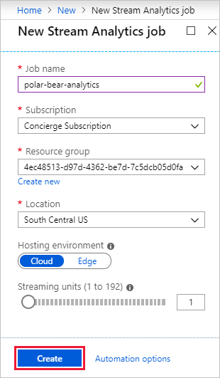
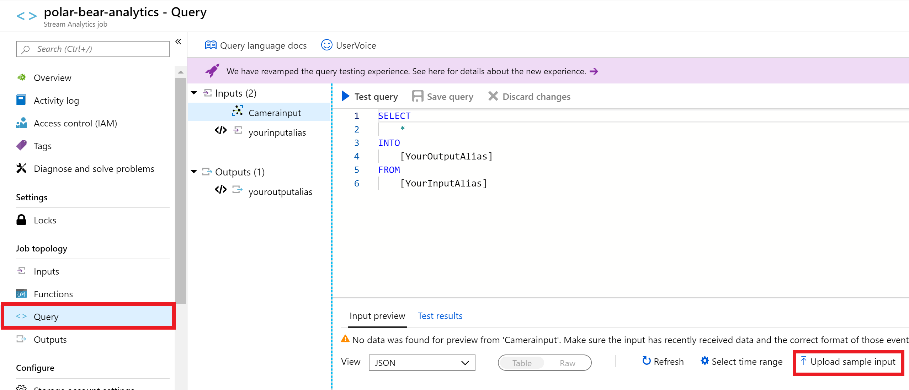
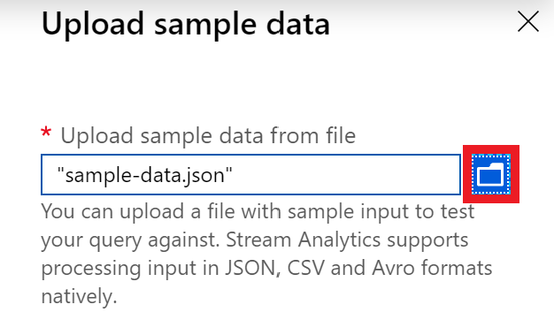
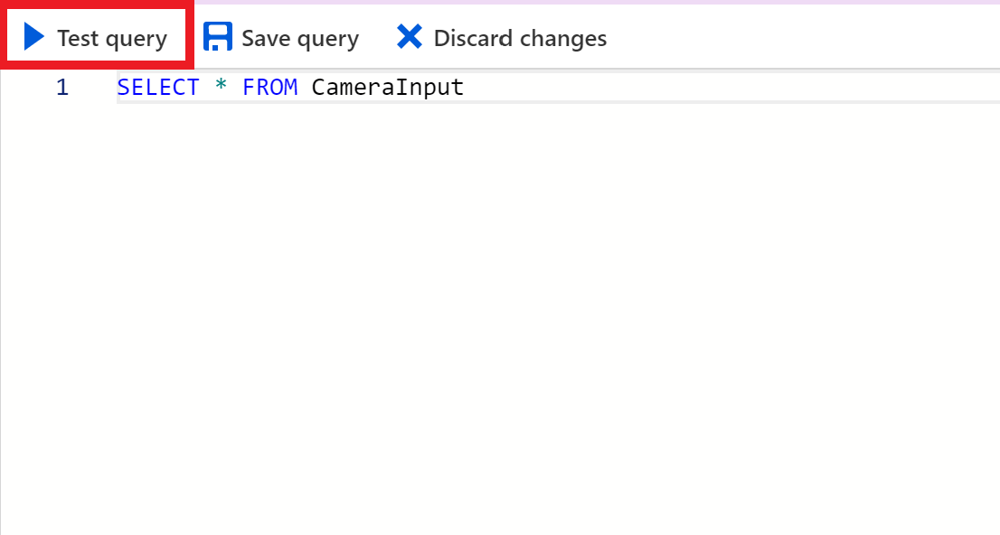
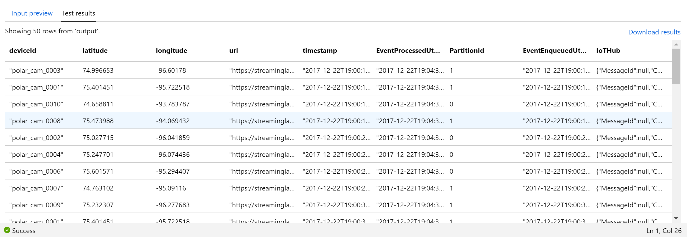
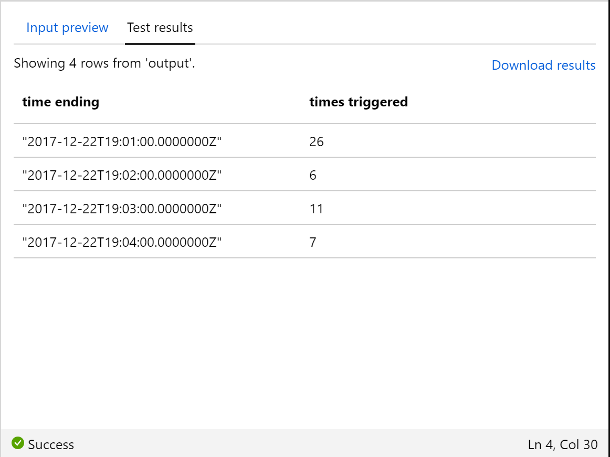

Now that we have our IoT hub connected to the blob container, let's connect a Stream Analytics job to process the input.

1. Select **+ Create a resource** in the left-hand sidebar of the Azure portal, followed by **Internet of Things** and **Stream Analytics job**.

    

1. Name the job "polar-bear-analytics" and place it in the resource group that you created earlier.

1. Specify **South Central US** as the location. This was the same location used for the IoT Hub.

    > [!IMPORTANT]
    > The location selection is important when you are building a production system. You want your IoT hub to be in the same region as the analytics job. While you are not charged for data that moves within a data center, you typically *are* charged for data that moves *between* data centers. In addition, locating services that are connected to each other in the same region reduces latency.

1. Make sure **Hosting environment** is set to **Cloud**.

1. Set **Streaming units** to "1".

1. Select the **Create** button to create the resource.

    

1. Open the **polar-bear-analytics** Stream Analytics job in the portal. If the Stream Analytics job doesn't appear in the resource group, click the **Refresh** button at the top of the view until it does.

1. Click **Inputs** in the left-side menu. 

1. Select **Add stream input > IoT Hub** to add an input to the Stream Analytics job.

    

1. Type "CameraInput" into the **Input alias** box.

1. Select the IoT hub that you created earlier.

1. Make sure **Endpoint** is set to **Messaging**, and accept the defaults everywhere else.

1. Click the **Save** button at the bottom of the view.

    

After a few moments, the new input "CameraInput" appears in the list of inputs for the Stream Analytics job. This is the only input you'll create, but you can add any number of inputs to a Stream Analytics job.

In the [Stream Analytics Query Language](https://msdn.microsoft.com/library/azure/dn834998.aspx), each input is treated as a separate data source similar to tables in a relational database. The query language is expressive, even allowing input streams to be joined in a manner similar to joining database tables.

## Set up a Stream Analytics query to retrieve data

The heart of a Stream Analytics job is the query that extracts information from the data stream. It's recommended to test a query using sample data before deploying it against a live data stream, because with sample data, you can verify a known set of inputs produces the expected outputs.

The sample data we'll test with is in the same GitHub repo the assets came from.

1. Download the [sample-data.json](https://raw.githubusercontent.com/MicrosoftDocs/mslearn-build-ml-model-with-azure-stream-analytics/master/sample-data.json) file to your local computer. Right-click the link and select "Save As" or the equivalent in your browser.

    This JSON file contains some sample IoT events we can test our query against. Here's an example event from the file:

    ```json
    {
        "deviceId": "polar_cam_0003",
        "latitude": 74.996653,
        "longitude": -96.60178,
        "url": "https://streaminglabstorage.blob.core.windows.net/photos/image_09.jpg",
        "timestamp": "2017-12-22T19:00:18.000Z",
        "EventProcessedUtcTime": "2017-12-22T19:04:35.2124006Z",
        "PartitionId": 1,
        "EventEnqueuedUtcTime": "2017-12-22T19:00:17.6720000Z",
        "IoTHub": {
            "MessageId": null,
            "CorrelationId": null,
            "ConnectionDeviceId": "polar_cam_0003",
            "ConnectionDeviceGenerationId": "636494537606587154",
            "EnqueuedTime": "2017-12-22T19:00:17.0710000Z",
            "StreamId": null
        }
    }
    ```

1. Return to the Stream Analytics job in the portal and click **Query** in the menu on the left side of the view.

1. Select **Upload sample data from file** in the bottom panel.

    

1. Select the **folder** icon on the right and select the **sample-data.json** file you just downloaded.

1. Click **OK** to upload the file.

    

1. When the upload is complete, type the following query into the query window. Then click the **Test query** button to execute it:

    ```sql
    SELECT * FROM CameraInput
    ```

    

1. Confirm that you see the output pictured below. The test data contains 50 rows, each representing an event transmitted to the IoT hub by one of the cameras in the camera array. `DEVICEID` is the camera's device ID, `LATITUDE`, and `LONGITUDE` specify the camera's location, `URL` is the URL of the blob containing the picture that was taken, and `TIMESTAMP` is the time at which the picture was taken. The other fields were added by Azure.

    

### Refine the query

One of the key features of the Stream Analytics Query Language is its ability to group results using _windows of time_ whose length you specify.

Windowing is specified using query keywords in a `GROUP BY` clause.

| Windowing Keyword | Description |
|-------------------|-------------|
| [TumblingWindow](https://msdn.microsoft.com/azure/stream-analytics/reference/tumbling-window-azure-stream-analytics) | Tumbling window functions are used to segment a data stream into distinct time segments and perform a function against them. For example, "Tell me the count of tweets per time zone every 10 seconds". The key differentiators of a Tumbling window are that they repeat, do not overlap, and an event cannot belong to more than one tumbling window. |
| [HoppingWindow](https://msdn.microsoft.com/azure/stream-analytics/reference/hopping-window-azure-stream-analytics) | Hopping window functions hop forward in time by a fixed period. It may be easy to think of them as Tumbling windows that can overlap, so events can belong to more than one Hopping window result set. For example "Every 5 seconds, give me the count of tweets over the last 10 seconds." |
| [SlidingWindow](https://msdn.microsoft.com/azure/stream-analytics/reference/sliding-window-azure-stream-analytics) | Sliding window functions, unlike Tumbling or Hopping windows, produce an output only when an event occurs. Every window will have at least one event and the window continuously moves forward by an € (epsilon). Like hopping windows, events can belong to more than one sliding window. For example, "Give me the count of tweets for all topics that are tweeted more than 10 times in the last 10 seconds."|
| [SessionWindow](https://msdn.microsoft.com/azure/stream-analytics/reference/session-window-azure-stream-analytics) | Session window functions group events that arrive at similar times, filtering out periods of time where there's no data. It has three main parameters: timeout, maximum duration, and partitioning key (optional). For example "Tell me the count of tweets that occur within 5 minutes of each other." |

1. Execute the following query to count the number of times the cameras were triggered each minute:

    ```sql
    SELECT System.Timestamp as [Time Ending],
        COUNT(*) AS [Times Triggered]
    FROM CameraInput TIMESTAMP BY timestamp
    GROUP BY TumblingWindow(n, 1)
    ```

    `TIMESTAMP BY` is an important element of the Stream Analytics Query Language. If it was omitted from the query above, you would be querying for the number of events that arrived *at the event hub* each minute rather than the number of events that occurred at the camera locations. `TIMESTAMP BY` allows you to specify a field in the input stream as the event time.

1. Confirm that you see the output below:

    

## Create the live query

Now it's time to check for two photos snapped by the same camera within 10 seconds. *This is the query that you'll use against a live data stream*. The assumption is that since polar bears tend to move rather slowly, we'll ignore pictures taken more than 10 seconds apart, but if the same camera snaps two pictures within 10 seconds, it's worth examining them to see if one of them contains a polar bear.

1. Enter the following query and click **Test** to execute it:

    ```sql
    SELECT C1.deviceId, C1.latitude, C1.longitude, C1.url, C1.timestamp
      FROM CameraInput C1 TIMESTAMP BY timestamp
      JOIN CameraInput C2 TIMESTAMP BY timestamp
        ON C1.deviceId = C2.deviceId
            AND DATEDIFF(ss, C1, C2) BETWEEN 0 AND 10
            AND C1.timestamp != C2.timestamp
    ```

1. This time the output should contain six rows, each representing two photographs taken by the same camera within 10 seconds and containing the URL of one of the pictures.

    

1. Finish up by clicking the **Save** button at the top of the view to save the query.

1. Select **Yes** if asked to confirm. This will be the query that's executed when you run the Stream Analytics job.

The query that you tested employs simple logic: if the same camera snaps two pictures within 10 seconds, there *might* be a polar bear. But the ultimate goal is to determine with a great deal of confidence whether there really *is* a polar bear. That means supplementing Stream Analytics with machine learning.