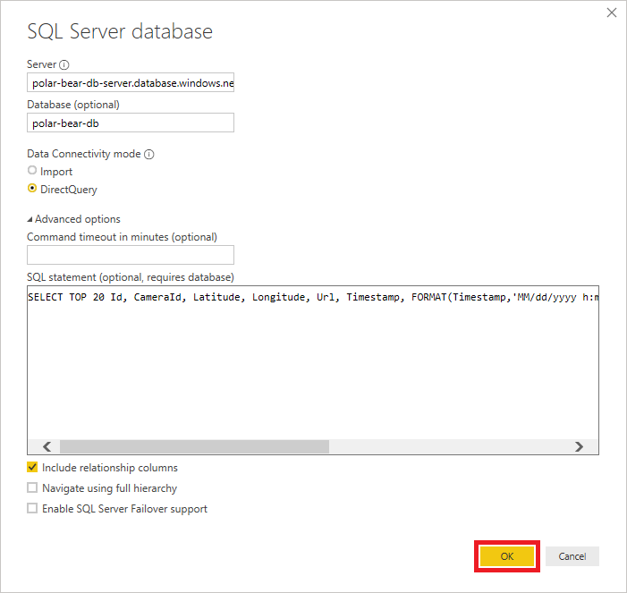
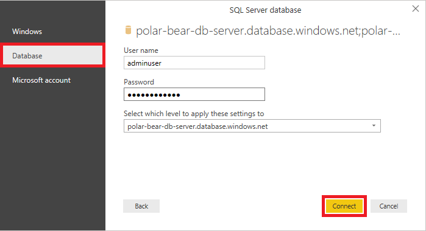
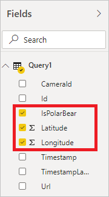
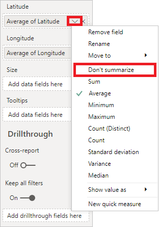

To complete the end-to-end solution for spotting polar bears in the wild, you'll connect Power BI to the database you created in the preceding unit and build a report that shows in near real time where polar bears are being photographed by your cameras. You'll use Power BI Desktop to create the report. 

Power BI Desktop runs only on Windows. If you aren't running Windows, one solution is to create a Windows VM in Azure and run Power BI Desktop from there.

## Connect Power BI to the SQL database

You used Custom Vision to train an image classification model to differentiate between different types of Arctic wildlife and modified the function app you wrote to output the results to a SQL database. The first step in using Power BI to explore and visualize this data is connecting it to the SQL database. In this exercise, you connect Power BI Desktop to the SQL database.

1. If Power BI Desktop isn't already installed on your computer, [install it](https://powerbi.microsoft.com/desktop/?azure-portal=true).

1. Open Power BI Desktop. If you're asked to sign in, sign in with your work or school account.

    > [!NOTE]
    > There are two types of Microsoft accounts: personal Microsoft accounts and work or school accounts, also known as organizational accounts. You can sign in to Power BI with a work or school account, but not with a personal account. If you have a Microsoft 365 subscription, it uses your work or school account. But, you can have a work or school account without having a Microsoft 365 subscription. For an explanation of the differences between personal Microsoft accounts and work or school accounts, see [Understanding Microsoft work and personal accounts](http://www.brucebnews.com/2016/06/finding-your-way-through-microsofts-maze-of-work-and-personal-accounts/).

1. On the ribbon, select **Get Data**. In the left menu, select **Azure**, and then select **Azure SQL database**. Select **Connect**.

    

    _Add a data source_

1. Enter the server's host name (the server name you specified in the preceding unit with *.database.windows.net* added to the end of the server name) and the database name. Select **DirectQuery**, and then select **Advanced options**. T
1. In **SQL statement**, copy and then paste in the following code to select the 20 most recently added rows in the `dbo.PolarBears` table. Power BI uses this query to pull information from the database. Select **OK**.

    ```sql
    SELECT TOP 20 Id, CameraId, Latitude, Longitude, Url, Timestamp, FORMAT(Timestamp,'MM/dd/yyyy h:mm:ss tt') AS TimestampLabel, IsPolarBear FROM dbo.PolarBears ORDER BY Timestamp DESC
    ```

    

    _Connect to the database_

1. In **SQL Server database**, select the **Database** tab. Enter the user name and password you specified when you created the database server, and select the database server from the drop-down list. Select **Connect**, and then select **Load**.

    

    _Enter the admin credentials_

After a short delay, Power BI connects to the database and retrieves a dataset by using the query you provided. The next step is to add visuals to bring that dataset to life.

## Build a report in Power BI Desktop

Visualizations (or simply "visuals") are the primary element that make up Power BI reports. In this exercise, you'll use the Power BI report designer to create visuals from the database you connected to, adjust filters and aggregates to refine the way the data is reported, and format the visuals to produce compelling output.

1. In **Visualizations**, select the **Map** icon to add a map visual to the report.

    

    _Add a map visual_

1. In **Fields**, select **IsPolarBear**, **Latitude**, and **Longitude**  to include these fields in the map visual.

    

    _Add fields to the map visual_

1. In **Visualizations**, select the down arrow next to **Average of Latitude**, and select **Don't summarize**. Then, do the same for **Average of Longitude**.

    

    _Remove summary calculations_

1. Select the empty area outside the map to deselect it. In **Fields**, select **CameraId**, **IsPolarBear**, and **TimestampLabel** to add a table visual that contains those columns to the report.

    

    _Add a table visual_

1. Select in an empty area to deselect the table visual. Then check **IsPolarBear** and **Latitude** in the "Fields" panel to add another table visual, and select the **Pie Chart** icon in the "Visualizations" panel to convert the table into a pie chart. 

    

    _Add a pie-chart visual_

1. In **Visualizations**, under **Values**, select the down arrow next to **Average of Latitude**, and select **Count** to configure the pie chart to show a count of sightings and the proportion of sightings in which polar bears were detected. 

    

    _Refine the pie chart visual_

1. Clear the pie chart visual and select the **Slicer** icon to add a slicer to the report. Slicers provide a convenient means for filtering information in a Power BI report by narrowing the data shown in other visuals. Then, in **Fields**, select the **IsPolarBear** field so that the slicer shows check boxes labeled **True** and **False**.

    

    _Add a slicer_

1. Resize and reposition the visuals to achieve a layout similar to this example:

    

    _Adjust the layout_

1. With the report structure in place, the next task is to use some of Power BI's rich formatting options to embellish the visuals. Start by selecting the map visual in the report designer. Then, in **Visualizations**, select the **Format** icon.

    

    _Format the map visual_

1. In **Visualizations**, use the formatting controls to make the following changes to the map visual:

    * **Legend**: Set **Legend Name** to **Polar Bear Sighted?**
    * **Data colors**: Set the color for **True** to **00FF00 (pure green)** and set the color for **False** to **FF0000 (pure red)**.
    * **Bubbles**:  Set the bubble size to **30%**.
    * **Map styles**: Set the theme to **Aerial**.
    * **Title**: Select **Off**.

    Confirm that the resulting map looks something like this example:

    

    _Formatted map visual_

1. Select the pie chart visual and use the formatting controls in **Visualizations** to make the following changes:

    * **Data colors**: Set **True** to **00FF00** and set **False** to **FF0000**.
    - **Detail  labels**: Set the label style to **Data value, percent of total**.
    - **Title**: Change the title text to **Sightings Proportion**.

1. Select the table visual and use the formatting controls in the "Visualizations" panel to make the following changes:

    - Under "Style," change the table style to "Alternating rows"
    - Turn "Title" on, and change the title text to "Camera Activity" 

1. Select the slicer visual and use the formatting controls in the "Visualizations" panel to make the following changes.

    - Under the "Selection controls" section, turn **Multi-select with CTRL** off. This setting prevents you from having to use the Ctrl key to select more than one check box.

1. In the bottom-left corner of the designer, double-click **Page 1**  and change the report title to **Polar Bear Activity**.

1. Use the **File** > **Save** command to save the report.

Feel free to embellish the report further. Once you're satisfied with the layout and content, it's time to put it to work using a live data source.

## Run the end-to-end solution

Now that the report is prepared in Power BI, your final task is to run the end-to-end solution and check for polar bears!

1. Open the SQL database that you created in the [Azure portal](https://portal.azure.com?azure-portal=true). Use the query editor to run the following query and delete all rows from the `dbo.PolarBears` table:

    ```sql
    DELETE FROM dbo.PolarBears
    ```

1. Return to the project directory in a Command Prompt or terminal window, and run *run.js*:

    ```bash
    node run.js
    ```

1. Return to Power BI Desktop and select **Refresh** in the ribbon at the top of the window. Select it again every 15 seconds or so. The report will refresh automatically every few minutes, but you can refresh it manually as often as you would like to update the visuals. 

1. Confirm that red and green bubbles appear at various locations around the island. Green bubbles indicate the presence of polar bears, while red bubbles represent locations where photos were taken but no polar bears were detected. Locations that have a mixture of sightings will show red *and* green, as pictured below.

    

    _There be polar bears!_

1. Suppose you wanted to show *only* locations where polar bears were detected. In the slicer visual, select **True**. What happens in the map?

1. Continue running the report for a few minutes, and refresh the report once or twice a minute. Confirm that there are polar bears active on the island!

1. When you're satisfied that the solution is working as intended, return to the Command Prompt or terminal window and select Ctrl+C to stop the cameras.

You now have a report that shows, in near real time, polar bear activity on the island. If you have a Power BI Pro or Power BI Premium account, you can share the report with other Power BI users so that they, too, can monitor polar bear activity. For more information about sharing your work, see [Share Power BI dashboards and reports](https://docs.microsoft.com/power-bi/service-how-to-collaborate-distribute-dashboards-reports "Share Power BI Dashboards and Reports"). You also can view reports in the [Power BI mobile apps](https://docs.microsoft.com/power-bi/mobile-apps-for-mobile-devices), so you can keep track of polar bears on your Windows, Android, or iOS device—even on an Apple watch!
