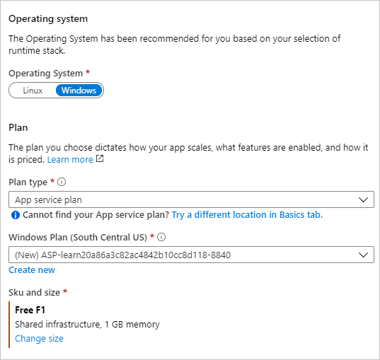
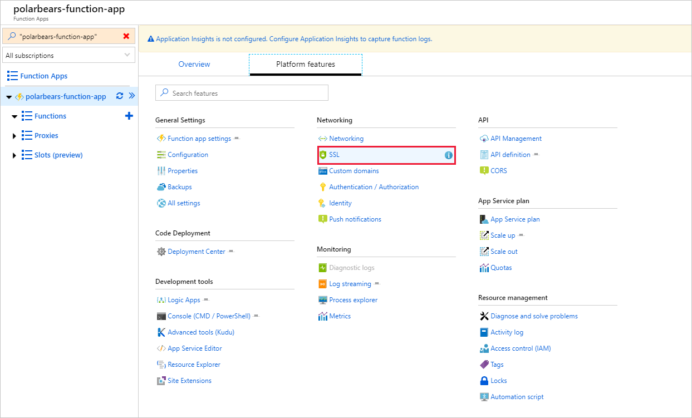
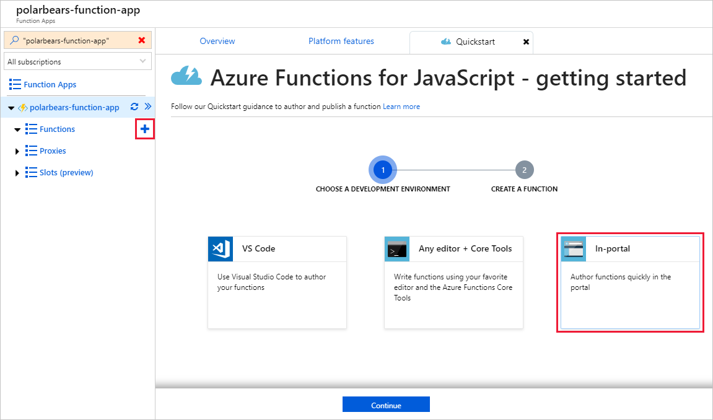
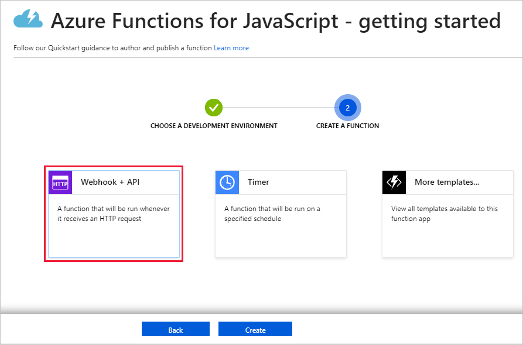
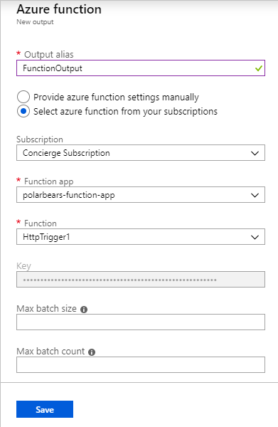

One way to connect a Stream Analytics job to a machine-learning model running in the cloud is to use an [Azure Function](https://azure.microsoft.com/services/functions/) as a Stream Analytics output. 

The function, which is invoked each time Stream Analytics produces an output, can then call out to the machine-learning model to perform predictions.

1. In the [Azure portal](https://portal.azure.com?azure-portal=true), click **+ Create a resource**, followed by **Compute** and **Function App**.

    

1. Enter an app name that is unique to Azure. Place the Function App in the same resource group you created earlier.

1. Ensure the **Resource Group** is set to the resource group we have used in previous units.

1. Set **OS** to **Windows**

1. Set the **Hosting Plan** to **App Service Plan**.

    > [!TIP]
    > When you create an Azure Function App, you can choose from two hosting plans: Consumption plan or App Service plan. The former is cheaper because you only pay when the function executes. But with Consumption plan, the function might not execute for several minutes after it's called. With App Service plan, you pay more, but the function runs immediately.

1. Select the **App Service plan/Location** item and create a new App Service plan in the South Central US region.

1. Select **Node.js** as the **Runtime Stack**.

1. Under **Storage**, select the storage account that you created earlier.

1. Turn off Application Insights.

1. Select the **Create** button to create a new Azure Function app.

    

1. Select your resource group in the portal and click **Refresh** until the Function App appears. Click the Function App, and then click **Platform features** followed by **SSL**.

    

1. Under "Protocol Settings," make sure the minimum TLS version is set to 1.0.

    

1. Scroll the view back to the left to show the **Platform features** screen in the portal.

1. Click the **+** sign to the right of **Functions**. Click **In-portal**, and then click **Continue**.

    

1. Click **Webhook + API**, and then click **Create**.

    

1. Replace the code shown in the code editor with the statements below. Then click **Save**, followed by **Run**.

    ```javascript
    module.exports = async function (context, req) {
        context.log(req.rawBody);
    };
    ```

    

1. Return to the Stream Analytics job in the portal by returning to your resource group and select **Outputs** in the menu on the left side.
1. Click **+ Add** and select **Azure function** to add an Azure Function as an output.

    

1. Name the output "FunctionOutput". Select the Function App you created earlier in this exercise and accept the defaults everywhere else. Then click **Save**.

    

    Just as a Stream Analytics job will accept multiple inputs, it supports multiple outputs, too. In addition to passing the output to an Azure Function, you could easily add outputs to log the output from the job in an Azure SQL database, an Azure Cosmos DB database, blob storage, and other locations.

1. Wait for the output to appear in the list of outputs, indicating that it has been successfully added to the Stream Analytics job.

1. Select **Query** from the left-hand menu and modify the query you wrote in the previous exercise to include an `INTO` clause (line 2 below) that directs query results to the output you just added:

    ```sql
    SELECT C1.deviceId, C1.latitude, C1.longitude, C1.url, C1.timestamp
      INTO FunctionOutput
      FROM CameraInput C1 TIMESTAMP BY timestamp
      JOIN CameraInput C2 TIMESTAMP BY timestamp
        ON C1.deviceId = C2.deviceId
            AND DATEDIFF(ss, C1, C2) BETWEEN 0 AND 10
            AND C1.timestamp != C2.timestamp
    ```

1. Click **Save** to save the query.

1. Select **Overview** in the menu on the left and click **Start** to start the Stream Analytics job running.

    

1. Make sure **Job output start time** is set to **Now**, and then click **Start** to start the run.

    

The job will take a couple of minutes to start. You can move to the next unit and begin setting up the simulation to generate camera events.
