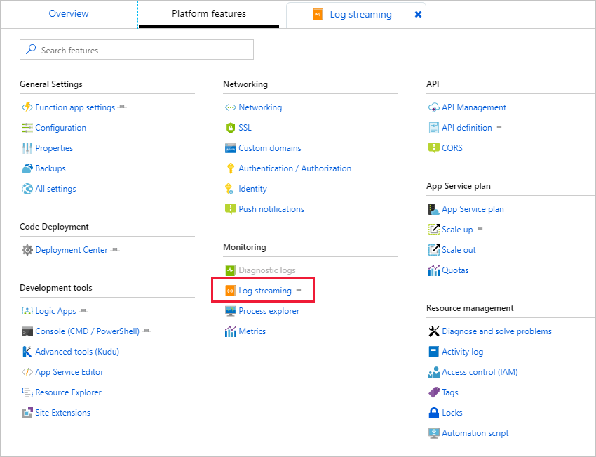

We're ready to start generating events that will push images up to Blob Storage from one of our simulated cameras. This upload will trigger our IoT hub, which will in turn, notify the Azure function you created.

We'll use an existing Node.js app included with the assets you cloned earlier to simulate the cameras. The app will read the **cameras.json** created earlier and periodically upload a photo to Blob storage to simulate a camera catching movement.

If the Azure Cloud Shell timed out while you were working in the portal, go ahead and reconnect it. All the files and folders are still present but the environment variables you set earlier will be missing because this is a new terminal session. Make sure to execute the following statements with the proper values before you continue.

```bash
export HUB_NAME={iot-hub-name}
export ACCOUNT_NAME={storage-account-name}
```

1. In the Cloud Shell on the right, make sure you are in the project folder `photoproc`. Recall you can use the `cd` command in the shell to switch to the proper folder.

1. Copy the **run.js** app into the project folder from assets.

    ```bash
    cp assets/src/run.js .
    ```

You can explore the code in the code editor if you like. It uses the [class support](http://es6-features.org/#ClassDefinition) in ECMAScript 6 (ES6) to define a class named `Camera`. Then it creates 10 `Camera` instances and starts them running. Each camera object connects to the IoT hub securely using an access key obtained from **cameras.json**, and then uses a random timer to transmit events every 5 to 60 seconds. Each event that is transmitted includes the camera's ID, latitude/longitude, and an image URL with timestamp.

The URL refers to an image that the camera uploaded to blob storage before firing the event. Images are randomly selected from the files in the project directory's "photos" subdirectory.

## Modify the simulation code

1. Open the simulation code with the Cloud Shell editor.

    ```bash
    code run.js
    ```

1. Replace `ACCOUNT_KEY` on line 5 with the storage account's access key. If you need to retrieve the access key again you can use the following command in the terminal area below the editor.

    ```azurecli
    az storage account keys list \
        --account-name $ACCOUNT_NAME \
        --resource-group <rgn>[sandbox resource group name]</rgn>
    ```

1. Save the file and close the editor.

1. Run the simulation.

    ```bash
    node run.js
    ```

1. Confirm that you see output similar to the following, indicating that all 10 "cameras" are connected to the IoT hub:

    ```output
    polar_cam_0003 connected
    polar_cam_0005 connected
    polar_cam_0001 connected
    polar_cam_0009 connected
    polar_cam_0004 connected
    polar_cam_0006 connected
    polar_cam_0008 connected
    polar_cam_0007 connected
    polar_cam_0002 connected
    polar_cam_0010 connected
    ```

    The order in which the cameras connect to the IoT hub will probably differ from what's shown here, and will also vary from one run to the next.

1. After a few seconds, additional output should appear. Each line corresponds to an event transmitted from a camera to the IoT hub. The output will look something like:

    ```output
    polar_cam_0008: https://streaminglabstorage.blob.core.windows.net/photos/image_24.jpg
    polar_cam_0004: https://streaminglabstorage.blob.core.windows.net/photos/image_10.jpg
    polar_cam_0005: https://streaminglabstorage.blob.core.windows.net/photos/image_26.jpg
    polar_cam_0007: https://streaminglabstorage.blob.core.windows.net/photos/image_27.jpg
    polar_cam_0001: https://streaminglabstorage.blob.core.windows.net/photos/image_15.jpg
    polar_cam_0007: https://streaminglabstorage.blob.core.windows.net/photos/image_20.jpg
    polar_cam_0003: https://streaminglabstorage.blob.core.windows.net/photos/image_18.jpg
    polar_cam_0005: https://streaminglabstorage.blob.core.windows.net/photos/image_21.jpg
    polar_cam_0001: https://streaminglabstorage.blob.core.windows.net/photos/image_20.jpg
    polar_cam_0009: https://streaminglabstorage.blob.core.windows.net/photos/image_26.jpg
    ```

1. Confirm that the cameras are running and generating events as shown above. 

## Watch the Azure Function log

The Streaming Analytics job is sending events to the Azure Function. We can monitor these in the Azure portal.

1. Sign into the [Azure portal](https://portal.azure.com?azure-portal=true) or switch to the tab with the portal.

1. Locate your Azure Function in the portal, you can type the name in the Search Box at the top to quickly jump to a resource. Alternatively, you can find it through the Resource Groups.

1. Select **Platform features** and then **Log streaming** under the _Monitoring_ section as shown below.

    

1. Verify that over the course of a few minutes, the log shows several outputs from Stream Analytics. .The frequency will vary because the cameras use random timers to fire events.

    > [!TIP]
    > Remember that the Stream Analytics job doesn't forward every event it receives to the function. It generates an output *only* when one camera snaps two photos within 10 seconds.

    Each output contains a JSON payload containing a device ID, latitude, longitude, blob URL, and timestamp.

    ```output
    Connecting...
    2019-05-02T15:31:55  Welcome, you are now connected to log-streaming service.
    2019-05-02T15:32:40.020 [Information] Executing 'Functions.HttpTrigger1' (Reason='This function was programmatically called via the host APIs.', Id=66ed06a5-708a-4e1b-a6e3-81299cde131c)
    2019-05-02T15:32:40.022 [Information] [{"deviceid":"polar_cam_0009","latitude":75.232307,"longitude":-96.277683,"url":"https://therebepolarbears.blob.core.windows.net/photos/image_28.jpg","timestamp":"2019-05-02T15:32:29.126Z"}]
    2019-05-02T15:32:40.022 [Information] Executed 'Functions.HttpTrigger1' (Succeeded, Id=66ed06a5-708a-4e1b-a6e3-81299cde131c)
    2019-05-02T15:32:40.020 [Information] Executing 'Functions.HttpTrigger1' (Reason='This function was programmatically called via the host APIs.', Id=66ed06a5-708a-4e1b-a6e3-81299cde131c)
    2019-05-02T15:32:40.022 [Information] [{"deviceid":"polar_cam_0009","latitude":75.232307,"longitude":-96.277683,"url":"https://therebepolarbears.blob.core.windows.net/photos/image_28.jpg","timestamp":"2019-05-02T15:32:29.126Z"}]
    2019-05-02T15:32:40.022 [Information] Executed 'Functions.HttpTrigger1' (Succeeded, Id=66ed06a5-708a-4e1b-a6e3-81299cde131c)
    2019-05-02T15:32:52.716 [Information] Executing 'Functions.HttpTrigger1' (Reason='This function was programmatically called via the host APIs.', Id=e300acb6-5209-408f-832f-677f6b0dfcd7)
    2019-05-02T15:32:52.718 [Information] [{"deviceid":"polar_cam_0010","latitude":74.658811,"longitude":-93.783787,"url":"https://therebepolarbears.blob.core.windows.net/photos/image_02.jpg","timestamp":"2019-05-02T15:32:44.127Z"}]
    2019-05-02T15:32:52.719 [Information] Executed 'Functions.HttpTrigger1' (Succeeded, Id=e300acb6-5209-408f-832f-677f6b0dfcd7)
    2019-05-02T15:32:52.716 [Information] Executing 'Functions.HttpTrigger1' (Reason='This function was programmatically called via the host APIs.', Id=e300acb6-5209-408f-832f-677f6b0dfcd7)
    2019-05-02T15:32:52.718 [Information] [{"deviceid":"polar_cam_0010","latitude":74.658811,"longitude":-93.783787,"url":"https://therebepolarbears.blob.core.windows.net/photos/image_02.jpg","timestamp":"2019-05-02T15:32:44.127Z"}]
    2019-05-02T15:32:52.719 [Information] Executed 'Functions.HttpTrigger1' (Succeeded, Id=e300acb6-5209-408f-832f-677f6b0dfcd7)
    2019-05-02T15:32:58.300 [Information] Executing 'Functions.HttpTrigger1' (Reason='This function was programmatically called via the host APIs.', Id=b73cadb4-75d3-4599-80fc-a72bc45f3f96)
    2019-05-02T15:32:58.303 [Information] [{"deviceid":"polar_cam_0008","latitude":75.473988,"longitude":-94.069432,"url":"https://therebepolarbears.blob.core.windows.net/photos/image_14.jpg","timestamp":"2019-05-02T15:32:43.296Z"}]
    2019-05-02T15:32:58.304 [Information] Executed 'Functions.HttpTrigger1' (Succeeded, Id=b73cadb4-75d3-4599-80fc-a72bc45f3f96)
    2019-05-02T15:32:58.300 [Information] Executing 'Functions.HttpTrigger1' (Reason='This function was programmatically called via the host APIs.', Id=b73cadb4-75d3-4599-80fc-a72bc45f3f96)
    2019-05-02T15:32:58.303 [Information] [{"deviceid":"polar_cam_0008","latitude":75.473988,"longitude":-94.069432,"url":"https://therebepolarbears.blob.core.windows.net/photos/image_14.jpg","timestamp":"2019-05-02T15:32:43.296Z"}]
    2019-05-02T15:32:58.304 [Information] Executed 'Functions.HttpTrigger1' (Succeeded, Id=b73cadb4-75d3-4599-80fc-a72bc45f3f96)
    ```

1. Return to the Stream Analytics job in the portal and click **Stop** to stop it. Then click **Yes** when asked to confirm that you want to stop the job.

1. Return to the Command Prompt or terminal window where **run.js** is executing and press <kbd>Ctrl</kbd>+<kbd>C</kbd> (<kbd>Cmd</kbd>+<kbd>C</kbd> on a Mac) to stop the flow of events from the simulated cameras.

You've confirmed that Stream Analytics is receiving input from the IoT hub and that the Azure Function is receiving input from Stream Analytics. The next step is built a machine-learning model and invoke it from the Azure Function.