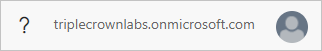
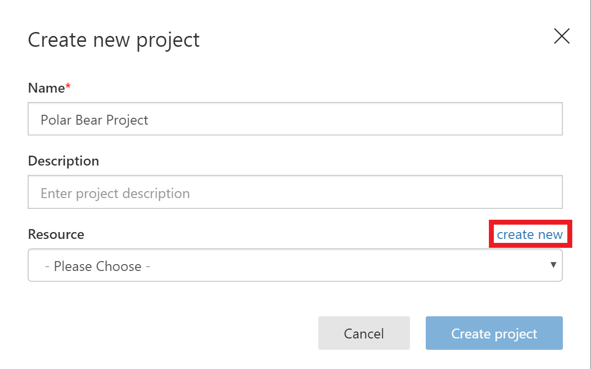
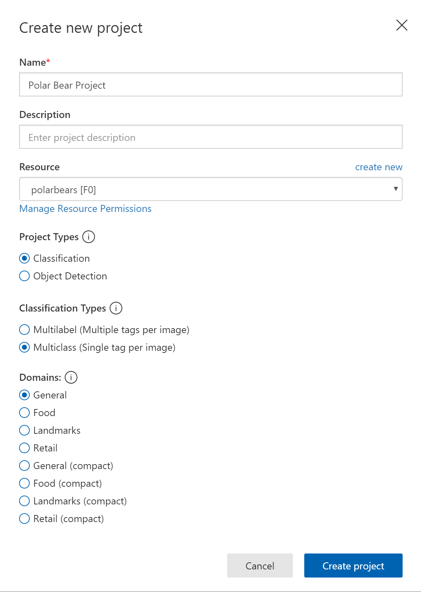
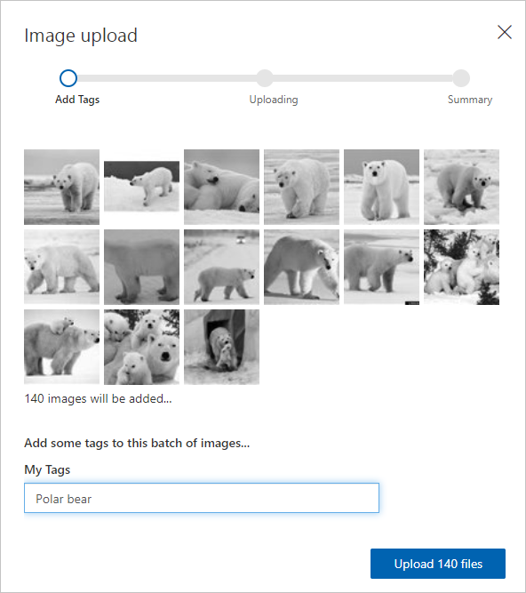

You can build, train, and test image-classification models using either the Custom Vision Service portal, or the Custom Vision Training REST API. Once a model is trained, apps can use the Custom Vision Prediction REST API to call the model and return results in JSON.

In this unit, you'll create a new Custom Vision Service project. Then you'll upload images of polar bears, arctic foxes, and walruses and tag the images so the Custom Vision Service can learn to differentiate between them.

This unit requires an Azure subscription. The resources we create here are free, but the Custom Vision Service portal doesn't work with the Concierge subscription created by the Azure Sandbox.

[!INCLUDE [azure-free-trial-note](../../../includes/azure-free-trial-note.md)]

## Sign into the Custom Visual Service portal

1. Open the [Custom Vision Service portal](https://www.customvision.ai/?azure-portal=true) in your browser. Then click **Sign In** and sign in with your Microsoft account associated to an Azure subscription.

    

> [!IMPORTANT]
> By default, you might be placed into the Concierge directory which is part of the Azure Sandbox. Unfortunately, this directory won't work because it doesn't have all the details of a full Azure subscription. If the directory name listed next to your profile icon in the top-right corner says **triplecrownlabs.onmicrosoft.com**, you will need to change it to your own subscription.
>
> 
>
> If this is the case, select your profile icon and select another directory from the drop-down.

## Create a new Custom Vision project

1. Click **+ NEW PROJECT** to display the "Create new project" dialog. Enter a project name such as "Polar Bear Project", then press **create new**.

    

1. Enter a resource name such as "polarbears", choose *your own* Azure **Subscription** and **Resource Group** to be the resource group from previous units. Select **Kind** as **CustomVision.Training**, **Location** as **South Central US**, and **Pricing Tier** as **F0** - the free tier. Then press **Create resource**

    

1. Finally, ensure that the **Resource** you just set up is selected, **Classification** is set as the project type, **Multiclass** as the classification type, and **General** is selected as the domain.

    > [!TIP]
    > A domain optimizes a model for specific types of images. For example, if your goal is to classify _food images_ by the types of food they contain or the ethnicity of the dishes, then it's helpful to select the **Food domain**. For scenarios that don't match any of the offered domains, or if you are unsure of which domain to choose, select the **General domain**.

1. Select **Create resource**. It will take a minute or two to complete the process.

    

## Add the training images

The vision service needs to be trained to recognize visual elements within images. This step is done by uploading multiple images that include the element you want to locate and tagging the images in the service.

We'll use a set of training images that show three arctic animals we expect to see on camera: foxes, walruses, and polar bears.

1. Download the [training images for arctic foxes](https://github.com/MicrosoftDocs/mslearn-build-ml-model-with-azure-stream-analytics/raw/master/training-images/arctic-fox.zip) and unzip the contents to a folder on your local computer.

1. Click **Add images** to add images to the project.

    

1. Browse to the folder containing the training images and select all of the files in the **arctic-fox** folder.

1. OK the selection and type "Arctic fox" as the tag for the images.

1. Select the **Upload 130 files** button. Wait for the upload to complete, and then click **Done**.

    

1. Download the [training images for polar bears](https://github.com/MicrosoftDocs/mslearn-build-ml-model-with-azure-stream-analytics/raw/master/training-images/polar-bear.zip) and unzip the contents to a folder on your local computer.

1. Click **Add images** at the top of the page and repeat the previous step to upload all of the images in the **polar-bear** folder to the Custom Vision Service and tag them with the term "Polar bear." Wait for the upload to complete, and then click **Done**.

    

1. Download the [training images for walruses](https://github.com/MicrosoftDocs/mslearn-build-ml-model-with-azure-stream-analytics/raw/master/training-images/walrus.zip) and unzip the contents to a folder on your local computer.

1. Upload all of the images in the **walrus** folder to the Custom Vision Service and tag them with the term "Walrus." Wait for the upload to complete, and then click **Done**.

## Train the vision model

With the images tagged and uploaded, the next step is to train the model so it can distinguish between arctic foxes, polar bears, and walruses, and determine whether an image contains one of these animals.

Training can be accomplished with a simple button click in the portal, or by calling the **TrainProject** method in the Custom Vision Training REST API. Once trained, a model can be refined by uploading additional tagged images and retraining it. Let's use the portal approach since it's the easiest to start with. If you wanted to continue to refine the model over time, the REST API allows you to do it programmatically.

1. Click the **Train** button at the top of the page to train the model. Select **Fast Training**. Each time you train the model, a new iteration is created. The Custom Vision Service maintains several iterations, allowing you to compare your progress over time.

    

1. Wait for the training process to complete. (It should only take a few seconds.) Then review the training statistics presented to you for iteration 1.

    

### Determining model accuracy

The statistics provided in the results display three related values that can be used to determine the model's accuracy.

**Precision** and **Recall** are separate but related  measures of the model's accuracy. Suppose the model was presented with three polar-bear images and three walrus images, and it correctly identified two of the polar-bear images properly, but incorrectly identified two of the walrus images as polar-bear images. In this case, the precision would be 50% (two of the four images it classified as polar-bear images actually are polar-bear images), while its recall would be 67% (it correctly identified two of the three polar-bear images as polar-bear images).

**AP**, short for *Average Precision*, is a third measurement of the model's accuracy. Where precision measures the false-positive rate and recall measures the false-negative rate, _AP_ is a mean of false-positive rates computed across a range of thresholds.

## Test the vision model

Now let's test the model using the portal's Quick Test feature, which allows you to submit images to the model and see how it classifies them using the knowledge gained during training.

1. Download the [test images for polar bears](https://github.com/MicrosoftDocs/mslearn-build-ml-model-with-azure-stream-analytics/raw/master/test-images/polar-bear.zip) and unzip the folder on your local computer.

1. Click the **Quick Test** button at the top of the page. Then click **Browse local files**, browse to the polar-bear folder, and select any one of the test images in that folder.

1. Examine the results of the test in the "Quick Test" dialog. What is the probability that the image contains a polar bear? What is the probability that it contains an Arctic fox or a walrus?

    

1. Repeat this test for arctic foxes. Download the [test images for arctic foxes](https://github.com/MicrosoftDocs/mslearn-build-ml-model-with-azure-stream-analytics/raw/master/test-images/arctic-fox.zip) and unzip the folder on your local computer.

1. Upload a few of the images in the **arctic-fox** folder. How well is the model able to differentiate between Arctic foxes and polar bears?

1. Try one more time with walruses by downloading the [test images for walruses](https://github.com/MicrosoftDocs/mslearn-build-ml-model-with-azure-stream-analytics/raw/master/test-images/walrus.zip).

The "Testing Images" folder in the downloaded assets contains subdirectories with a total of 30 different images for testing. Perform additional quick tests using these images until you're satisfied that the model is reasonably adept at predicting whether an image contains a polar bear.

## Publish the vision model

1. Return to the project and click **Publish**. Enter a name for this iteration of the model. Then click **Prediction URL**.

    

1. The dialog lists two URLs: one for uploading images through a URL, and another for uploading images as byte streams. Copy the first one (URL-based) to the clipboard, and paste it into your favorite text editor so you can retrieve it later.

1. Do the same for the `Prediction-Key` value underneath the URL. This value must be passed in each call to the prediction URL.

    

You now have a machine-learning model that can determine whether an image contains a polar bear, and a `URL` and `API key` for invoking the model. The next step is to create a database for storing the results of those calls.