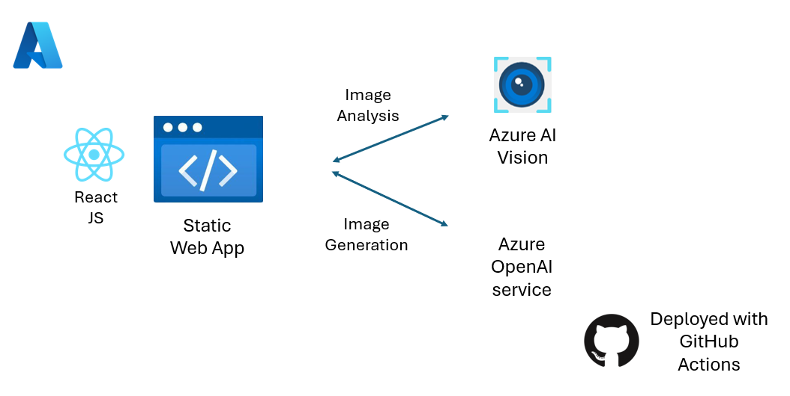

Computer vision is a core area of artificial intelligence (AI), aimed at processing and analyzing the information contained within visual data sources, such as images and videos, to extract useful insights. This branch of AI emulates human visual capabilities by using advanced algorithms: cutting-edge AI technologies reached a level of accuracy that is comparable to human vision in many tasks, such as image classification, object detection, and image captioning.

Knowing how to integrate computer vision into your applications is crucial to develop modern, smart solutions in several domains, like retail or security, and to guarantee accessibility to your services, for example, by providing a text description of the images you share on your website.

> [!NOTE]
> This is a **_challenge project_** module where you will complete a project end-to-end based on a specification. This module is designed to be a test of your skills: there are few guidelines and no step-by-step instructions.

## Example Scenario

You are a developer working for a company that wishes to provide a web application to its employees assisting them in their content development daily job. The application allows content creators to upload images and generate a text description of it, together with useful information related to the image, they can use to ensure their content is accessible to everyone.
Also, the application allows employees to generate innovative images from text descriptions, they can use in their content.

## Learning objectives

In this challenge, you will create a smart web application that integrates computer vision capabilities, leveraging Azure AI Vision and Azure OpenAI cognitive services. At the end of the challenge, your final application will provide the following functionalities:

1. It will display a message if Azure key and endpoint for Azure AI Vision or Azure OpenAI service isn't found.
2. It will allow the user to analyze an image with Azure AI Vision service, by entering a public image URL through a graphical user interface.
3. It will allow the user to generate an image with Azure OpenAI service, by entering a text description through a graphical user interface.

By completing this project you'll demonstrate your ability to:

- Integrate the newest Image Analysis 4.0 capabilities - powered by Microsoft’s Florence large foundation model - into your application, by applying the knowledge learnt in the [Explore Cognitive Services for Vision](https://learn.microsoft.com/training/modules/explore-cognitive-services-vision/?WT.mc_id=academic-105496-cacaste) Microsoft Learn module.
- Enrich your solution with generative AI capabilities, by applying the skills learnt in the [Develop Generative AI solutions with Azure OpenAI Service](https://learn.microsoft.com/training/paths/develop-ai-solutions-azure-openai/?WT.mc_id=academic-105496-cacaste) Microsoft Learn module.

Overall, the tech stack of the final solution will look as follows:

