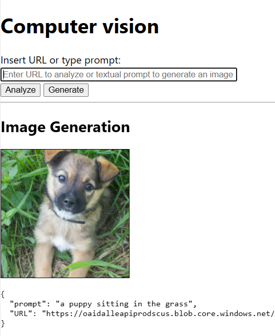

In this exercise you will add image generation capabilities to your React application, using Azure OpenAI cognitive service and in particular DALLE2 model.

## Specification

1. Create a new Azure OpenAI Service resource in your subscription. To configure your resource properly, check the [region availability](https://learn.microsoft.com/azure/ai-services/openai/concepts/models#dall-e-models-preview?WT.mc_id=academic-105496-cacaste) for DALLE2 model before creating it.
Please note that, as part of Microsoft's commitment to responsible AI, access to Azure OpenAI service is currently limited to a set of Azure customers requesting it in advance, by filling out [this form](https://customervoice.microsoft.com/Pages/ResponsePage.aspx?id=v4j5cvGGr0GRqy180BHbR7en2Ais5pxKtso_Pz4b1_xUOFA5Qk1UWDRBMjg0WFhPMkIzTzhKQ1dWNyQlQCN0PWcu). If your application doesn't match the [acceptance criteria](https://learn.microsoft.com/legal/cognitive-services/openai/limited-access?context=%2Fazure%2Fcognitive-services%2Fopenai%2Fcontext%2Fcontext&WT.mc_id=academic-105496-cacaste), you can rely on the [OpenAI public APIs](https://platform.openai.com/docs/api-reference/introduction) to build your prototype.

1. Add the code to call the [Azure OpenAI service API](https://learn.microsoft.com/azure/ai-services/openai/reference#image-generation?WT.mc_id=academic-105496-cacaste) to your React application as a function 'generateImage' in a new separate module, that you can name 'azure-image-generation.js'. Note that if you are using a non-Azure endpoint, authentication and endpoint construction are handled differently and you should refer to the [OpenAI API reference](https://platform.openai.com/docs/api-reference).

1. Add 'generateImage' as a new module into your App.js and call the 'generateImage' function from there, in a way that the image generation action is triggered when the 'Generate' button is pressed. Ensure to hold the UI and to have a processing indicator while the action is running.

1. In your App.js file edit the 'DisplayResults' function to display the results of the API call, along with the URL of the generated image.

> [!TIP]
> Don't include the services key directly in your code, and never post it publicly. When running your app locally, you can store your credentials in environment variables. Environment variables are name-value pairs that are stored within a specific development environment.
> See the [Azure AI services security article](https://learn.microsoft.com/azure/ai-services/security-features?WT.mc_id=academic-105496-cacaste) for more authentication options.

## Check your work

To validate the work done in this exercise, run your React app locally (using `npm start` command) and open the URL <http://localhost:3000> in a browser.
Ensure you set up your environment variables with the Azure OpenAI service key and endpoint URL beforehand.
You should see the same GUI as in the previous exercise, but now when you enter a textual prompt as input of the text box and press the 'Generate' button, you should see the brand-new image generated by OpenAI DALLE2 model, like in the image below:

You can use the prompt 'A puppy sitting in the grass' to test your app.
