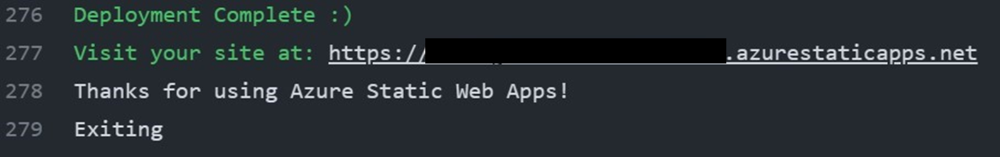

Congratulations! Your app is ready and it runs correctly on your local machine. In this last exercise you'll deploy the latest version of your app on the Cloud, to make it accessible to other users on different devices, through their web browsers. You'll use Azure Static Web Apps to deploy your app.

## Specification

In the first exercise, you built a GitHub workflow, connecting the GitHub repository hosting your code to the Azure static web app resource in your subscription. Now, to deploy your app changes on Azure, you'll push your code to the GitHub repository. You can use the built-in Git support in Visual Studio Code to do so.
But before that, you need to configure the authentication parameters to ensure the deployed app is able to call the Azure AI services correctly. You can add the Azure AI Vision and Azure OpenAI services key and endpoint to your GitHub repository as [secrets](https://docs.github.com/en/actions/security-guides/encrypted-secrets#using-encrypted-secrets-in-a-workflow).
Then, edit the GitHub workflow file (hosted in the '.github/workflows' folder of your solution) to enable your app to retrieve the authentication parameters from the GitHub Actions secrets and assign their values to the corresponding environment variables. Finally, push your code to the GitHub repository to trigger the workflow and deploy your app on Azure.

## Check your work

Navigate to your GitHub repository and click on the 'Actions' tab. You should be able to see the GitHub workflow launched by your latest commit running. When the workflow execution is completed, double check that it ended with a successful status and expand the 'Build and Deploy' job. You should see a log similar to the one below:

Click on the site link and test your app on the Cloud!

> [!TIP]
> Once you are done, remember to clean-up the Azure resources you created in this challenge, to avoid incurring in unexpected costs.
