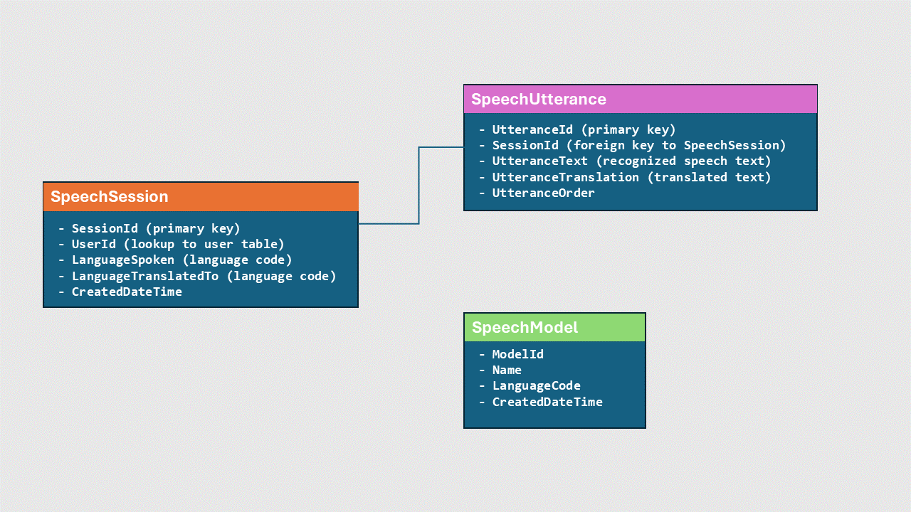

Your first activity will be to create a Dataverse table to store conversation history and details of the user. Giving the nature of the project, you only have to store the translated texts into the table and this doesn't require complex tables and relationship mapping. You'll validate your app against requirements to check your work.
Let's dive deeper into other tasks to be carried out.

## Specification
Create a Power Apps that meets the following basic functionalities and specifications:

- Create a custom table to capture the conversation. Here are some recommendations for storing the speech recognition and translation data in Dataverse tables:

Create a "SpeechSession" table to store metadata for each speech interaction:
Columns:
- SessionId (primary key)
- UserId (lookup to user table)
- LanguageSpoken (language code)
- LanguageTranslatedTo (language code)
- CreatedDateTime

Create a "SpeechUtterance" table to store each utterance in a session:
Columns:
- UtteranceId (primary key)
- SessionId (foreign key to SpeechSession)
- UtteranceText (recognized speech text)
- UtteranceTranslation (translated text)
- UtteranceOrder

Create a "SpeechModel" table to track Speech API model used:
Columns:
- ModelId
- Name
- LanguageCode
- CreatedDateTime

Use one-to-many relationship between SpeechSession and SpeechUtterance tables

> [!NOTE]
> SpeechSession can have a lookup to SpeechModel to track model used.
Maintain indexes on key columns like SessionId, UtteranceId for efficient querying
Optionally track user feedback per utterance to improve recognition accuracy.
> This model is a guide, if you have a better implementation for your tables, kindly go ahead.

This normalized structure allows efficient storage and querying of speech data. The session and utterance separation support scenarios like analysis across sessions, aggregations per session etc.

Back to more Specifications
- Create a Power Apps canvas app with input and output controls
- Microphone control for speech input
- Text label to display recognized text
- Dropdown to select target language
- Button to trigger translation
- Text label to display translated text
- Button to trigger text-to-speech
- Speaker control to play synthesized speech

## Check your work
To validate that you have completed working on the requirement for this first exercise, test your app behavior out by following these steps:
1. Run your App, Start a new translation
2. Press the Microphone control to record a speech (you should see the control working)
3. Use drop down to select translation language
4. Press the button to trigger text-to-speech (No action is expected from this button)

> [!NOTE]
> This part of the exercise is to work on the look and feel of your App. There is no integration to Microsoft Azure AI Services yet as you haven't setup your Azure Speech Recognition API.

After validating the results of this exercise, proceed to the next exercise in this challenge.
