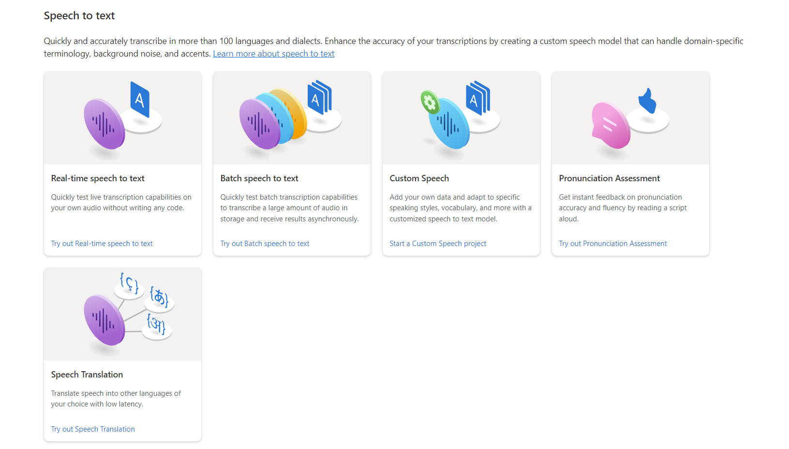

In the previous module, you created a simple Canvas App however, not all the features are working, for example, clicking on the Translate button didn't change anything because there's no service yet for speech recognition and translation. In this exercise, you're to set up Microsoft Azure AI Speech Service that will address this need.

## About Microsoft AI Service - Speech Service

The Speech service provides speech to text and text to speech capabilities with a Speech resource. You can transcribe speech to text with high accuracy, produce natural-sounding text to speech voices, translate spoken audio, and use speaker recognition during conversations.

 

The Microsoft Azure AI Service - Speech Service is the back-end engine that completes the solution we're building.

>[!Note]
>As of July 2023, Azure AI services encompass all of what were previously known as Cognitive Services and Azure Applied AI Services. There are no changes to pricing. The names Cognitive Services and Azure Applied AI continue to be used in Azure billing, cost analysis, price list, and price APIs. There are no breaking changes to application programming interfaces (APIs) or SDKs.

## Set up Microsoft Azure Speech Service
- Navigate to [Microsoft Azure portal](https://portal.azure.com) and create a `Speech Service`. Follow the prompt to set up the resources.
- Once done, you have access to your Keys, Locations/Regions, and Endpoints. You need these details before you can consume the service in Power Apps.

> [!NOTE]
> You need an Active Microsoft Azure subscription to carry out this exercise. If you are a student you can benefit from a [free Azure for students subscription](https://azure.microsoft.com/free/students/?WT.mc_id=academic-109170-ooyinbooke) with $100 in credit to spend on Azure services for 12 months. If you are not a student, you can still sign up for a [free Azure trial](https://azure.microsoft.com/free/?WT.mc_id=academic-109171-ooyinbooke) with $200 in credit to spend on Azure services for 30 days.

## Check your work

- To validate if this works, navigate to Power Apps, add `AzureBatchSpeech-to-text` to your data source and connect using the key and region details from the Microsoft Azure portal.

If added successfully, Congratulations! You're making incredible progress.

## Helpful Resources
If you need help with Azure AI Speech Service, kindly explore the resources here:
- [Microsoft AI Service - Speech Recognition ](/azure/ai-services/speech-service/overview?WT.mc_id=academic-109173-ooyinbooke)
- [Quickstart: Create a multi-service resource for Azure AI services](/azure/ai-services/multi-service-resource?WT.mc_id=academic-109174-ooyinbooke)
