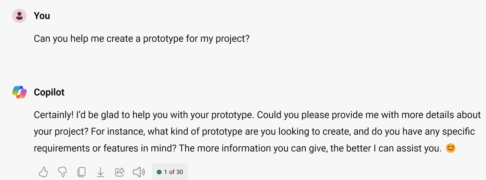

Imagine if you could use artificial intelligence to generate prototypes for your ideas. What if you could describe your idea in natural language, and let AI do the rest? The aim of this module is to assist you in creating your own prototype using Generative AI.

Whether you want to build a mobile app, a website, a game, or a physical device, today, you can use AI to help you generate a prototype that matches your description from natural language. Our goal is to enable creators to explore their ideas without being limited by their technical skills or resources, and to foster a culture of innovation and creativity.

By the end of this module, you learn how to use Bing Chat to guide you on how to create prototypes/ mock-ups of your solution and on implementing the project.

> [!NOTE]
> This is a **_challenge project_** module where you complete a project end-to-end based on a specification. This module is designed to be a test of your skills: there are few guidelines and no step-by-step instructions.

## Alternative tools

You need Bing Chat to do this exercise. It involves text and image generation. If you don't have Bing Chat, you can use other tools, but you may need to change some steps. Here are some places where you can find these tools:

- Bing Image Creator at [Bing Image Creator](https://www.bing.com/images/create?WT.mc_id=academic-114050-bethanycheum)
- ChatGPT at [OpenAI](http://openai.com/)
- Dalle-2 at OpenAI - [OpenAI](http://openai.com/)

You can use other platforms if you would like. However, the directions are intended for Bing Chat therefore, you might have to adapt a few things specifically when it comes to image creation.
