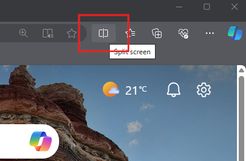

## Use 'Split Screen' to work side by side.

Put the Challenge project on one side and Bing chat on the other  to work simultaneously. We set up the two browser windows to work side by side throughout this challenge.

## Go to Bing Chat

Open Bing Chat in your personal profile [https://www.bing.com/new](https://www.bing.com/new).

Click  **Chat now.**

> [!NOTE]
> When you start a chat, do not refresh the page. Refreshing the page might result in your conversation being lost and as each step builds on the next, the history of the conversation is important. If you happen to refresh the page, you may need to start over again quickly by using the sample prompts.

## Set the conversation style

Set the conversation style to  **More Creative**

> [!NOTE]
> Setting the conversation style helps you define what type of output you will be getting. Creative mode encourages Bing to use more expressive language, use humour or emotion, and generate different types of content. Precise mode, on the other end, focuses on clarity and accuracy, while balanced looks to provide a balance between the two extremes.
