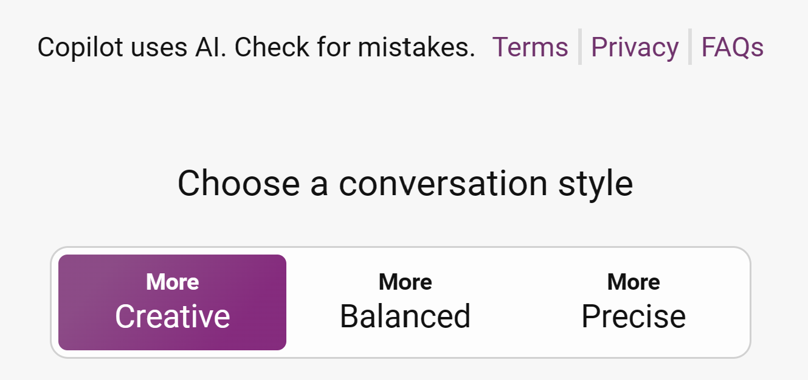

## Use 'Split Screen' to work side by side.

Put the Challenge project on one side and Microsoft Copilot on the other  to work simultaneously. We set up the two browser windows to work side by side throughout this challenge.

## Go to Microsoft Copilot

Open Microsoft Copilot in your personal profile [https://copilot.microsoft.com/](https://copilot.microsoft.com/).

> [!NOTE]
> In case you accidentally refresh the page after you start the conversation on Microsoft Copilot, your chat session will be saved and accessible from the Recents tab on the right side of your browser window. Microsoft Copilot becomes more effective when it retains and refers to the history of the conversation to provide context for better responses.

## Set the conversation style

Set the conversation style to  **More Creative**

> [!NOTE]
> Setting the conversation style helps you define what type of output you will be getting. Creative mode encourages Microsoft Copilot to use more expressive language, use humour or emotion, and generate different types of content. Precise mode, on the other end, focuses on clarity and accuracy, while balanced looks to provide a balance between the two extremes.
