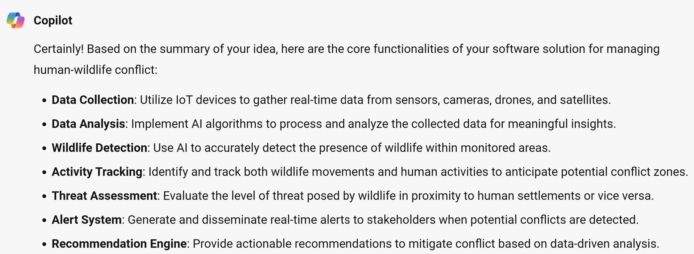
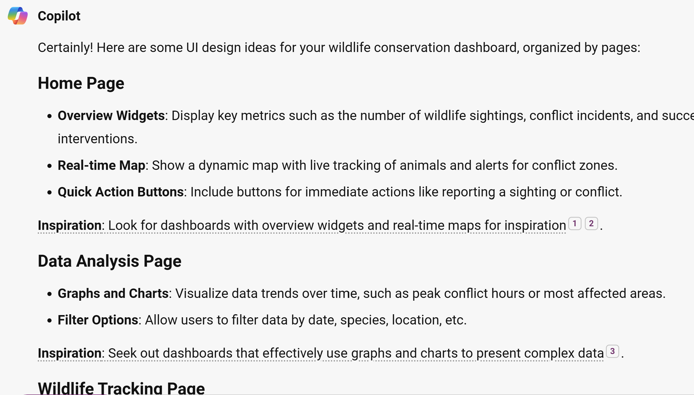
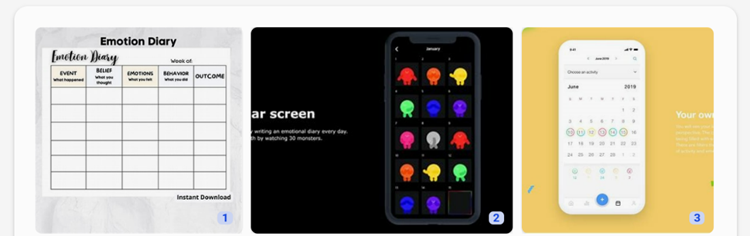

Now that you have completed your brainstorming/ ideation and with Bing Chat in the first challenge project, we will now use it to guide us in generating a prototype.

## Identify the core functionalities of your software

### Steps

1. Copy the sample prompt provided below and edit it to add your refined idea 1-paragraph summary from unit 4 of the previous challenge.
1. Paste it into Bing Chat.

### Sample prompt

```text
Hey Bing, here is a paragraph summary of my idea that I want to create a prototype for then implement/ start building. Can you help me break down the core functionalities of my software solution (app/ website/ dashboard). Suggest this in short bullet points.

Human-wildlife conflict is a serious and growing problem that affects both wildlife conservation and human development. Current solutions are often inadequate, expensive, or unsustainable. They also lack real-time data that can enable proactive and preventive actions. Our solution is to use IoT and AI to create a smart system that can monitor, predict, and prevent human-wildlife conflict. The system can collect and analyze data from various devices, such as sensors, cameras, drones, and satellites. The system can then use AI to detect, identify, and track wildlife and human activities and threats. The system can also use AI to provide alerts, recommendations, or interventions to the relevant stakeholders, such as wildlife managers, farmers, or rangers. Our solution is unique and competitive because it uses IoT and AI to provide a comprehensive and adaptive solution that can address the diverse and dynamic challenges of human-wildlife coexistence. It is also scalable and customizable to different contexts and needs. Our solution has the potential to improve the conservation and welfare of wildlife species, as well as the livelihoods and security of people living with wildlife.
```

### Sample response



## Generate UI ideas for your project

### Steps to generate UI ideas

1. Copy the sample prompt provided below and make any edits you want
2. Paste it into Bing chat

### Sample prompt for UI ideas

```text
Can you suggest some UI ideas that easily provide these core functionalities for the users? If the dashboard needs to be multi-page, you can separate the features for the respective pages. Please include links UI designs with similar examples for additional inspiration
```

### Sample response for UI ideas



> [!NOTE]
> Bing chat will provide some links to the UI samples to inspire.


## Sketch your UI from the examples recommended by Bing Chat

Grab your pen and paper and try to sketch your UI.

> [!NOTE]
> With your users in mind, take some time to sketch the different pages of your solution whether a website, web app, dashboard and remember to consider using responsive designs.

### [Optional] Share your mock-up with Bing Chat for more visual inspiration




## Next steps

Bing Chat provided us with valuable insights and inspiration for creating our mock-up and prototype. We were able to leverage the tools and visual resources provided by Bing Chat to develop our ideas and refine our vision. With this solid foundation, we are now ready to move forward with the next phase of our project and begin building.
