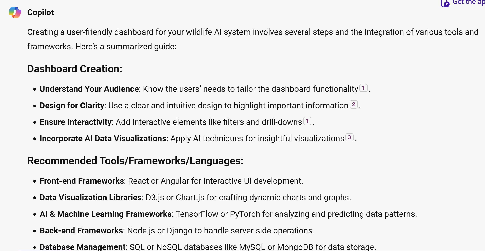

We created our protype, which enables us to visualize how our project would look like as well as the tools we would need to bring it to life. In this section, we cover how we can narrow down on the key features for our product and build a Minimal Viable Product. A Minimal Viable Product (MVP) is the simplest version of your product your users can use.

An MVP is a tangible product that you can use to test and validate your prototype with customers.

## Step 1: Use Bing Chat to narrow down your product features

In this step, we will ask Bing Chat to suggest some features we can build for our product.

### Steps

1. Copy the sample prompt provided below and make any edits you want
2. Paste it into Bing chat

### Sample Prompt

_Hey Bing, from what I have shared so far about my idea, I now want to implement and start building. Can you help me narrow down the main features my product should have?_

### Sample Response

_Hello, this is Bing. I'm happy to hear that you want to implement and start building your idea. I can help you narrow down the main features your product should have. Based on what you have shared so far about your idea, here are some possible main features:_

_A feature that allows the user to register and manage their devices, such as sensors, cameras, drones, and satellites. The user should be able to add, edit, delete, and configure their devices according to their needs and preferences._

_A feature that enables the user to view and monitor the data collected from their devices, such as the location, status, battery level, and signal strength of each device. The user should also be able to access the live or recorded video or audio feed from their cameras or drones._

_A feature that leverages AI to analyze and process the data from the devices, such as detecting, identifying, and tracking wildlife and human activities and threats. The feature should also use AI to generate insights and predictions based on the data, such as the behavior, movement, and population of wildlife and the risk, impact, and trend of human-wildlife conflict._

_A feature that utilizes AI to provide alerts, recommendations, or interventions to the user based on the data and insights. The feature should also allow the user to customize the type, frequency, and mode of the alerts, recommendations, or interventions. For example, the user can choose to receive a text message, a phone call, or a push notification when an alert is triggered. The user can also choose to accept, reject, or modify a recommendation or an intervention._

_A feature that enables the user to generate and download reports based on the data and insights. The feature should also allow the user to select the time period, the format, and the content of the reports. For example, the user can choose to generate a weekly, monthly, or yearly report in PDF, Excel, or PowerPoint format. The user can also choose to include the summary, the details, or the graphs of the data and insights._

_I hope these main features help you with your implementation and building. If you need more assistance, please let me know. 😊_

But before we focus on each feature separately, let us ask Bing chat to help identify the tools and services we will need to put this together.

### Sample Prompt on tools/services for our project

_Thanks for the help so far. To successfully implement these features, which tools/ services will I need to get? Please use a list and respond in short bullet points and categorize the tools per feature/ functionality._

### Sample Response on tools/services for our project

_You're welcome. I'm glad to help you with your IoT and AI development. To successfully implement these features, you will need to get some tools and services that can help you with the following aspects:_

_- Hardware and software platforms: You will need to choose the appropriate hardware and software platforms for your IoT devices, such as Arduino, Raspberry Pi, or Tessel 2. These platforms provide the necessary components, such as microcontrollers, sensors, actuators, and connectivity modules, to build and program your IoT devices. You will also need to select the suitable IoT operating systems, such as Raspbian, Ubuntu Core, or FreeRTOS, to run your IoT devices. These operating systems provide the essential features, such as security, performance, and compatibility, to support your IoT applications._

_- Connectivity and integration: You will need to ensure that your IoT devices can communicate with each other and with other services, such as cloud platforms, databases, or web apps. You will need to use the appropriate IoT protocols, such as MQTT, CoAP, or HTTP, to enable data exchange between your IoT devices and services. You will also need to use the proper IoT platforms, such as AWS IoT, Azure IoT, or Google Cloud IoT, to manage, store, and process your IoT data. These platforms provide the necessary tools, such as device management, data visualization, and analytics, to facilitate your IoT development._

_- Analytics and machine learning: You will need to leverage the power of AI to analyze and process your IoT data, such as detecting, identifying, and tracking wildlife and human activities and threats. You will need to use the relevant AI tools and services, such as TensorFlow, PyTorch, or Azure Machine Learning, to build and deploy your machine learning models. These tools and services provide the necessary features, such as data preprocessing, model training, testing, and optimization, to enable your AI development._

## Step 2: Select a feature and flesh out more details on implementation

In this step, we select one of the features and brainstorm with Bing Chat how we can have it implemented and the tools we may need. This will start preparing us to understand the workload that is ahead of you to bring this idea to life.

Now let's focus on each feature/ functionality separately.

### Steps for a specific feature

1. Copy the sample prompt provided below and make any edits you want
2. Paste it into Bing chat

### Sample Prompt for a specific feature

_We are building a wildlife AI system. How can we create a dashboard for users to view and manage the data collected? In addition, suggest which tools/ frameworks/ languages we need to successfully build our application. Summarize the response in bullet points._

### Sample Response for a specific feature

_To create a dashboard for users to view and manage the data collected from your wildlife AI system, you can follow these steps:_

_Choose a suitable IoT platform that can handle the data collection, processing, visualization, and device management. [For example, you can use AWS IoT, Azure IoT, Google Cloud IoT, or ThingsBoard](https://bing.com/search?q=tools+and+frameworks+for+IoT+and+AI+development)[1](https://bing.com/search?q=tools+and+frameworks+for+IoT+and+AI+development)._

_Connect your IoT devices, such as sensors, cameras, drones, and satellites, to the IoT platform using the appropriate IoT protocols, such as MQTT, CoAP, or HTTP. [You can use tools like Arduino](https://bing.com/search?q=tools+and+frameworks+for+IoT+and+AI+development)[2](https://www.geeksforgeeks.org/top-iot-tools/)[, Kinoma](https://bing.com/search?q=tools+and+frameworks+for+IoT+and+AI+development)[2](https://www.geeksforgeeks.org/top-iot-tools/)[, or Mainspring](https://bing.com/search?q=tools+and+frameworks+for+IoT+and+AI+development)[2](https://www.geeksforgeeks.org/top-iot-tools/) to build and program your IoT devices..._

Bing will give us an overview of the different tools we may need to ensure we successfully implement a product. We can ask Bing for ideas on how we can use this in the project as follows:

> [!NOTE]
>If you're a student, you can have 100USD free Azure credits to use it in your technology. Learn more about it, [here](aka.ms/azure/students/free).
> If you're new to azure, you can sign in and try azure for 30-days, register [here](aka.ms/azure/free)

Repeat step 2 for each feature until you have a clear understanding of how you can build the final product.

## Step 4: Now to the exciting part: Building our MVP.

You now have a proper guide to the technical requirements to implement your project. Next step is for you (and your team) to start building. Bing chat has helped us identify tools that you would need to install, so a good flow of events from here would be:

1. Review your sketch designs to ensure that you are clear on what you are building
2. Set up your local or virtual developer environment such as [GitHub Codespaces](https://github.com/features/codespaces) to begin the project

### [Optional] Keep working with Bing chat

Here are some additional ways in you can keep using bang chat throughout your project development cycle. Be creative on how you engage the tool to guide your development or unblock you if you get stuck.

#### Example: Ask help on how to build specific components and on libraries to use

Note: Explore asking Bing chat for some code samples too

#### Sample Prompt on different components/libraries

_Can you guide me on how to create the calendar of emotions on react native?_

#### Sample Response on different components/libraries

As a student you have free access to [GitHub Copilot](https://education.github.com/pack), that will be your coding buddy as you bring your MVP to life. You can use GitHub Copilot on various IDEs including Visual Studio, JetBrains, Neovim and Visual Studio Code.

But before you leave to create your awesome project, finish this module to identify more opportunities for you to share your project globally in a global student competition and access founders' programs for additional support to launch your very own startup.

## Step 5: Free deployment services to share your project with others

The purpose of building an MVP is to ensure that you can be able to test and validate your ideas. In addition, it gives you an opportunity to finally put your product to potential customers. We can ask Bing to give us ideas of how we can deploy our product, for example:

### Sample Prompt on deployment

_Part of my solution is a website, and I am also thinking of building my company website. As a student, how can I deploy websites using Microsoft services or free tools to avail this to my users?_

### Sample Response on deployment

_I can help you with some options on how to deploy it to final users using Microsoft services or free tools. Here are some possible ways:_

_- You can use Azure Static Web Apps to host your website for free on the Azure cloud platform. Azure Static Web Apps is a service that automatically builds and deploys full stack web apps from a GitHub repository. You can use it to host static web content, such as HTML, CSS, JavaScript, and images, as well as dynamic serverless APIs, such as Azure Functions. You can also use it to enable authentication, authorization, custom domains, and continuous delivery. To use Azure Static Web Apps, you will need a GitHub account, a GitHub repository with your website code, and an Azure account. You can follow this tutorial1 to learn how to host your website on Azure Static Web Apps for free._

_- You can use Web Deploy to publish your website to an Azure App Service. Web Deploy is a tool that simplifies the migration, management, and deployment of web applications and websites. You can use it to package and deploy your website from Visual Studio or the command line. You can also use it to synchronize your website across multiple servers or environments. To use Web Deploy, you will need an Azure account, an Azure App Service plan, and a web app resource. You can follow this tutorial2 to learn how to publish your website to Azure App Service with Web Deploy._

_- You can use GitHub Pages to host your website for free on GitHub. GitHub Pages is a service that allows you to create and publish websites directly from your GitHub repository. You can use it to host static web content, such as HTML, CSS, JavaScript, and images, as well as dynamic content generated by Jekyll, a static site generator. You can also use it to enable custom domains, HTTPS, and themes. To use GitHub Pages, you will need a GitHub account, a GitHub repository with your website code, and a GitHub Pages site. You can follow this tutorial3 to learn how to host your website on GitHub Pages for free._

_I hope these options help you with your deployment. If you need more assistance, please let me know._

## Next Steps

Whether you are building a website, an application or an API there are various tools you can utilize to deploy your solution, be sure to modify the prompt to match your needs. Some additional resources you can use to deploy your solution are:

- [Deploy your company website on Azure using Azure Static Web Apps](https://learn.microsoft.com/en-us/training/paths/azure-static-web-apps/)
- [Deploy your web application with Azure using Azure Web Apps](https://learn.microsoft.com/en-us/training/paths/deploy-a-website-with-azure-app-service/)
- [Publish your API on Azure](https://learn.microsoft.com/en-us/azure/api-management/import-and-publish)
- [Configure a virtual dev environment for all your software engineers – GitHub Codespaces.](https://github.com/features/codespaces)
- [Build a database for your application on Azure.](https://learn.microsoft.com/en-us/azure/developer/javascript/database-developer-guide?tabs=MySQL%2Cazure-cli)
