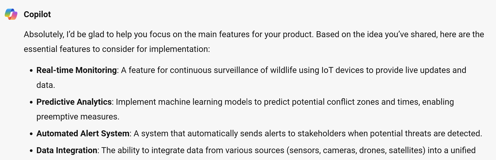
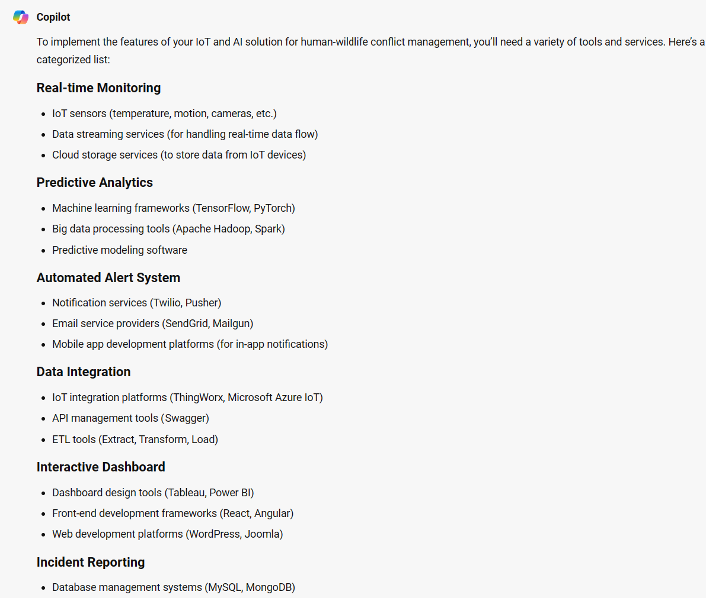

We created our prototype, which enables us to visualize how our project would look like and the tools we would need to bring it to life. In this section, we cover how we can narrow down on the key features for our product and build a Minimum Viable Product. A Minimum Viable Product (MVP) is the simplest version of your product your users can use.

An MVP is a tangible product that you can use to test and validate your prototype with customers.

## Step 1: Use Microsoft Copilot to narrow down your product features

In the first step, we ask Microsoft Copilot to suggest some features we can build for our product.

### Steps

1. Copy the sample prompt provided and make any edits you want
2. Paste it into Microsoft Copilot

**Sample prompt**

```text
Hey Microsoft Copilot, from what I have shared so far about my idea, I now want to implement and start building. Can you help me narrow down the main features my product should have?
```

**Sample response**



But before we focus on each feature separately, let us ask Microsoft Copilot to help identify the tools and services we need to put our project together.

**Sample prompt on tools/services for our project**

```text
Thanks for the help so far. To successfully implement these features, which tools/ services will I need to get? Please use a list and respond in short bullet points and categorize the tools per feature/ functionality.
```

**Sample response on tools/services for our project**



## Step 2: Select a feature and flesh out more details on implementation

In the second step, we select one of the features and brainstorm with Microsoft Copilot how to implement and the tools we may need. The output prepares us to understand the workload that is ahead of you to bring our idea to life.

Now let's focus on each feature/ functionality separately.

### Steps for a specific feature

1. Copy the sample prompt provided and make any edits you want
2. Paste it into Microsoft Copilot

**Sample prompt for a specific feature**

```text
We are building a wildlife AI system. How can we create a dashboard for users to view and manage the data collected? In addition, suggest which tools/ frameworks/ languages we need to successfully build our application. Summarize the response in bullet points.
```

**Sample response for a specific feature**


Microsoft Copilot gives us an overview of the different tools we may need to ensure we successfully implement a product.

> [!NOTE]
>If you're a student, you can have 100USD free Azure credits to use it in your technology. Learn more about it, [at Azure for Studens](https://azure.microsoft.com/free/students/?WT.mc_id=academic-114050-bethanycheum).
> If you're new to azure, you can sign in and try azure for 30-days, register [at Azure free account](https://azure.microsoft.com/free/?WT.mc_id=academic-114050-bethanycheum)

Repeat step 2 for each feature until you have a clear understanding of how you can build the final product.

## Step 3: Now to the exciting part: Building our MVP

You now have a proper guide to the technical requirements to implement your project. Next step is for you (and your team) to start building. Microsoft Copilot helps us identify tools that you would need to install, so a good flow of events from here would be:

1. Review your sketch designs to ensure that you're clear on what you're building
2. Set up your local or virtual developer environment such as [GitHub Codespaces](https://github.com/features/codespaces?WT.mc_id=academic-114050-bethanycheum) to begin the project

### [Optional] Keep working with Microsoft Copilot

Here are some more ways in you can keep using Microsoft Copilot throughout your project development cycle. Be creative on how you engage the tool to guide your development or unblock you if you get stuck.

#### Example: Ask help on how to build specific components and on libraries to use

Explore asking Microsoft Copilot for some code samples too.

**Sample prompt on different components/libraries**

```text
Can you guide me on how to create the calendar of emotions on react native?
```

**Sample response on different components/libraries**


As a student you have free access to [GitHub Copilot](https://education.github.com/pack?WT.mc_id=academic-114050-bethanycheum) your AI-powered coding buddy as you bring your MVP to life. You can use GitHub Copilot on various IDEs including Visual Studio, JetBrains, Neovim and Visual Studio Code.

But before you leave to create your awesome project, finish this module to identify more opportunities for you to share your project globally in a global student competition and access founders' programs for more support to launch your own startup.

## Step 4: Free deployment services to share your project with others

The purpose of building an MVP is to ensure that you can be able to test and validate your ideas. In addition, it gives you an opportunity to finally put your product to potential customers. We can ask Microsoft Copilot to give us ideas of how we can deploy our product, for example:

**Sample prompt on deployment**

```text
Part of my solution is a website, and I am also thinking of building my company website. As a student, how can I deploy websites using Microsoft services or free tools to avail this to my users?
```

The response from Microsoft Copilot gives ideas on different tools and services to deploy the project.

## Next steps

Whether you're building a website, an application or an API there are various tools you can utilize to deploy your solution, be sure to modify the prompt to match your needs. Some more resources you can use to deploy your solution are:

- [Deploy your company website on Azure using Azure Static Web Apps](https://learn.microsoft.com/training/paths/azure-static-web-apps/?WT.mc_id=academic-114050-bethanycheum)
- [Deploy your web application with Azure using Azure Web Apps](https://learn.microsoft.com/training/paths/deploy-a-website-with-azure-app-service/?WT.mc_id=academic-114050-bethanycheum)
- [Publish your API on Azure](https://learn.microsoft.com/azure/api-management/import-and-publish?WT.mc_id=academic-114050-bethanycheum)
- [Configure a virtual dev environment for all your software engineers – GitHub Codespaces.](https://github.com/features/codespaces?WT.mc_id=academic-114050-bethanycheum)
- [Build a database for your application on Azure.](https://learn.microsoft.com/azure/developer/javascript/database-developer-guide?tabs=MySQL%2Cazure-cli?WT.mc_id=academic-114050-bethanycheum)
