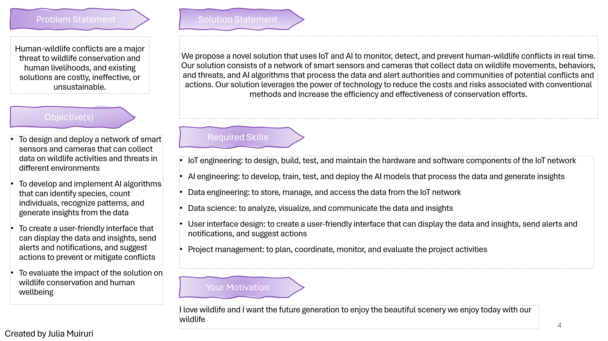

## How to Use Ideation to Solve Problems and Challenges
Ideation is a Design Thinking stage that aims to produce ideas that are innovative, practical, and, most importantly, solves a problem among a defined user audience. These ideas in turn inspire the design of new or better solutions/projects/products. The goal is to not only have a solution at the end of this challenge, but it is to think beyond obvious solutions by exploring areas of innovation to increase the innovative potential of your idea.

The exercises in this module mark the beginning of an exciting journey as you step into a new role of an **Innovator/Problem Solver**. You will take on the challenge of identifying problems and creating new products or services that can help solve these issues.

But you won't do this alone. **Co-create this vision with AI**, and together you will go through an ideation session to explore diverse possibilities and idea generation.

## Ideation in the Era of AI

While we acknowledge that we are in the Era of Artificial Intelligence, we have structured this challenge in a way that will help you explore any and every possibility of coming up with AI-optimized ideas that will offer an AI-Experience for users.

The goal of this module is to create a PowerPoint Slide to communicate your idea, co-created with AI. Use the slide template that has been provided to you, and with each step of the challenge, you will fill a respective part on the Deck to finish your Deck for your idea.

## The Deck

Our Deck contains the following items:
- **Problem Statement:** The summary of the problem you are trying to solve.
- **Solution Statement:** How would you solve the problem described in your statement. What would the solution need to do and technologies necessary to make it a reality.
- **Objective(s):** What would be the objectives for your idea to fullfill the Solution Statement and steps to make it a success.
- **Required Skills:** What skills are needed for the team to create the solution?
- **Motivation:** What inner motives do you have to create this? Are you passionate about it?

See an example of a finished ideation project below:

