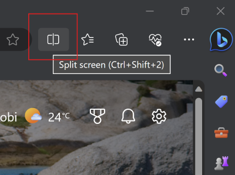
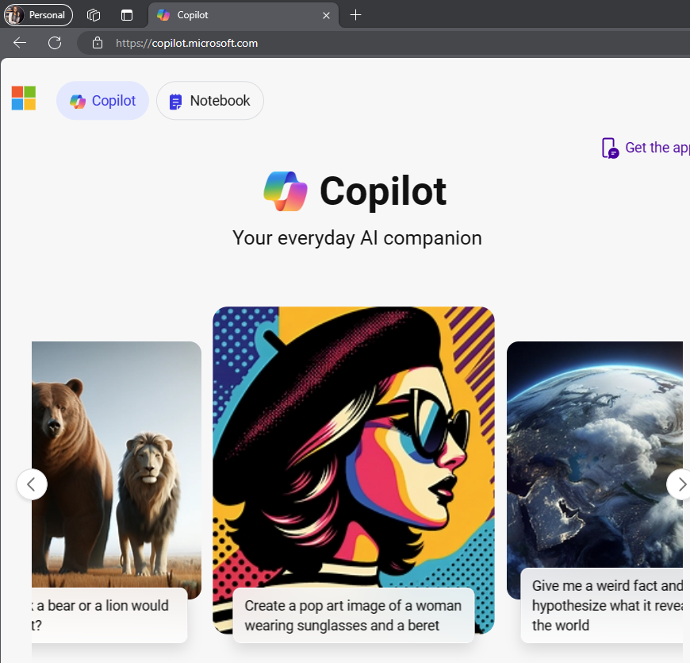
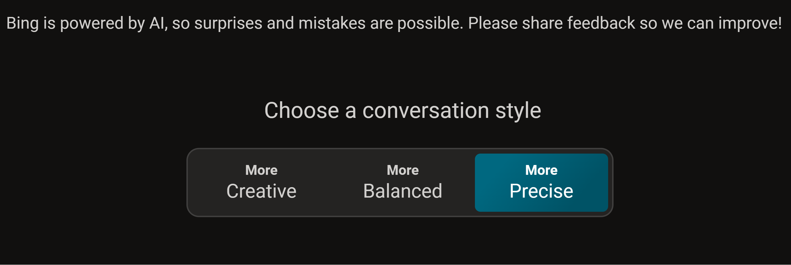
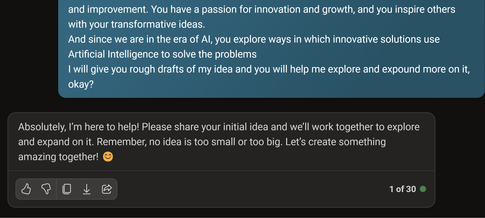
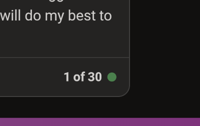

Let's get started with Microsoft Copilot.

> [!NOTE]
> These instructions are customized for those using **Microsoft Copilot with their personal account**

Check that you're using your personal profile in Microsoft Edge or that you're logged in with your personal account. You can create a Personal Microsoft Edge Profile by  [following these steps](https://support.microsoft.com/en-us/topic/sign-in-and-create-multiple-profiles-in-microsoft-edge-df94e622-2061-49ae-ad1d-6f0e43ce6435#:~:text=1%20Create%20multiple%20profiles.%202%20Select%20Profile%2C%20then,The%20additional%20profiles%20are%20now%20available%20for%20selection?WT.mc_id=academic-114397-pablolopes) and associating your personal account to it.

## Use 'Split Screen' to work side by side.

We'll set up the two browser windows to work side by side throughout this challenge. Put the Challenge project on one side and Microsoft Copilot on the other one.



## Go to Microsoft Copilot

Open Microsoft Copilot in your personal profile https://copilot.microsoft.com/.



> [!NOTE]
> In case you accidentally refresh the page after you start the conversation on Microsoft Copilot, your chat session will be saved and accessible from the Recents tab on the right side of your browser window. Microsoft Copilot becomes more effective when it retains and refers to the history of the conversation to provide context for better responses.

## Set the Conversation Style

Set the conversation style to **More Precise**

> [!NOTE]
> Setting the conversation style helps you define what type of output you'll be getting. Creative mode encourages Microsoft Copilot to use more expressive language, use humour or emotion, and generate different types of content. Precise mode, on the other end, focuses on clarity and accuracy, while balanced looks to provide a balance between the two extremes.



## Utilize the Role Setting Technique

In the introduction unit, you got the instructions that for this challenge, step into the role of an **Innovator/ Problem solver**, and hopefully as you're getting to this point, you're seeing yourself in the actual position of an innovator.

 Do the same to Microsoft Copilot by giving it the role you want it to play. By utilizing the role setting technique, you give more context to the conversation, and it identifies the role's identity and general characteristics.

### Steps
1. Copy the sample prompt provided and make any edits you want.
2. Paste it into Microsoft Copilot

_**Sample Prompt**_

```
Imagine you're an innovator and a problem solver. Your goal is to identify and research real world problems and brainstorm on innovative solutions that will solve the problem. 
You craft compelling ideas that will result in innovative designs for solutions and products that address these real world problems. 
You're not afraid to experiment and learn from failure, and you constantly seek feedback and improvement. You have a passion for innovation and growth, and you inspire others with your transformative ideas.
And since we are in the era of AI, you explore ways in which innovative solutions use Artificial Intelligence to solve the problems 
I will give you rough drafts of my idea and you will help me explore and expound more on it, okay?
```

_**Sample Response**_

See a sample response from Microsoft Copilot.



## Note on Conversation Limits
If you are on Microsoft Copilot with your personal profile in Microsoft Edge, you should have **30 conversation turns**. A conversation turn is a response from Microsoft Copilot, so basically this means that you get up to 30 responses in one conversation session. This tutorial takes around 24 conversation turns, leaving you with a few to explore as we go along. You can confirm how many turns you have remaining by looking at your last conversation response, as shown below. If you see a lower number (like 10), make sure you log into the Microsoft Edge Browser with your personal profile.


