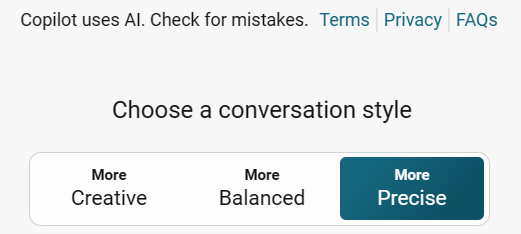
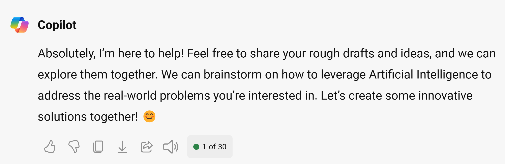
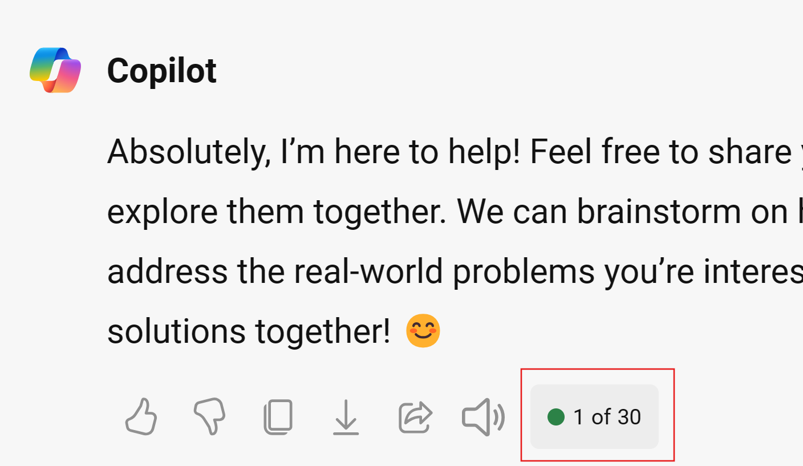

Let's get started with Bing Chat.

> [!NOTE]
> These instructions are customized for those using **Bing Chat with their personal account**

Check that you're using your personal profile in Microsoft Edge or that you're logged in with your personal account. You can create a Personal Microsoft Edge Profile by  [following these steps](https://support.microsoft.com/en-us/topic/sign-in-and-create-multiple-profiles-in-microsoft-edge-df94e622-2061-49ae-ad1d-6f0e43ce6435#:~:text=1%20Create%20multiple%20profiles.%202%20Select%20Profile%2C%20then,The%20additional%20profiles%20are%20now%20available%20for%20selection?WT.mc_id=academic-114397-pablolopes) and associating your personal account to it.

## Use 'Split Screen' to work side by side.

We'll set up the two browser windows to work side by side throughout this challenge. Put the Challenge project on one side and bing chat on the other one.


## Go to Bing Chat

Open Bing Chat in your personal profile https://www.bing.com/new.


Click **Chat now**.

> [!NOTE]
> When you start a chat, do not refresh the page. Refreshing the page might result in your conversation being lost and as each step builds on the next, the history of the conversation is important. If you happen to refresh the page, you may need to start over again quickly by using the sample prompts.

## Set the Conversation Style

Set the conversation style to **More Precise**

> [!NOTE]
> Setting the conversation style helps you define what type of output you'll be getting. Creative mode encourages Bing to use more expressive language, use humour or emotion, and generate different types of content. Precise mode, on the other end, focuses on clarity and accuracy, while balanced looks to provide a balance between the two extremes.



## Utilize the Role Setting Technique

In the introduction unit, you got the instructions that for this challenge, step into the role of an **Innovator/ Problem solver**, and hopefully as you're getting to this point, you're seeing yourself in the actual position of an innovator.

 Do the same to Bing chat by giving it the role you want it to play. By utilizing the role setting technique, you give more context to the conversation, and it identifies the role's identity and general characteristics.

### Steps
1. Copy the sample prompt provided and make any edits you want.
2. Paste it into Bing Chat

_**Sample Prompt**_

```
Imagine you're an innovator and a problem solver. Your goal is to identify and research real world problems and brainstorm on innovative solutions that will solve the problem. 
You craft compelling ideas that will result in innovative designs for solutions and products that address these real world problems. 
You're not afraid to experiment and learn from failure, and you constantly seek feedback and improvement. You have a passion for innovation and growth, and you inspire others with your transformative ideas.
And since we are in the era of AI, you explore ways in which innovative solutions use Artificial Intelligence to solve the problems 
I will give you rough drafts of my idea and you will help me explore and expound more on it, okay?
```

_**Sample Response**_

See a sample response from Bing Chat.



## Note on Conversation Limits
If you're on Bing Chat with your personal profile in Edge, you should have **30 conversation turns**. This tutorial takes around 24 conversation turns, leaving you with a few to explore as we go along. You can identify how many turns you have by looking at your last conversation response, as shown. If you see a lower number (like five), make sure you log into the Edge Browser with your personal profile.


