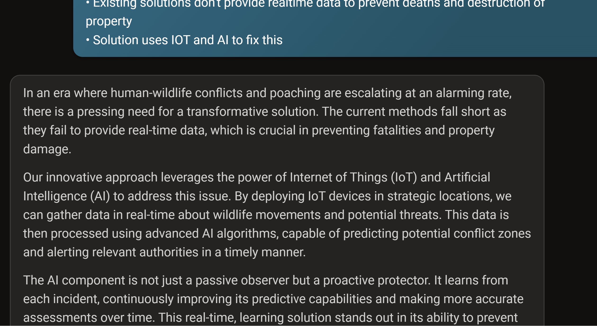
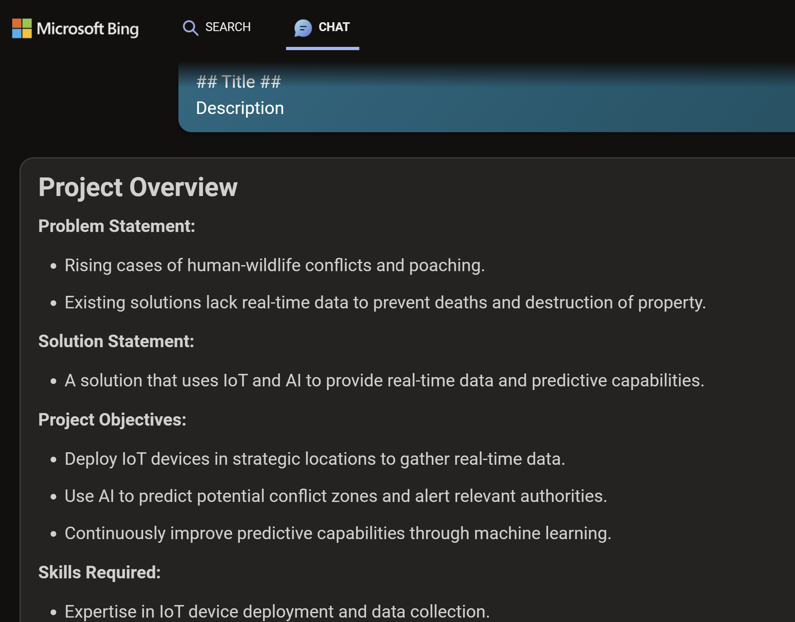

The previous step allowed you to think about a general idea that solves an identified problem that is close to you. This step allows you to refine your idea by generating a better idea definition and bring it as close to practicality as possible.

## Introducing your Idea
Now, we need to introduce our idea to Microsoft Copilot. Let's provide some general bullet points and ask Microsoft Copilot to craft a better idea statement for us.

### Steps
1. Copy the sample prompt provided and add your rough idea in bullet points.
2. Paste it into Microsoft Copilot

_**Sample Prompt**_

```
I have an idea that I want to explicate for this ideation exercise as part of my project design thinking and I will provide some bullet points. Can you help me create a short  paragraph with a technical project pitch tone and embellish on details that really bring this idea to life. It should capture the following points. Do not give this idea a name. Focus on what makes this idea unique and competitive and emphasize more on the use of AI in the solution. We will brand and name it later. It should capture the following points. Do not give this business a name. Focus on what makes this business unique and competitive. We will brand and name this business later.
• Cases of human wildife conflicts and poaching are rising at an alarming rate
• Existing solutions don't provide realtime data to prevent deaths and destruction of property
• Solution uses IOT and AI to fix this
```

_**Sample Response**_

A sample response from Microsoft Copilot.



## Generate an Executive summary of your Idea
### Steps
1. Copy the sample prompt provided and make any edits you want.
2. Paste it into Microsoft Copilot

_**Sample Prompt**_

```
Let's review the project description we wrote and extract and summarize the following key parts of this project. Please summarize the main points of your response in short bullet points to fit in one slide
Problem statement
Solution statement
Bullet points of the project objectives
Bullet points of the skills required to build this project
Design a workflow architecture diagram of the technical implementation of this project
Can you format it like this:

## Title ##
Description
```

_**Sample Response**_

A sample response from Microsoft Copilot.



This should pull together all your written content for you. You can always revisit the chat, but you can summarize your work this way.

## Creating Your Final Output
We created a bunch of content. Now use the PowerPoint Slide template to bring all that content together.

### Steps
- Download the [PowerPoint template here](https://stdntpartners-my.sharepoint.com/:p:/g/personal/julia_muiruri_studentambassadors_com/EbeKzsf-qVJHpjWTCKCPlM4BEbDZMGbmyrWeyaX02TknAA?e=vlgaWJ?WT.mc_id=academic-114397-pablolopes)
- Open the PowerPoint template
- Insert your content in the deck
