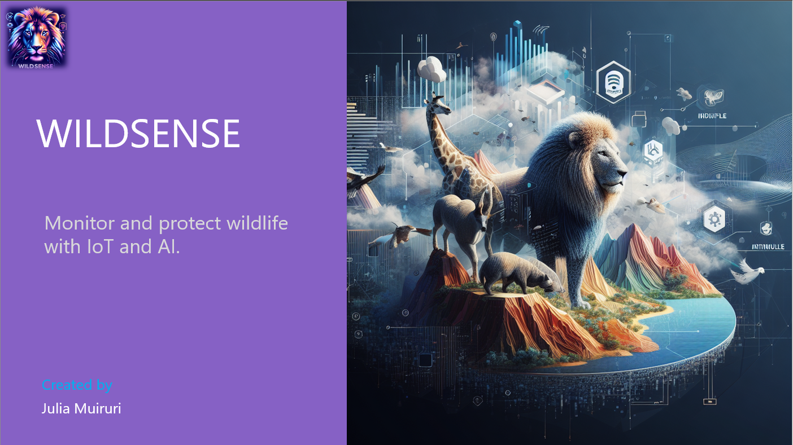

In the early stages of a startup, roles and responsibilities of the startup team often overlap, requiring individuals to put on multiple hats.

The exercises in this module mark the beginning of an exciting journey as you step into a new role of a **Chief Strategy Officer (CSO)** You take on the task of creating a Business Strategy/ Model using the Business Model Canvas Template guide.

But you won't do it alone. **Co-create this vision with AI**, and together you'll ideate, research, and brand to kick start your startup and set it up for success.

Put on your learning gear and join this challenge where you are **creating a Business Model for your very own Startup**. We invite you to bring your curiosity and creativity to use Generative AI capabilities to build a Business Model for your Startup.

**Your goal** is to create a PowerPoint Deck/ Video that communicates your business strategy with AI generated content. A Deck template is provided to you, and with each step of the challenge, you fill a respective slide on the Deck to accelerate your output.

> [!NOTE]
> In this challenge project, you will use Microsoft Copilot to create a Business Model for your existing startup or a fictitious startup.

## Alternative Tools

You need Microsoft Copilot to do this exercise. It involves text and image generation. If you don’t have Microsoft Copilot, you can use other tools, but you might need to change some steps. Here are some places where you can find these tools:

- Microsoft Designer at <https://designer.microsoft.com/>
- ChatGPT at <http://openai.com>
- Dalle-2 at OpenAI - <http://openai.com>

You can use other platforms if you would like, just note that the directions are intended for Microsoft Copilot so you might have to adapt a few things specifically when it comes to image creation.
