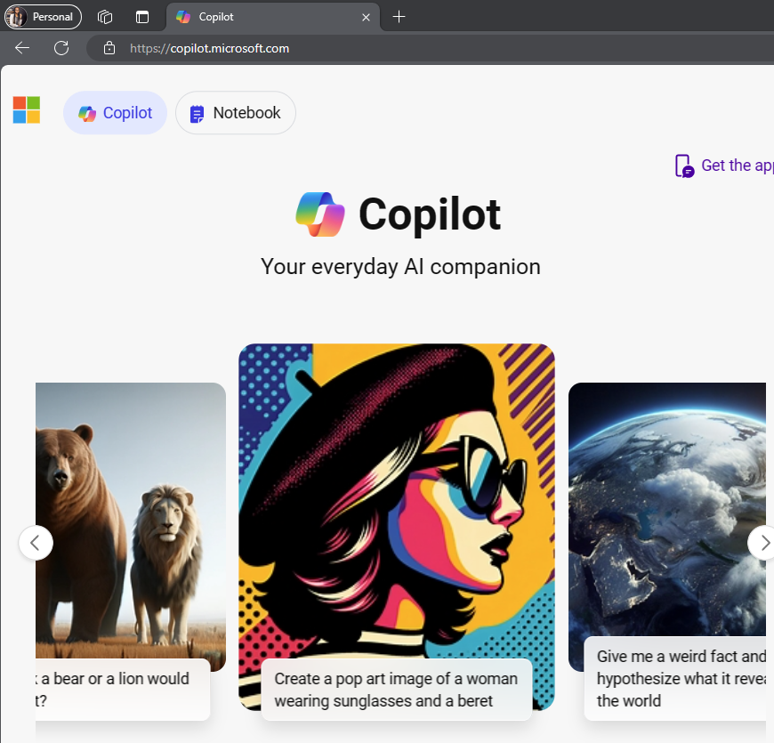
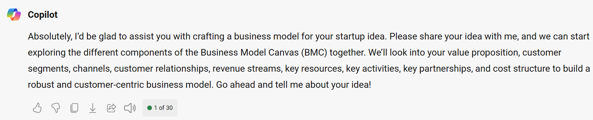

Let's get started with Microsoft Copilot.

> [!NOTE]
> These instructions are customized for those using Microsoft Copilot with their personal account

Check that you're using your personal profile in Microsoft Edge or that you're logged in with your personal account. You can create a Personal Microsoft Edge Profile by [following these steps](https://support.microsoft.com/en-us/topic/sign-in-and-create-multiple-profiles-in-microsoft-edge-df94e622-2061-49ae-ad1d-6f0e43ce6435#:~:text=1%20Create%20multiple%20profiles.%202%20Select%20Profile%2C%20then,The%20additional%20profiles%20are%20now%20available%20for%20selection) and associating your personal account to it.

## Use 'Split Screen' to work side by side

We'll set up the two browser windows to work side by side throughout this challenge. Put the Challenge project on one side and Microsoft Copilot on the other one.


## Go to Microsoft Copilot

Open Microsoft Copilot in your personal profile <https://copilot.microsoft.com/>.



> [!NOTE]
> In case you accidentally refresh the page after you start the conversation on Microsoft Copilot, your chat session will be saved and accessible from the _Recents_ tab on the right side of your browser window. Microsoft Copilot becomes more effective when it retains and refers to the history of the conversation to provide context for better responses.


## Set the Conversation Style

Set the conversation style to **More Creative**

> [!IMPORTANT]
> Setting the conversation style helps you define what type of output you will be getting. Creative mode encourages Microsoft Copilot to use more expressive language, use humour or emotion, and generate different types of content. Precise mode, on the other end, focuses on clarity and accuracy, while balanced looks to provide a balance between the two extremes.


## Utilize the Role Setting Technique

In the previous unit, you got the instructions that for this challenge, you wear the shoes of a Chief Strategy Officer (CSO). Hopefully, as you're getting to this point, you're seeing yourself in the actual position of a Strategy Officer.
You do the same to Microsoft Copilot by giving it the role you want it to play. By utilizing the role setting technique, you give more context to the conversation, and it identifies the role's identity and general characteristics.

### Steps

1. Copy the sample prompt provided below and make any edits you want
2. Paste it into Microsoft Copilot

**Sample Prompt**

```
Imagine you are the Chief Strategy Officer of your startup.
Your goal is to craft a flexible, scalable and customer-centric business model using the BMC that sets up your startup for success.
You start with an idea that solves a problem and creates an impact for your target market.
Then, you explore the key aspects of your business model, such as potential partners, resources, channels, customers, value propositions, cost structure, and revenue streams.
You aim to create a unique value proposition that differentiates your startup from the competition and satisfies your customers’ needs and wants.
You also pay attention to the details that make your customers happy and loyal.
You use your skills and knowledge to identify and evaluate the key assumptions and risks of your business model.
You also test and validate your ideas with real customers and data.
You constantly iterate and improve your business model to make it more sustainable, versatile, and promising.
I will give you my idea and you will help me create a business model for it, okay?
```

**Sample Response**

Below is a sample response from Microsoft Copilot.


## Note on Conversation Limits

If you are on Microsoft Copilot with your personal profile in Microsoft Edge, you should have **30 conversation turns**. A conversation turn is a response from Microsoft Copilot, so basically this means that you get up to 30 responses in one conversation session. This tutorial takes around 24 conversation turns, leaving you with a few to explore as we go along. You can confirm how many turns you have remaining by looking at your last conversation response, as shown below. If you see a lower number (like 10), make sure you log into the Microsoft Edge Browser with your personal profile.


