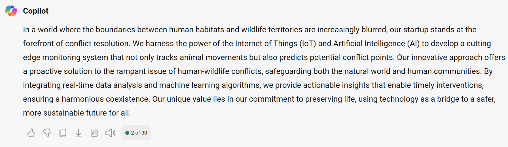

We need to introduce our idea to Microsoft Copilot. We'll provide some general bullet points. We'll ask Microsoft Copilot to craft a better idea statement for us.

## Steps

1. Copy the sample prompt provided below and **edit the bullet points to reflect your startup idea**
1. Paste it into Microsoft Copilot.

**Sample Prompt**

```
These bullet points roughly describe my idea.
• new business/ startup scenario
• solves rampant cases of human wildlife conflicts
• uses IoT and AI to monitor animal

Can you help me create a paragraph with a business pitch tone from my idea?
Do not give this startup a name. Focus on what makes this startup unique and competitive.
We will brand and name this startup later.
```

**Sample Response**

Below is a sample response from Microsoft Copilot.



We now want to design a logo for the company that reflects the startup's core business.

> [!NOTE]
> This tutorial uses Microsoft Copilot, logged as on your personal account so that we can use the image generation features of Microsoft Copilot for consumers. If you have chosen to use other AI tools, note that you will need to write your own image generation prompts.

As Microsoft Copilot remembers the context of the conversation, we can take the lazy way to have it create a logo from the description it already wrote. Ask Microsoft Copilot to create a logo for you.

*Note that if you're using another tool, you need to create a prompt to generate the image.*

### Steps

- Copy the sample prompt (if you're using Microsoft Copilot)
- Paste into Microsoft Copilot
- Pick a logo you like
- Download that logo

*If it can't generate a logo for you, you can go to Copilot designer or another online tool that can generate images from text.*

> [!NOTE]
> Be creative with this prompt to get the best and most creative logo for your startup.

**Sample Prompt**

```
Can you create a company logo that creatively describes my idea, unique, 3D rendering?
```

**Sample Response**

Sample logo created


*If it can't generate a logo for you, you can go to [Copilot designer](https://copilot.microsoft.com/images/create) or another online tool that can generate images from text.*

## Learnings and Extensions

Key takeaways from this unit:

- **Using Microsoft Copilot to expound on ideas:** We only specified a few bullet points, and it did the work to expand that.
- **Specifying tone:** We specified a _business pitch tone_ for the business summary paragraph.
- **Inclusion/ Exclusion:** We clearly outlined what we didn't want it to _(don't give this startup a name. We'll brand and name this startup later)_. Trying to give the clearest guided instructions by specifying what it should or shouldn't include.
- **Length or format of response:** Our output is a “paragraph”. Explore creating three sentences to see how it might change the output.
- **Contextual Directives:** You can direct Microsoft Copilot to do what you want based on context and previous information _(Can you create a logo that creatively describes my idea?)_ It understands the context from conversation making your conversation more valuable.
- **Creating images from context:** We had Microsoft Copilot create its own image prompt derived from the conversation context.

Explore providing a few links for it to reference to help you articulate what you are looking for. Augment your prompt with content.
