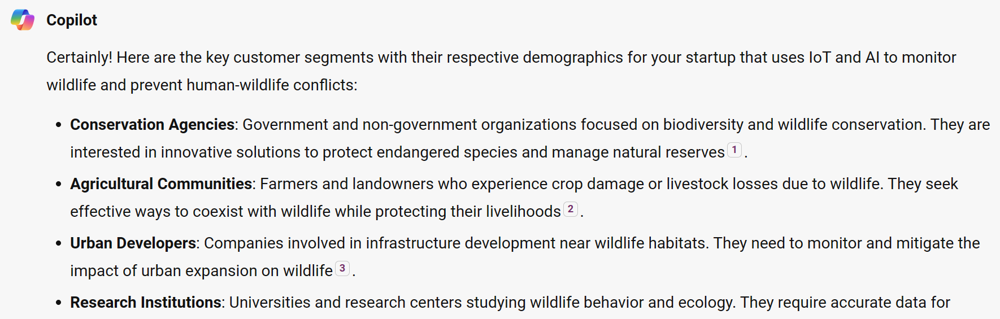
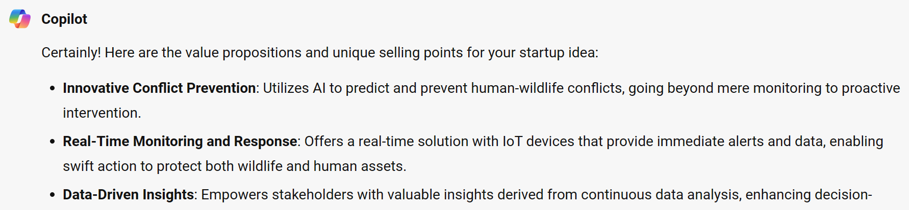
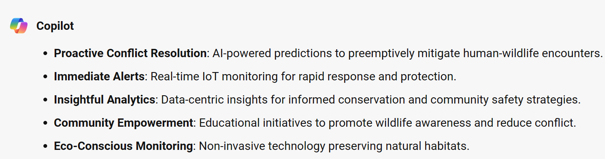
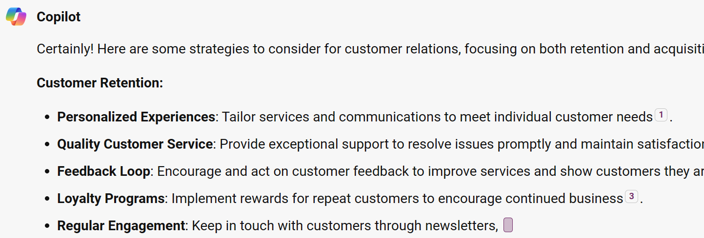

Before going straight to building a product, a key step for a startup is to identify which customers the company will try to serve through its products and services. Remember, you can't really have any startup/business without customers. With your idea in mind, think about the needs of your most important users and their attributes including demographics and categorization. Your most important customers could be:

- **A mass market**: Your product considered to serve a wide view of potential users with no specific attributes.
- **A niche market**: Your product is customized for uses with a specialized need and characteristics.
- **Segmented market**: Looking at an existing customer segment, your product is highly customized for a distinguished portion of the customer group.
- **Diverse market**: Your product serve multiple customers with different needs and characteristics.

> [!NOTE]
> Steps to add prompts:
>
> 1. Copy the sample prompt provided and make any edits you want.
> 1. Paste it into Microsoft Copilot.

## Let's get help defining our customers

**Sample Prompt**

```text
Can you help me identify who our key customers will be with their respective demographics?
The customers could belong to any market type. Please summarize your response in short bullet points.
```

**Sample Response**

Here's a sample response from Microsoft Copilot.



<!---
> [!NOTE]
> You can iterate and ask for more ideas. However, if using Microsoft Copilot, just note that it can only handle 30 conversation turns in a single session, and you don't want to start over a new and different conversation before you finish the challenge project!
-->

## What is your value proposition?

The value proposition comprises the set of offerings that your startup offers to meet the needs of your customers. This also defines your unique selling point and features that set your startup apart from your competitors.

**Sample Prompt**

```text
Can you help me think about the value propositions/unique selling points for this idea?
Please summarize the main points of your response in short bullet points.
```

**Sample Response**

Here's a sample response from Microsoft Copilot.



### Edit the Description

We need to rewrite this description in a business tone.

**Sample Prompt**

```text
Can you rewrite that description in a tone that suits a business pitch?
Please use short bullet point phrases of each value proposition.
```

**Sample Response**

Here'ss a sample response from Microsoft Copilot.



## Customer Relations

Having identified who your customers are, the next important thing would be to think about how you not only obtain more customers, but also retain them in the end. To build great relations with customers, think about strategies you enforce to get new customers to grow your user base, retain your existing customers and how your value proposition evolves to increase revenue from your current customers.

**Sample Prompt**

```text
Can you help me think about our customer relations?
Ideas on how to retain our existing customers and also get new customers for our startup.
Please summarize the main points of your response in short bullet points.
```

**Sample Response**

Here's a sample response from Microsoft Copilot.


