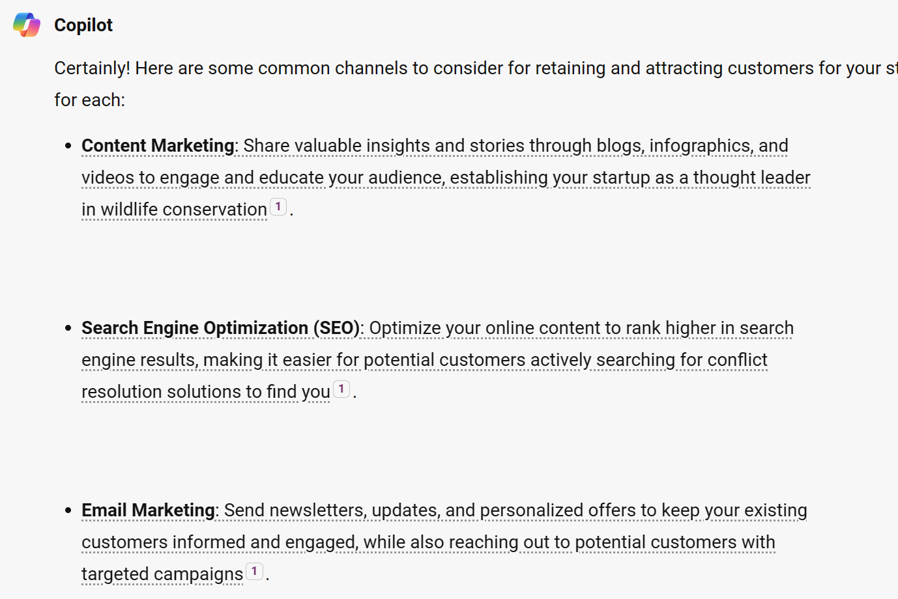
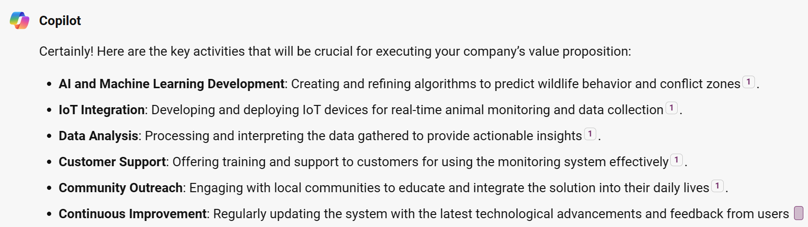
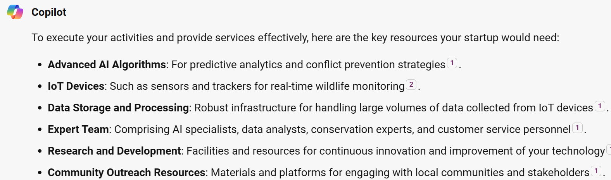
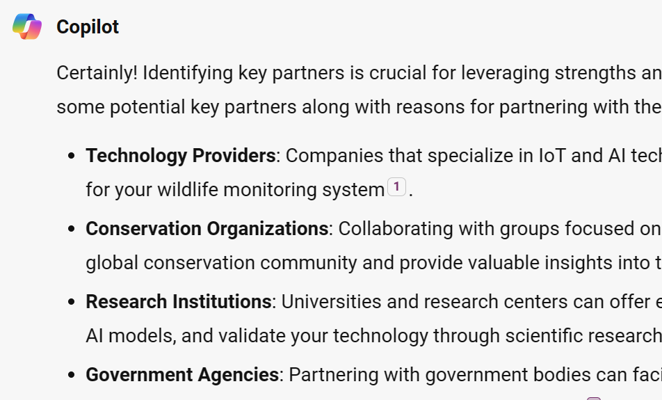

This step guides you through identifying how you reach your identified customers to create awareness of your unique value proposition and interact with them. 

To ensure a successful startup, you need to identify effective channels that will be fast, efficient and cost effective.

> [!NOTE]
> Steps to add prompts
>
> 1. Copy the sample prompt provided below **and make any edits you want**.
> 1. Paste it into Microsoft Copilot
>
## Key Channels
The main question to answer for this part of the business model is on what platforms are your potential customers located and what are the channels that you can use to reach them?

**Sample Prompt**

```
Can you now help me think of channels most common to this set of users to retain connection with our existing customers and also attract new customers for our startup, then mention a short justification for each channel.
Please summarize the main points of your response in short bullet points.
```

**Sample Response**

Below is a sample response from Microsoft Copilot.


## Key Activities

In this step, you start thinking about the practical actions that need to be undertaken in order for you deliver your value proposition to your customers. Use this section to list down and prioritize the important activities that need to be completed.

The activities you list here should directly lead to meeting customer needs and generating revenue for the startup.

**Sample Prompt**

```
Thanks! Can you help me think about our key activities that will be crucial to executing the company's value proposition to our customers.
Please summarize the main points of your response in short bullet points.
```

**Sample Response**

Below is a sample response from Microsoft Copilot.


## Key Resources

Now since you understand what you need to do to deliver to your customers, there are resources that are required to make it happen. These resources/ assets fall under different categories, which include: -

- Human resources
- Financial resources
- Intellectual resources
- Physical materials

**Sample Prompt**
```
Please help me think about and identify the key resources that we would need to execute our activities and provide our services to our customers.
Please summarize the main points of your response in short bullet points.
```

**Sample Response**

Below is a sample response from Microsoft Copilot.



## Key Partners

Launching a startup often has its own risks associated with it and innovators need to establish critical partnerships to help reduce these risks and work to optimize operations. This step guides you through thinking about key partnership opportunities and joining forces with business allies through strategic partnerships or joint ventures.

These partners provide a network that your startup could potentially use to reduce risks and uncertainties to your business model, costs, and streamline access to resources and capabilities that give you a competitive advantage.

**Sample Prompt**

```
Thanks! Can you help me think about our key partners that will be crucial to our success with a mention of why we should partner with them.
Please summarize the main points of your response in short bullet points.
```

**Sample Response**

Below is a sample response from Microsoft Copilot.

