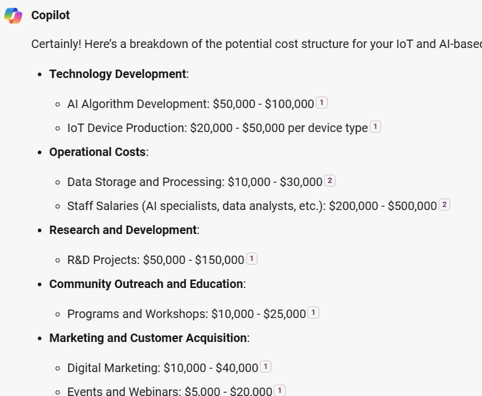
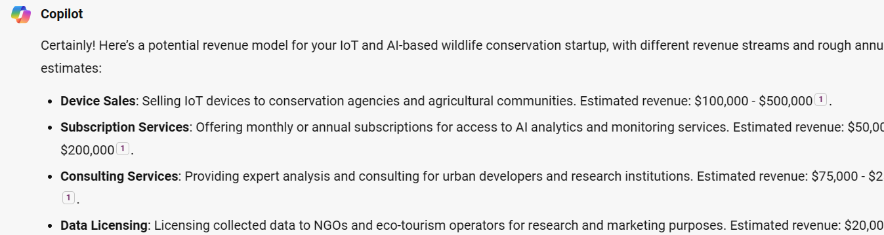

> [!NOTE]
> Steps to add prompts
>
> 1. Copy the sample prompt provided below **and make any edits you want**.
> 1. Paste it into Microsoft Copilot

## Cost Structure
As a founder, it's important to understand the monetary consequences associated with delivering value to your customers. Going through this step helps you optimize your fixed and variable costs based on your key activities and explore ideas to minimize costs.

**Sample Prompt**

```
Thanks! This is very insightful so far. Now, Can you help me think through our cost structure considering everything we have covered so far.
Help me break down the different cost- associated responsibilities and give rough estimates of what each might cost me per year.
Please summarize this in short bullet points.
```

**Sample Response**

Below is a sample response from Microsoft Copilot.


## Revenue Streams
The final step involves thinking about how the startup generates income from each of the identified customer segments. You explore the different sources and methods you can use to generate revenue, and reasonable pricing models for your products/ services to your different customer segments.

Some of revenue generation methods include:-

- **Asset sale:** Money generated after selling ownership rights to physical goods
- **Product usage costs:** Money generated from customers using your products
- **Subscription fees:** Money generated from offering continuous services in packages
- **Renting/ Lending/ Leasing fees:** Money generated from giving exclusive right to products for a defined period

**Sample Prompt**

```
Can you help me think through and generate a revenue model for my startup.
Considering all the above, help me break down the different possible revenue streams and give rough estimates of what each might bring into the company.
Please summarize this in short bullet points.
```

**Sample Response**

Below is a sample response from Microsoft Copilot.

