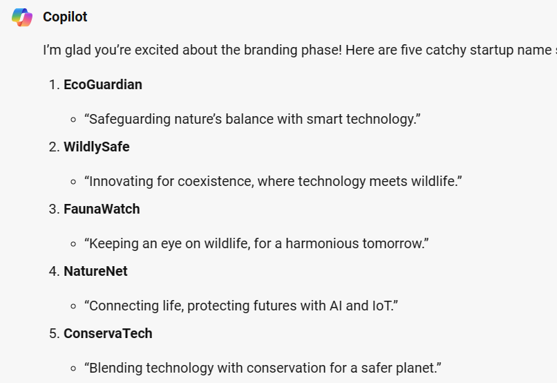

> [!NOTE]
> Steps to add prompts
>
> 1. Copy the sample prompt provided below **and make any edits you want**.
> 1. Paste it into Microsoft Copilot

## Branding

We generated almost everything we need to bring this idea as close to a startup as possible. Now we need to do some basic branding for the startup. We create:

- a catchy name for our startup
- a short description/ tagline that captures its mission

> [!NOTE]
> Give details to get a better result. Should the name be a pun? Should it include a cultural reference? Should it evoke a certain feeling? Expand the suggested prompt and add your own details.

**Sample Prompt**

```
This is fantastic! Now given everything we have worked on around this new startup idea, its time to come up with some branding for it.
Can you list 5 suggestions of catchy startup names for this startup along with a short one sentence tagline, which will basically describe our mission.
```

**Sample Response**

Below is a sample response from Microsoft Copilot.


## Pulling it Together

Microsoft Copilot can’t remember the images it generated but it can remember the content. We can ask it to summarize the content to make it easier to pull together. It has a character limit, and you have a request limit, so this only works if you have more questions available to ask, and it might be wise to do it in two segments to accommodate for the character limit. You can always revisit the chat to get your content, but let's see if we can summarize.

**Sample Prompt**

```
Let's review all the copy we wrote. Can you give me the last edited copy for these parts of the project.
Please summarize each section in short bullet points to fit this summary on a business model canvas 1-pager template :
Introduction - Idea
Customer Segmentation
Value Proposition
Customer relationships
Key Channels
Key Activities
Key Resources
Key Partners
Cost Structure
Revenue Streams
Branding

Can you format it like this:

## Title ##
Description
```

> [!NOTE]
> *Take a minute to do something else, as it might take a little bit of time! It's a big ask and it needs to create a lot of text, so be patient.*

This should pull together all your written content for you. You can always revisit the chat, but you can summarize your work this way.

## Creating your final output

We created a bunch of content. We use a PowerPoint template to bring all that content together.

### Steps

- Download the [PowerPoint template here](https://stdntpartners-my.sharepoint.com/:p:/g/personal/julia_muiruri_studentambassadors_com/EYz9I_oj1gFLgvvZbgQWdQ4Bm_Lx45IqsoMli2Dk6Av9bw?e=Wo16qY)
- Open the PowerPoint template
- Replace the images and content in the deck with your own
- Export as video. See the image below

    

*The template has everything you need, you just need to replace the images and the text. Each slide has a little sticky note that tells you what to do. Remember to remove the sticky note image from each slide!*

## Completed

Congrats! We're excited to see what you created. This exercise taught some basic prompt creation techniques, highlighted some Microsoft Copilot capabilities, and provided an introduction to the capabilities of Generative AI (Large Language Models), whether it be completion, transformation, conversation, or summarizing.
