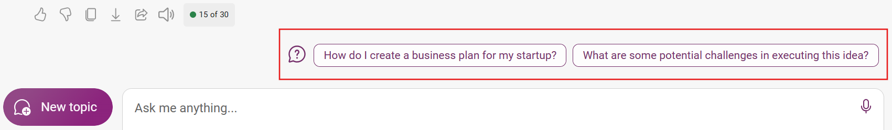

In this exercise, you learned how to use the various features or capabilities of Microsoft Copilot, such as:

- Utilizing multi-modal features of Microsoft Copilot, such as graphic art, to create graphical artworks based on your prompts.
- Prompt writing tips and techniques, such as using clear and specific instructions, providing examples, and avoiding ambiguity, to elicit high-quality responses from Microsoft Copilot.
- Practicing your critical and creative thinking with Microsoft Copilot, such as generating a business model, a revenue model, and a branding strategy for a startup idea.
- Researching with Microsoft Copilot, such as using the search web tool to find relevant and reliable information on various topics
- Applying format and tone to generative AI models, such as using markdown elements, LaTeX math, and citation schema, to present information in a visually appealing and accurate manner, and using a positive, polite, empathetic, interesting, entertaining, and engaging tone to communicate with Microsoft Copilot.

## Explore further with Microsoft Copilot

Microsoft Copilot also tries to recommend other prompts that can help you explore further areas of building your startup and setting it up for success. 

You can select the suggestions from Microsoft Copilot to get more insights.

## Next steps: Apply for Founders Hub

You have identified a real-world problem and identified potential customers with the help of Microsoft Copilot. At this stage, you're convicted that your idea solves the identified problem and you now have an insight on how your startup would operate.

Microsoft for Startups Founders Hub helps startups radically accelerate innovation by providing access to industry-leading AI services, expert guidance, and the essential technology needed to build a future-proofed startup.

This is the perfect opportunity 😃 for you to unlock extra resources and bring your startup into a reality, and guess what, you already have everything you need. Don't let this opportunity pass you.

Apply for the [Founders Hub program today.](https://www.microsoft.com/startups?WT.mc_id=academic-110682-juliamuiruri)