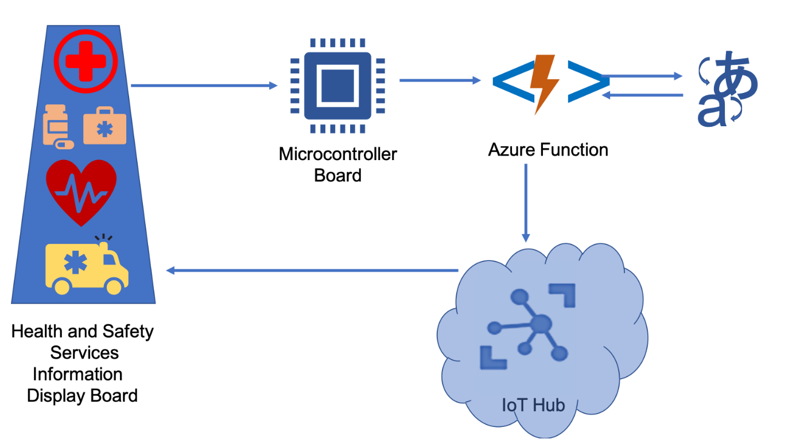

Azure Functions enable you to run Azure AI services using IoT devices. You build your solution in the cloud as snippets of code and the logic is implemented through Azure Functions on an IoT device.

Suppose you work as a product designer for a company that makes digital signage equipment to be deployed at bus stops. Your company wants to create a new type of signs for bus stops. The digital sign displays information about health and safety for tourists. The original sign is in English, but the tourist can speak at the sign in any of the specified languages – and the sign will display the text in that language. Previously, this facility was not possible to implement easily – but due to recent health issues, it has become imperative to display these signs. The company needs to make the interactive digital signs such that they can cater to a large number of markets by changing the target language.

In this module, you'll deploy Azure function in the cloud to make an IoT Edge device as a language translator. Your device records a voice in a foreign language and the function which calls the cognitive service will convert the speech to a custom target language. The translated text will then be displayed on the screen of the IoT device. By the end of this module, you'll be able to connect IoT device to the cognitive speech service using an Azure function.
