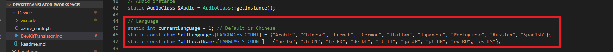
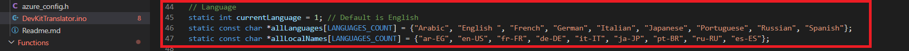
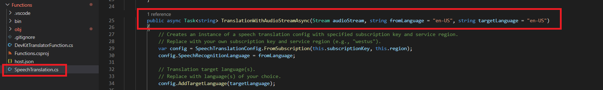
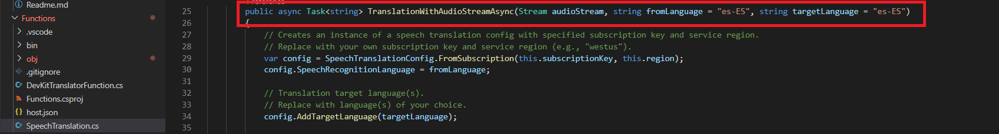
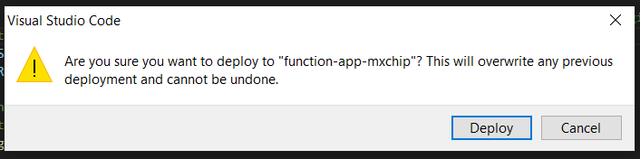

In this unit, you'll modify the source language and you'll change the target language. 

1. In the Visual Studio Code, go to the Device\DevKitTranslator.ino. There are 9 languages described and Chinese is selected as a default language.

    

2. Remove Chinese, change the default language to English and save it.

    

3. Open the Functions\SpeechTranslation.cs. The target language is defined as English (en-US).

    

4. Change the target language to Spanish(es-ES) and save it.

    

    >[!NOTE] 
    >You can find many supported languages by Speech Translation API from the [Microsoft page](https://docs.microsoft.com/azure/cognitive-services/speech-service/language-support#speech-translation).

5. Click F1, type, and select Azure IoT Device Workbench: Deploy to Azure.... If VS Code asks for confirmation for redeployment, click Yes.

    

    Make sure the deployment is successful. 

6. Click F1 again, type, and select Azure IoT Device Workbench: Upload Device Code. It starts to compile and upload the code to DevKit.

    The DevKit reboots and starts running the code.

##  Test the project

After app initialization, follow the instructions on the DevKit screen. The default source language is Chinese.

To select another language for translation:

1. Press button A to enter setup mode.
3. Press button B to scroll all supported source languages.
5. Press button A to confirm your choice of the source language.
7. Press and hold button B while speaking, then release button B to initiate the translation.
9. The translated text in English shows on the screen.

On the translation result screen, you can:

1. Press buttons A and B to scroll and select the source language.
3. Press the B button to talk. To send the voice and get the translation text, release the B button.
