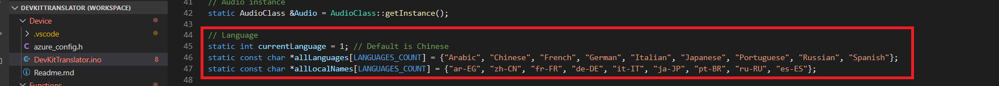
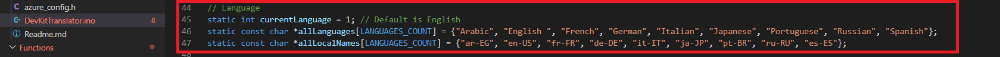
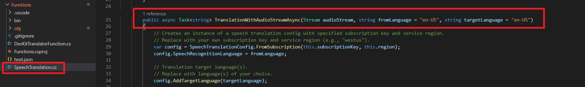
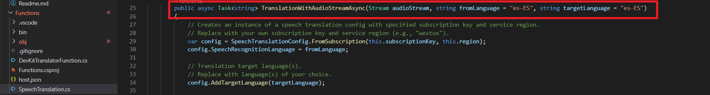
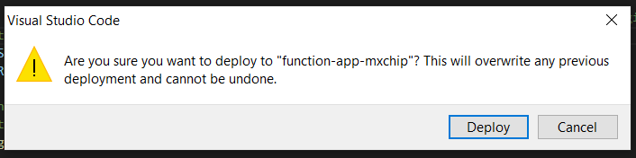

In this unit, you'll modify the source recognition language and change the target translation language.

>[!IMPORTANT]
>This unit continues the archived Azure IoT Device Workbench sample workflow. The Workbench commands below are legacy sample commands. For current projects, deploy the cloud-hosted Function app with the Azure Functions extension for Visual Studio Code or Azure Functions Core Tools, and manage IoT Hub/devices with Azure CLI plus the Azure IoT extension (`azure-iot`) or Azure IoT Explorer.

1. In Visual Studio Code, go to Device\DevKitTranslator.ino. There are 9 source recognition languages described, and Chinese is selected as the default language. Source recognition uses locale values such as `en-US`.

    

2. In the source-language arrays, replace the existing Chinese display name and locale entries with English and `en-US`, then save the file. This keeps the language count and default index consistent with the archived sample. If you add or remove languages instead, update `LANGUAGES_COUNT` and `currentLanguage` so they match the revised arrays and default source language.

    

3. Open Functions\SpeechTranslation.cs. The archived sample may show the Speech translation target language for English as `en-US`. Current Speech translation target languages use language codes such as `en` and `es`, not source recognition locale values such as `en-US` or `es-ES`.

    

4. Change the target translation language to Spanish (`es`) and save it.

    

    >[!NOTE] 
    >You can find many supported languages by Speech Translation API from the [Microsoft page](/azure/cognitive-services/speech-service/language-support#speech-translation).

5. Legacy sample command: Click F1, type, and select Azure IoT Device Workbench: Deploy to Azure.... If Visual Studio Code asks for confirmation for redeployment, click Yes.

    

    Make sure the deployment is successful. 

6. Legacy sample command: Click F1 again, type, and select Azure IoT Device Workbench: Upload Device Code. It starts to compile and upload the code to DevKit.

    The DevKit reboots and starts running the code.

##  Test the project

After app initialization, follow the instructions on the DevKit screen. The default source language is English.

To select another language for translation:

1. Press button A to enter setup mode.
3. Press button B to scroll all supported source languages.
5. Press button A to confirm your choice of the source language.
7. Press and hold button B while speaking, then release button B to initiate the translation.
9. The translated text in Spanish shows on the screen.

On the translation result screen, you can:

1. Press buttons A and B to scroll and select the source language.
3. Press the B button to talk. To send the voice and get the translation text, release the B button.
