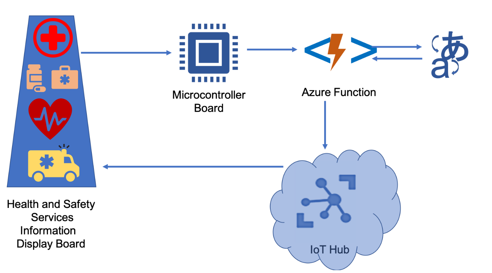

Azure Functions enable you to call Azure AI Speech from IoT solutions. You build your solution as snippets of code that run in a cloud-hosted Azure Function, and the IoT device calls that function.

Suppose you work as a product designer for a company that makes digital signage equipment to be deployed at bus stops. Your company wants to create a new type of signs for bus stops. The digital sign displays information about health and safety for tourists. In the base app for this module, a tourist speaks at the sign in a supported source language, and the sign displays the English translation. Later customization can change the source and target languages so the interactive digital signs can support more markets.

In this module, you'll deploy an Azure Function in the cloud so an MXChip IoT DevKit can work with a language translator. Your device records speech in a supported source language and posts the audio to the cloud-hosted HTTP-triggered function. The function calls Azure AI Speech translation to recognize and transcribe the audio, translates it into English by default, sends the translated text back through IoT Hub cloud-to-device messaging, and the IoT DevKit displays it. By the end of this module, you'll be able to connect an IoT device to Azure AI Speech using a cloud-hosted Azure Function.
