## Create an Azure AI Speech resource

>[!IMPORTANT]
>This exercise follows an archived Azure IoT Device Workbench sample workflow. The Workbench-based workflow and Azure IoT Tools sample path are legacy and unsupported for new development. Use the Workbench commands only as legacy sample commands when reproducing the archived sample. For current projects, deploy the cloud-hosted Function app with the Azure Functions extension for Visual Studio Code or Azure Functions Core Tools, and manage IoT Hub/devices with Azure CLI plus the Azure IoT extension (`azure-iot`) or Azure IoT Explorer.
>
>Choose one provisioning path. The **legacy Workbench path** provisions or selects an IoT Hub, an IoT Hub device identity, and a cloud-hosted Function App. The **current/reuse path** reuses existing IoT Hub/device resources, but you must create and deploy the Function App separately with supported Azure Functions tooling before configuring the app settings below.

In the Azure portal, click **Create a resource** and search for Speech.

Create an Azure AI Speech resource. 

Fill out the form to create the Speech resource.

**Name:** Enter a name  

**Subscription:** Select your available subscription

**Location:** Select your location

**Pricing tier:** Select S0

**Resource group:** Select your resource group

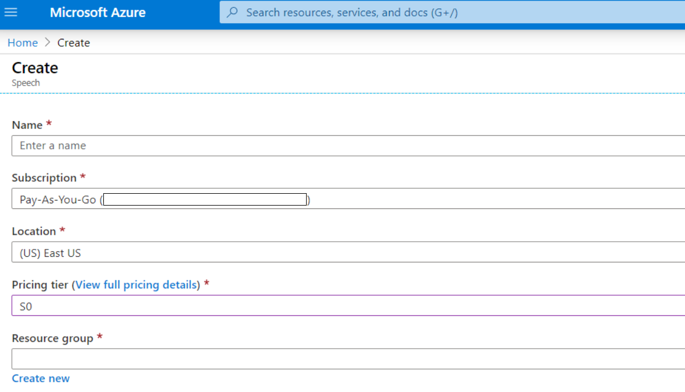


Go to the Azure AI Speech resource you just created, click the Keys section, and copy and note down both Key1 and the Speech resource region identifier (for example, `eastus` or `westus`). The cloud-hosted Function app uses both values to configure Azure AI Speech calls. Treat the key as a secret and don't commit it to source control.

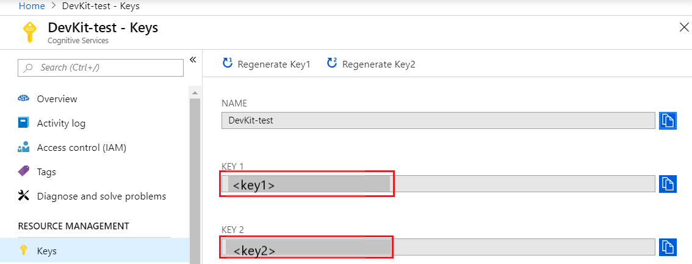


##  Installing extensions for Visual Studio Code

You need to install some extensions for the Visual Studio Code.

- Launch Visual Studio Code, search for Arduino in the extension marketplace, and install it. This extension provides enhanced experiences for developing on the Arduino platform.

- The archived sample used Azure IoT Device Workbench, which was previously distributed through the Azure IoT Tools extension pack. Azure IoT Tools/Device Workbench are legacy and retired for new development; use this path only if you're reproducing the archived sample and the extension is already available.

  >[!NOTE]
  >For current IoT Hub/device management, use Azure CLI plus the Azure IoT extension (`azure-iot`) or Azure IoT Explorer. The [Azure IoT Hub Toolkit extension](https://marketplace.visualstudio.com/items?itemName=vsciot-vscode.azure-iot-toolkit) is for managing and interacting with Azure IoT Hubs; it isn't the retired Azure IoT Tools extension pack or Azure IoT Device Workbench.

- Search for C# in the extension marketplace and install it.

## Configure Visual Studio Code with Arduino settings

In Visual Studio Code, click File > Preference > Settings. Then click the ... and Open settings.json.

Add following lines to configure Arduino depending on your platform:

- **Windows**:

  ```json
  "arduino.path": "C:\\Program Files (x86)\\Arduino",
  "arduino.additionalUrls": "https://raw.githubusercontent.com/VSChina/azureiotdevkit_tools/master/package_azureboard_index.json"
  ```

- **macOS**:

  ```json
  "arduino.path": "/Applications",
  "arduino.additionalUrls": "https://raw.githubusercontent.com/VSChina/azureiotdevkit_tools/master/package_azureboard_index.json"
  ```

- **Ubuntu**:

  Replace the **{username}** placeholder below with your username.

  ```json
  "arduino.path": "/home/{username}/Downloads/arduino-1.8.8",
  "arduino.additionalUrls": "https://raw.githubusercontent.com/VSChina/azureiotdevkit_tools/master/package_azureboard_index.json"
  ```


##  Opening sample project

First of all, start signing in your Azure account.
Click F1 to open the command palette, type, and select Azure: Sign in

Current path: Clone or download the DevKit Translator sample from GitHub, then open the project folder in Visual Studio Code.

```bash
git clone https://github.com/Azure-Samples/mxchip-iot-devkit-translator
code mxchip-iot-devkit-translator
```

If you don't use Git, download the ZIP from [https://github.com/Azure-Samples/mxchip-iot-devkit-translator](https://github.com/Azure-Samples/mxchip-iot-devkit-translator), extract it, and open the extracted folder in Visual Studio Code.

For archival reproduction only, use the legacy Workbench sample command: Click F1 to open the command palette, type, and select Azure IoT Device Workbench: Open Examples.... Then select IoT DevKit as the board.


In the IoT Workbench Examples page, find DevKit Translator and click Open Sample. Then select the default path to download the sample code.

 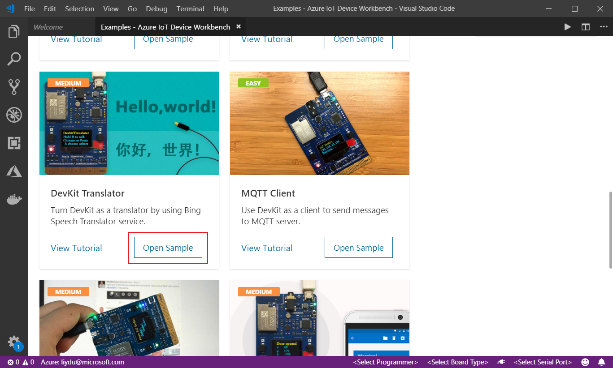

## Select the board

Click F1 to open the command palette, type, and select Arduino: Board Manager. Search for AZ3166 and install it.

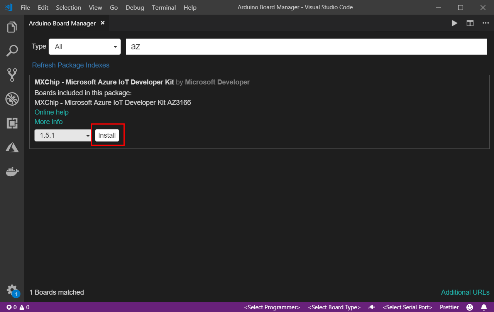

**Install Serial Port: ST-Link drivers**

- **Windows:** Download and install the USB driver from [STMicroelectronics website](https://www.st.com/en/development-tools/stsw-link009.html).
- **macOS:** No driver is required for macOS.

- **Ubuntu**: Run the commands in terminal and sign out and sign in for the group change to take effect:

  ```bash
  # Copy the default rules. This grants permission to the group 'plugdev'
  sudo cp ~/.arduino15/packages/AZ3166/tools/openocd/0.10.0/linux/contrib/60-openocd.rules /etc/udev/rules.d/
  sudo udevadm control --reload-rules
  
  # Add yourself to the group 'plugdev'
  # Logout and log back in for the group to take effect
  sudo usermod -a -G plugdev $(whoami)
  ```

>[!NOTE]
>ST-Link/V2 is the USB interface that IoT DevKit uses to communicate with your development machine. You need to install it on Windows to flash the compiled device code to the DevKit. Follow the OS-specific steps to allow the machine access to your device.


##  Create Azure Function/Provision Azure Services

Before provisioning, choose exactly one path:

- **Legacy Workbench path:** Use only when reproducing the archived sample. The Azure IoT Device Workbench command below provisions or selects the IoT Hub, IoT Hub device identity, and cloud-hosted Azure Function app used by this exercise.
- **Current/reuse path:** If you already created an IoT Hub and IoT Hub device identity in an earlier exercise or by using Azure CLI or Azure IoT Explorer, reuse those IoT resources and don't run the archived Workbench provisioning flow unless you intentionally want a separate IoT Hub/device set. Create and deploy the Function App separately with the Azure Functions extension for Visual Studio Code or Azure Functions Core Tools, then configure the `deviceName` constant with the IoT Hub device ID (`--device-id`), the Speech key and region, and the Function App application setting `iotHubConnectionString` as described below.

Legacy sample command: In Visual Studio Code, click F1, type, and select Azure IoT Device Workbench: Provision Azure Services....

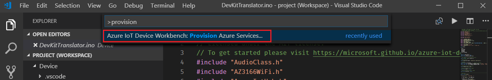

If you chose the legacy Workbench path, follow the steps to finish provisioning or selecting Azure IoT Hub, an IoT Hub device identity, and a cloud-hosted Azure Function app. If you chose the current/reuse path, skip this Workbench provisioning step and use the Function App you created with supported Azure Functions tooling.

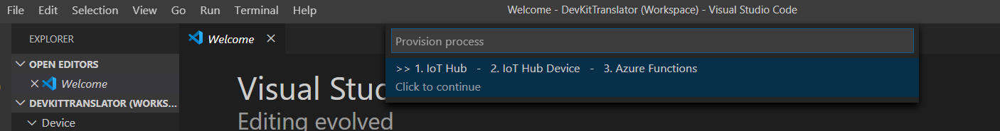

Take a note of the IoT Hub device ID (`--device-id`) you created or reused. You'll use it for the `deviceName` value in the Function code.

In the legacy Workbench path, the device connection string is saved in Visual Studio Code for configuring the IoT DevKit later. In the current/reuse path, keep the IoT Hub device connection string for the DevKit configuration step. The device connection string is separate from the backend `iotHubConnectionString` Function App application setting.

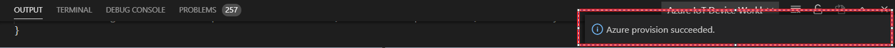

After the Function App exists and before testing, configure the cloud-hosted Function app with an application setting named `iotHubConnectionString`. This applies to both the current/reuse path and the legacy Workbench path. In the Azure portal, use the Function App's **Configuration** > **Application settings** page, or equivalent Azure Functions deployment tooling, to add the setting. Set this value to an IoT Hub service/shared-access policy connection string that permits cloud-to-device sends, such as a service policy with **ServiceConnect** permissions. The Function uses this backend connection to send translated results to the IoT DevKit as C2D messages. This setting is separate from the IoT Hub device connection string that is configured on the DevKit itself.


Open **Functions\DevKitTranslatorFunction.cs** in the archived sample. It contains constants for the IoT Hub device ID and Azure AI Speech settings:

```csharp
// Subscription key for the Azure AI Speech resource
const string speechSubscriptionKey = "";

// Region identifier of the Azure AI Speech resource, such as eastus or westus.
// Use the region that matches your Speech resource location, not the endpoint URL or display name.
const string speechServiceRegion = "";

// IoT Hub device ID (--device-id)
const string deviceName = "";
```

>[!IMPORTANT]
>These constants are legacy sample placeholders. For current development, store secrets in Function App application settings for the deployed app, use **local.settings.json** for local debugging, or use Key Vault references. Don't commit real Speech keys. If you run the archived sample unchanged, enter values only in your local working copy and remove them after the exercise.

Before deploying or testing the Function, open **Functions\SpeechTranslation.cs** in the archived sample and set the target translation language to the Speech translation target language code `en` for the base English-output test. The archived sample sets the target language as a default method parameter on `TranslationWithAudioStreamAsync`, commonly like `string targetLanguage = "en-US"`. Change that default parameter to `targetLanguage = "en"`, for example:

```csharp
public async Task<string> TranslationWithAudioStreamAsync(Stream audioStream, string fromLanguage = "en-US", string targetLanguage = "en")
```

Alternatively, leave the method signature unchanged and pass `"en"` from the caller when invoking `TranslationWithAudioStreamAsync`. Speech translation target languages use language codes such as `en`, `es`, and `de`, while source speech recognition uses locales such as `en-US`.

>[!IMPORTANT]
>The archived DevKit Translator sample targets old Azure Functions runtime and .NET Core versions, such as Azure Functions v2 and .NET Core 2.1. For current Azure deployments, migrate the Functions project to Azure Functions v4 and a supported .NET version before deploying. If you don't migrate it, treat the deployment path below as archival/legacy only.

##  Deploying Azure Function

Legacy sample command: Click F1, type, and select Azure IoT Device Workbench: Deploy to Azure.... If Visual Studio Code asks for confirmation for redeployment, click Yes. If you chose the current/reuse path, deploy the Function project to the Function App you created by using the Azure Functions extension for Visual Studio Code or Azure Functions Core Tools instead of the Workbench deployment command.

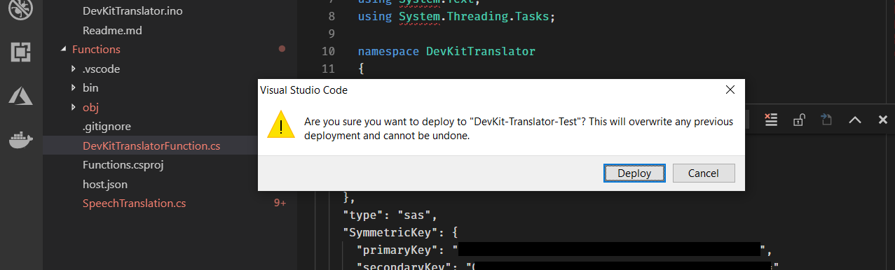

Make sure the deployment is successful. 

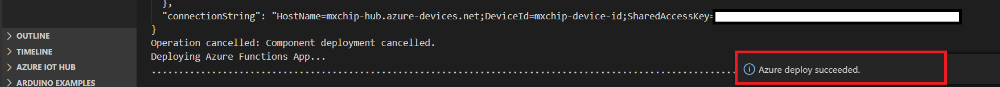

In the Azure portal, go to the Functions Apps section and find the cloud-hosted Azure Function app that was created. Click **devkit_translator**, then click **Get Function URL** to copy the URL.

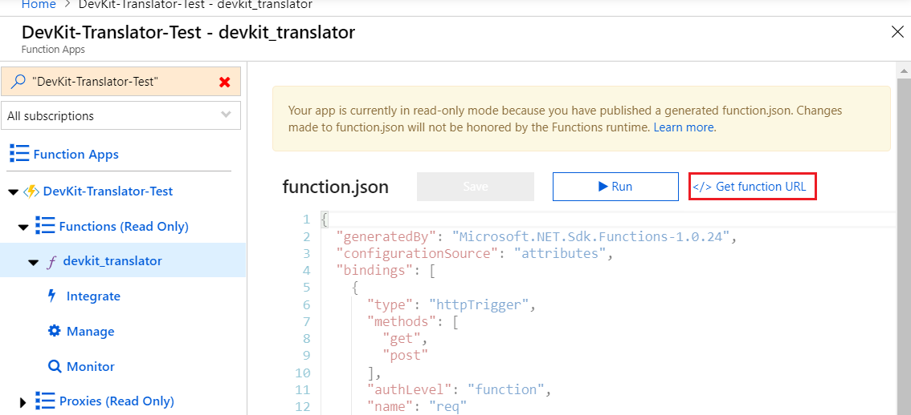

Paste the cloud-hosted function URL into the **azure_config.h** file. The IoT DevKit calls this URL when it sends audio for translation.

>[!WARNING]
>The Function URL copied from **Get Function URL** includes an access key by default. Treat the full URL as a secret, don't commit it or the **azure_config.h** file, and rotate or delete the lab key after the exercise. For production, use stronger authentication such as Azure API Management or App Service Authentication where appropriate.

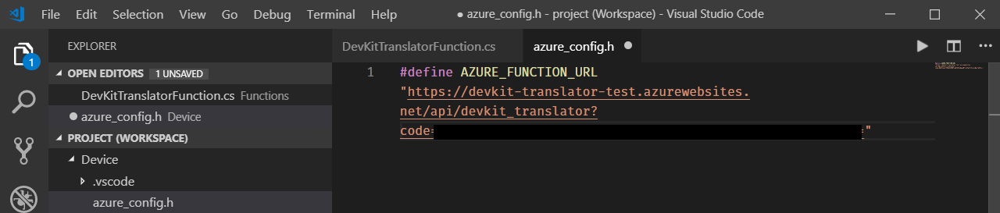


##  Configuring Device Settings

In the bottom-right status bar, check the MXCHIP AZ3166 is shown as a selected board, and serial port with STMicroelectronics is used.

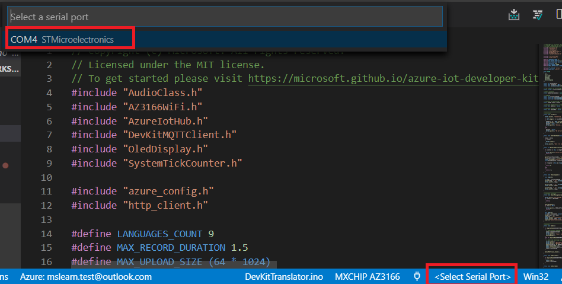 

Before running the Workbench configuration command, put the DevKit into configuration mode: hold down button A, push and release the reset button, and then release button A.

Legacy sample command: Click F1, type, and select Azure IoT Device Workbench: Configure Device Settings... > Config Device Connection String. Select IoT Hub Device Connection String to configure it on the DevKit.

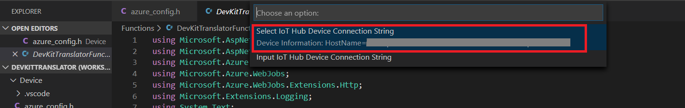 

The command sends the IoT Hub device connection string to the DevKit and saves it.

You'll see the notification once it's done successfully.  

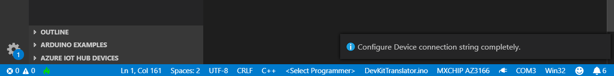

##  Uploading device code


Legacy sample command: Click F1 again, type, and select Azure IoT Device Workbench: Upload Device Code. It starts to compile and upload the code to DevKit.

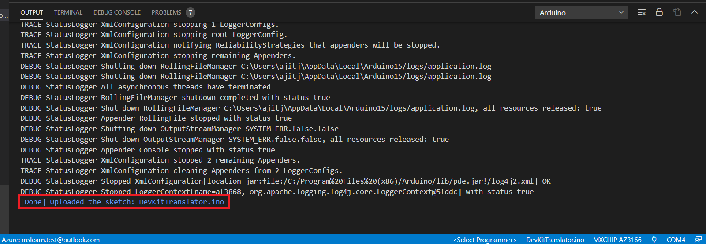


The DevKit reboots and starts running the code.


##  Test the project


After app initialization, follow the instructions on the DevKit screen. The default source language is Chinese.

To select another language for translation:

1. Press button A to enter setup mode.
3. Press button B to scroll all supported source languages.
5. Press button A to confirm your choice of the source language.
7. Press and hold button B while speaking, then release button B to initiate the translation.
9. The translated text in English shows on the screen.


On the translation result screen, you can:

1. Press buttons A and B to scroll and select the source language.
3. Press the B button to talk. To send the voice and get the translation text, release the B button.
