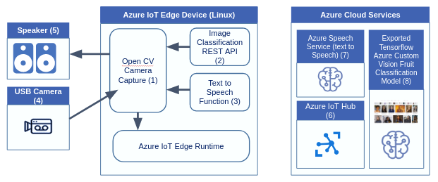

Azure IoT Edge allows you to move your workloads from the cloud to the edge. Doing so enables you to run your workloads locally on edge devices closer to where your data is being generated. This approach fits well with services that process large amounts of data, such as computer vision models. Cognitive Services with IoT Edge let you build a solution and deploy them to IoT devices as containers. When implemented together, Azure IoT Edge and Azure Cognitive Services enable you to find insights from images or video streams on the edge without transferring all of the data off-site first.

Suppose you work as a Data Scientist and you are responsible for deploying Cognitive Services that implement the image recognition function for self-checkouts used in supermarkets. The system should include an image-to-speech capability to enable visually impaired people to use the self-checkout. The system will run the scanned item image against a pre-trained machine learning model to identify the item scanned. The item will then be weighed, and the cost will be calculated depending on the identification. This facility avoids the visually impaired person having to look at the item. Using text to speech, the customer will be informed by an audio message that the item has been scanned. The business logic for the image recognition module will reside in the device. The system will identify the scanned item and convert a label of the image to speech.

To implement this approach, you could build and train the image recognition module in the cloud, dedicated to a given domain (such as identifying fruit), and deploy the model as a container to the device.

](../media/scenario-diagram.png#lightbox)

In this module, you'll run an Azure IoT Edge solution that uses Azure Custom Vision and Azure Speech Service and deploy the solution to the Edge device. The application consists of a number of modules that scan the items using a camera, classify the scanned items, and convert the identified items to speech.

By the end of this module, you'll be able to connect IoT devices to the cognitive service and deploy your solution to the IoT Edge device. The application will tell you (via audio) what items have been scanned.

## Learning objectives

- Use a pre-trained image classification module with Azure Cognitive Services

- Deploy your solution to the IoT Edge using Visual Studio Code

- Verify a module that running successfully

## Prerequisites

- Basic knowledge of IoT Edge

- Basic knowledge of Cognitive Services

- Ability to use Visual Studio Code 

- Azure subscription

- Linux computer that acts as a simulated Azure IoT Edge device

- USB Camera