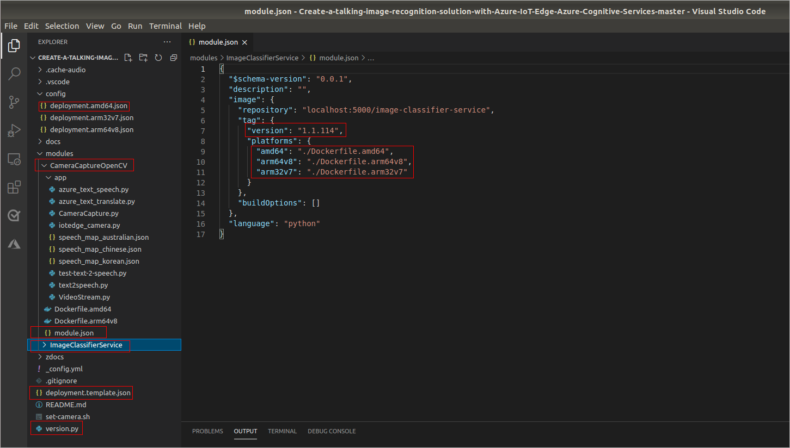

The following describes the highlighted sections of the project, which are available at the GitHub repository.

- There are two modules: 
   - **CameraCaptureOpenCV**
   - **ImageClassifierService**
- The **module.json** file defines the Docker build process, the module version, and your docker registry. Updating the version number, pushing the updated module to an image registry, and updating the deployment manifest for an edge device trigger the Azure IoT Edge runtime to pull down the new module to the edge device.
- The build process uses the **deployment.template.json** file. It defines what modules to build, what message routes to set up, and what version of the IoT Edge runtime to run.
- The **deployment.json** file is generated from the deployment.template.json and is the Deployment Manifest.
- The **version.py** in the project root folder is a helper app you can run on your development machine that updates each module's version number. Useful as a change in the version number triggers Azure IoT Edge runtime to pull the updated module, and it is easy to forget to change the module version numbers.

  ](../media/project-structure.png#lightbox) 
