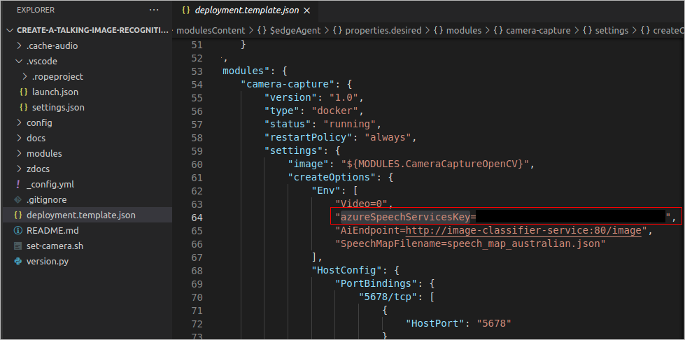
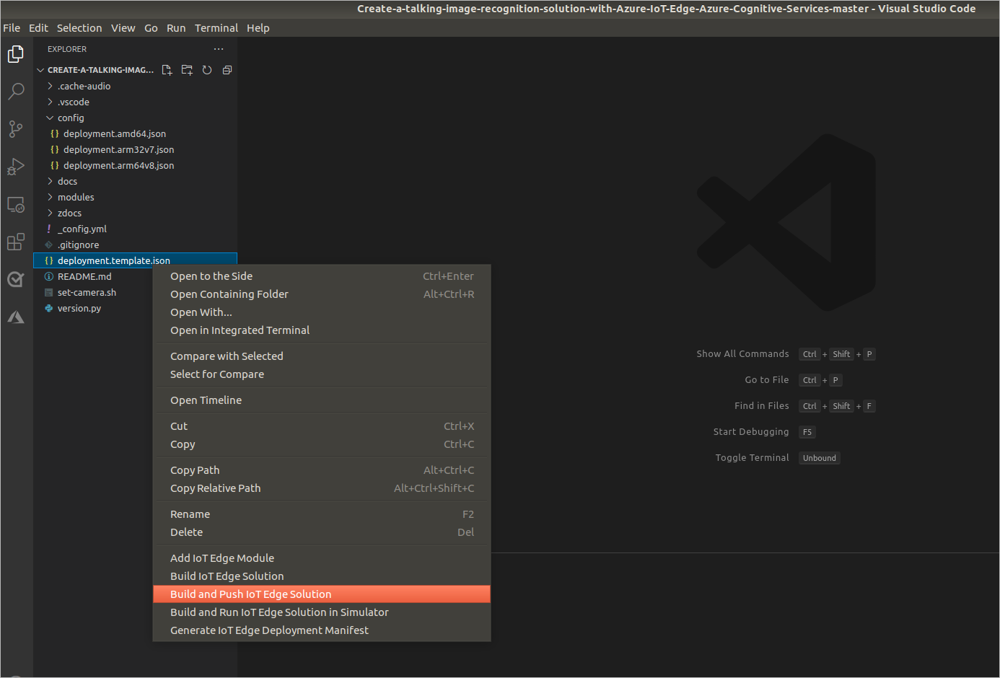
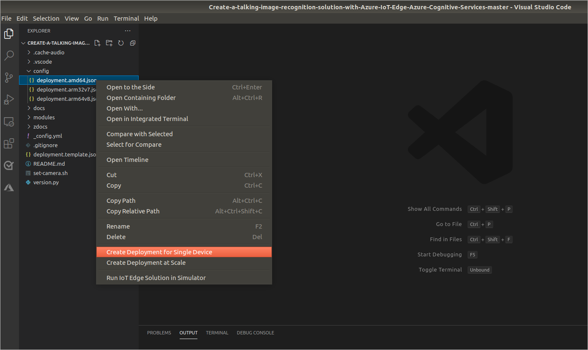

In the first exercise, you have already installed the Azure IoT Edge runtime on your Linux computer. Make sure you have installed the following software development tools.

- [Docker Community Edition](https://docs.docker.com/install/) on your Linux computer
- [Visual Studio Code](https://code.visualstudio.com/?WT.mc_id=iot-0000-dglover) is a code editor and is one of the most popular Open Source projects on GitHub. It runs on Linux, macOS, and Windows.
- The following Visual Studio Code Extensions
   - [Azure Account](https://marketplace.visualstudio.com/items?itemName=ms-vscode.azure-account)
   - [Azure IoT Tools](https://marketplace.visualstudio.com/items?itemName=vsciot-vscode.azure-iot-toolkit)
   - [Docker extension](https://marketplace.visualstudio.com/items?itemName=ms-azuretools.vscode-docker) for Visual Studio Code
   - [JSON Tools](https://marketplace.visualstudio.com/items?itemName=eriklynd.json-tools) useful for changing the "Create Options" for a module.

<a name='create-azure-ai-services'></a>

## Create Azure AI services

In this module, you use Azure AI Custom Vision and Azure AI Speech services.

- [Azure AI Custom Vision](https://azure.microsoft.com/services/cognitive-services/custom-vision-service/) service is used to create a machine learning model with fruit images provided. Then the model is exported and added to the project folder.

- [Azure AI Speech](https://azure.microsoft.com/services/cognitive-services/speech-to-text/) is used to generate speech from label of the item. You will add the speech key in deployment template. 

The multi-service resource is listed under **Azure AI services** > **Azure AI services multi-service account** in the portal. To create a multi-service resource follow these instructions:

1. Sign into the [Azure portal](https://portal.azure.com/?azure-portal=true).

1. Select this link to create a multi-service resource: [https://portal.azure.com/#create/Microsoft.CognitiveServicesAllInOne](https://portal.azure.com/#create/Microsoft.CognitiveServicesAllInOne)

1. On the **Create** page, provide the following information:

    |Project details| Description   |
    |--|--|
    | **Subscription** | Select one of your available Azure subscriptions. |
    | **Resource group** | The Azure resource group that will contain your Azure AI services resource. You can create a new group or add it to a pre-existing group. |
    | **Region** | The location of your Azure AI service instance. Different locations may introduce latency, but have no impact on the runtime availability of your resource. |
    | **Name** | A descriptive name for your Azure AI services resource. For example, *MyAzureAIServicesResource*. |
    | **Pricing tier** | The cost of your Azure AI services account depends on the options you choose and your usage. For more information, see the API [pricing details](https://azure.microsoft.com/pricing/details/cognitive-services/).

    :::image type="content" source="../media/2-resource-create-screen-multi.png" alt-text="Screenshot of creating a multi-service resource.":::

1. Configure other settings for your resource as needed, read and accept the conditions (as applicable), and then select **Review + create**.

> [!Tip]
> If your subscription doesn't allow you to create an Azure AI services resource, you may need to enable the privilege of that [Azure resource provider](/azure/azure-resource-manager/management/resource-providers-and-types#register-resource-provider) using the [Azure portal](/azure/azure-resource-manager/management/resource-providers-and-types#azure-portal), [PowerShell command](/azure/azure-resource-manager/management/resource-providers-and-types#azure-powershell) or an [Azure CLI command](/azure/azure-resource-manager/management/resource-providers-and-types#azure-cli). If you are not the subscription owner, ask the *Subscription Owner* or someone with a role of *admin* to complete the registration for you or ask for the **/register/action** privileges to be granted to your account.

## Install the Docker Registry on the Linux computer

Azure IoT Edge relies on Docker images being distributed from a Docker Registry. In production, you would deploy Docker images from a registry such as Azure Container Registry.

When you are developing an Azure IoT Edge module, it is faster to install a local container registry on the device and deploy Docker images from the local registry to Azure IoT Edge.

Open the terminal in your Linux computer and run the following command to set up a local Docker Registry.

```
docker run -d -p 5000:5000 --restart=always --name registry registry:2
```

## Clone the image recognition solution to the Linux computer

1. Clone this GitHub repository.

   ```
   git clone https://github.com/MicrosoftDocs/mslearn-oxford.create-image-recognition-with-azure-iot-edge
   ```

2. Open the solution from the Visual Studio Code menu.

## Update the Azure AI Speech key

Open the deployment.template.json file and update the **azureSpeechServicesKey** with the key you copied from the Azure Speech service.

   ](../media/speech-services-key.png#lightbox)

## Confirm the processor

You need to ensure the image you plan to build matches the target processor architecture. In our case, we are going to build for **amd64**. Confirm processor architecture. 

From the Visual Studio Code, bottom bar click the currently selected processor architecture, then from the popup select **amd64**.

   ](../media/select-processor.png#lightbox)

## Build the solution

Build and Push the solution to Docker by right mouse clicking the deployment.template.json file and select "**Build and Push IoT Edge Solution**". The first build will be slow as Docker needs to pull the base layers to your local machine. 

If you are cross-compiling to amd64 then the first build will be very slow as OpenCV and Python requirements need to be compiled. On a fast Intel i7-8750H processor, cross-compiling this solution will take approximately 40 minutes.

   ](../media/build-push-solution.png#lightbox)

## Deploy the solution

When the Docker Build and Push process has been completed, select the Azure IoT Hub device you want to deploy the solution to. Right mouse click the deployment.json file found in the config folder and select the target device from the drop-down list.

   ](../media/create-deployment.png#lightbox)
