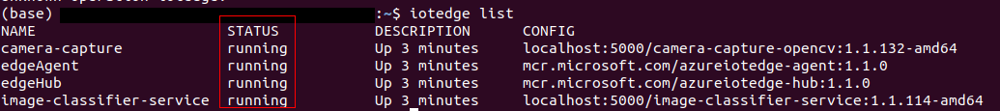
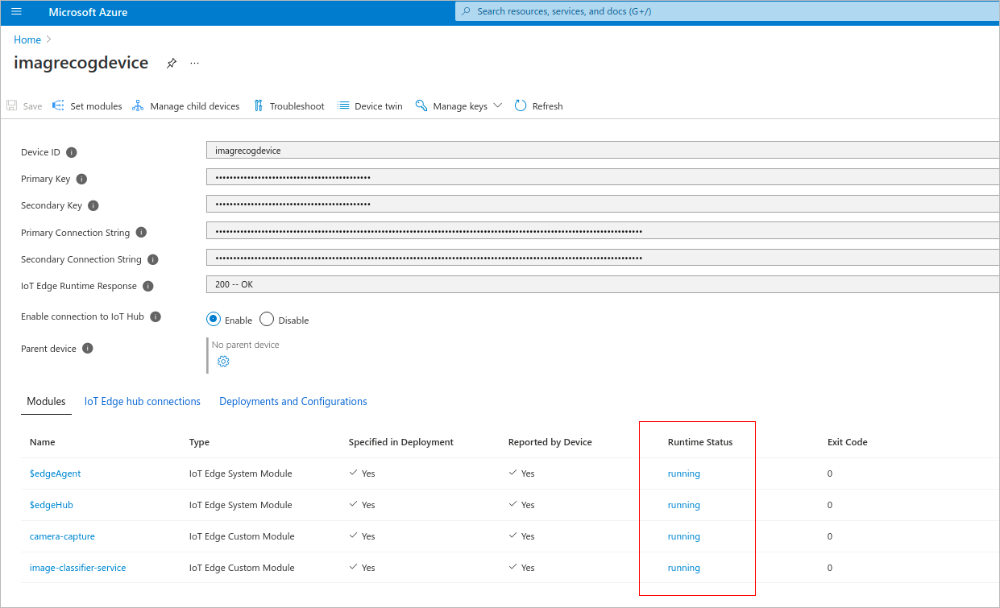

Once the solution is deployed to IoT Edge, the system operates to tell you the scanned items. 

## Monitor the solution on the IoT Edge device

Once the solution has been deployed, you can monitor it on the IoT Edge device using the iotedge list command.

```
iotedge list
```

](../media/module-status.png) 

## Monitoring the Solution from the Azure IoT Edge Blade

You can monitor the Azure IoT Edge module's state from the Azure IoT Hub blade on the Azure portal.

Click on the Azure IoT Edge blade device to view more details about the modules running on the device.

](../media/module-status-hub.png) 


## View the device telemetry from the Azure Cloud Shell

1. You will need to know the name of the Azure IoT Hub you created. You can get the name from the Azure web portal.

2. Open the Azure Cloud Shell

3. In the Cloud Shell, run the az extension add command to add the Microsoft Azure IoT Extension to your CLI shell. The IoT Extension adds IoT Hub, IoT Edge, and IoT Device Provisioning Service (DPS) specific commands to Azure CLI.

   ```
   az extension add --name azure-iot
   ```

4. Start the IoT Hub Events Monitor with the following command. Be sure to use your IoT Hub name.
 
   ```
   az iot hub monitor-events --hub-name {your IoT Hub name}
   ```

5. Observe telemetry in the cloud.

6. Use Ctrl+C to stop the event monitor. 