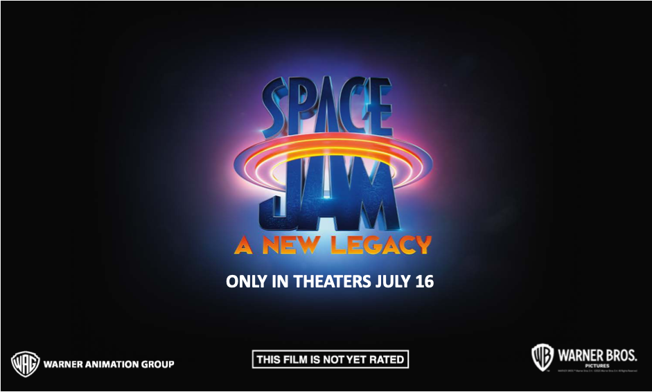

[Space Jam: A New Legacy](https://spacejam.com/) is a film about basketball and coding. [Official synopsis to be put here].

Inspired by the film, this module explores how data can play a big role during athletic games, specifically basketball. If you're a sports fan, you know that the coaches are doing more than watching what is happening in the moment of each game. They are using what they know about their team and players, and what they know about the other team and players, AND what is happening larger within the season, to make every decision as the game goes on. 

In the middle of Game 1 of the finals, should the coach continue to play LeBron James when the team is up by 10 points? Or should he give him a rest so that he can remain strong for future games? While coaches have years of experience and data gathering to help them make in-the-moment decisions, we can also see how data and a bit of coding *could* be of use to a coach in the heat of a game. 

Furthermore, we can start to experiement with how data can help inform a more novice coach with a not-so-typical team. In Space Jam: A New Legacy, we see a team of Looney Tunes players that each have unique skills they bring to the court that even a professional basketball coach might probably not be able to predict how well each player might do!

Through this module, you will use the data that was cleansed and manipulated as part of the previous module in this Space Jam: A New Legacy inspired learning path to create an app for the Looney Tunes' coach to use during an All Looney Tunes game. This app will help the coach determine which player should sit out for a short water break. Your goal: To optimize the chances of the Looney Tunes winning their game!

This module is part of a multi-modal approach to learning, which means that you can also follow along with a video tutorial on the [Learn with Dr G Learn TV video series](https://aka.ms/LearnWithDrG/SpaceJam).

## Learning objectives

In this module, you will begin to discover: 

- Python, Pandas, and machine learning
- Visual Studio Code notebooks for data science
- Data preparation for application use
- Azure static web apps
- GitHub Actions to deploy web apps
- CodeTour for code writing guidance
- JavaScript to create functionality for your app

## Prerequisites

- [Visual Studio Code, with the Python Extension](https://aka.ms/LearnOnVSCode)
- [Azure Static Web Apps extension for Visual Studio Code](https://marketplace.visualstudio.com/items?itemName=ms-azuretools.vscode-azurestaticwebapps)
- [CodeTour extension for Visual Studio Code](https://marketplace.visualstudio.com/items?itemName=vsls-contrib.codetour)
- A local Python environment set up, as seen in [Discover the role of Python in space exploration](https://docs.microsoft.com/en-us/learn/paths/introduction-python-space-exploration-nasa/)
- An [Azure account](https://docs.microsoft.com/en-us/learn/modules/create-an-azure-account/)
- A [GitHub account](https://docs.microsoft.com/en-us/learn/modules/introduction-to-github/)