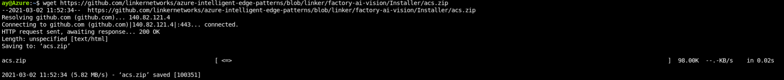
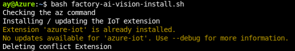
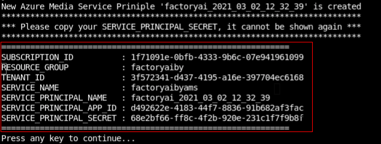
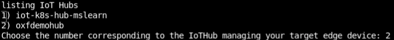
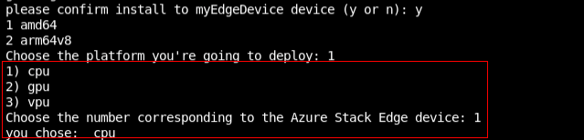
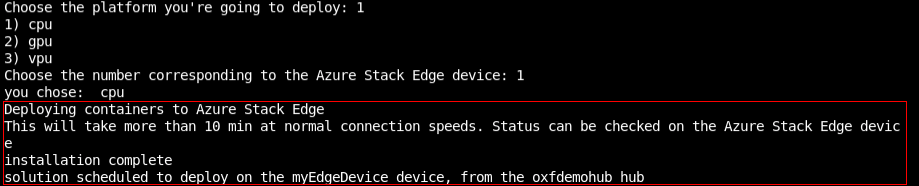

## Install the Vision on Edge Solution Accelerator

Perform the following steps in the Azure Cloud Shell environment.

1. Run the following command to download installer (acs.zip) from GitHub.

   ```
   wget -O acs.zip https://github.com/Azure-Samples/azure-intelligent-edge-patterns/raw/master/factory-ai-vision/Installer/acs.zip
   ```

   

2. Unzip it.

   ```
   unzip -o acs.zip
   ```

   [](https://github.com/linkernetworks/azure-intelligent-edge-patterns/raw/develop/factory-ai-vision/assets/step3.png)

3. Execute the installer. 

   ```
   bash factory-ai-vision-install.sh
   ```

4. It will check the az command and check if it requires any installing/updating the IoT extension.

   [](https://github.com/linkernetworks/azure-intelligent-edge-patterns/raw/develop/factory-ai-vision/assets/step3.png)

5. You would be asked if you would like to use an existing Custom Vision Service. Choose **yes** and go ahead to create a new one with the instruction.
   [](https://github.com/linkernetworks/azure-intelligent-edge-patterns/raw/develop/factory-ai-vision/assets/step5.png)

6. Once you create custom vision service information, make a note of API key and Endpoint. 

   [](../media/apikey-endpoint.png)

7. The next you will be asked if you want to use Azure Live Video Analytics. Choose **yes** and it will create Azure Media Service.

   [](../media/create-lva.png)

8. Copy the "SERVICE-PRINCIPLE-SECRET" information. You will need the secret information for later use.         

   [](../media/service-principal-secret.png)

9. There will be a list of IoT hubs, choose the IoT Hub that you created in this module.  [](../media/list-iothub.png)

10. It will show a list of devices in your account, and choose the device to install VisionEdge. 
    [](https://github.com/linkernetworks/azure-intelligent-edge-patterns/raw/develop/factory-ai-vision/assets/step9.png)

11. You will be asking if your device have a GPU or not. Choose **no**.

    [](../media/choose-device.png)

12. The installation will be started after. Please wait for couple minutes to complete the installation. You can check the deployment status on the [Azure portal](https://portal.azure.com/#home)

    [](../media/container-deployment.png)
