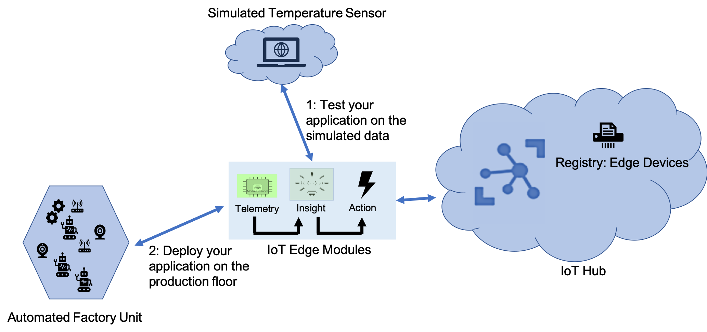

In the development phase of an IoT project, the continuous streams of data typically generated by deployed IoT devices aren't easy to acquire. To simulate data, you can use a prebuilt module as an executable package and deploy this module as a container on an IoT Edge device.

Suppose you're a developer who is deploying IoT applications for a factory automation application. You want to capture data about the machines running on the factory floor, such as the server room or the wind turbine. But you also want to capture data about the environment around the machines, like the ambient temperature. It isn't easy to acquire and visualize this data from the factory floor before the application goes live. Hence, you need a way to simulate data that mimics your scenarios to test your application.

We explore the following engineering-led themes:

- Forecasting behavior of a component or system
- Design of solutions
- Anticipating constraints/tolerances and specific operating conditions
- Safety and security considerations
- Building tools that help to create the solution  

In this module, you'll register an IoT Edge device to your IoT hub. You'll then start the IoT Edge runtime on your virtual device. Next, you'll remotely deploy a prebuilt module to an IoT Edge device that simulates sensors running on that device. Finally, you'll view the module's generated data to verify that the module is running on the device. We're using Azure IoT Edge on an Ubuntu virtual machine. In this case, your device already has the IoT Edge runtime installed. You're not running IoT Edge on your local machine or an ARM32 or ARM64 device.

## Learning objectives

In this module, you'll:

- Launch a module from Azure portal to IoT Edge  
- Generate simulated data from an edge device
- Verify data generated from the edge device

## Prerequisites

- Ability to use IoT Hub in Azure
- Ability to use Azure Cloud Shell
- Experience creating and managing resources using the Azure portal or Azure Cloud Shell at the beginner level
- Basic knowledge of Azure IoT Edge
