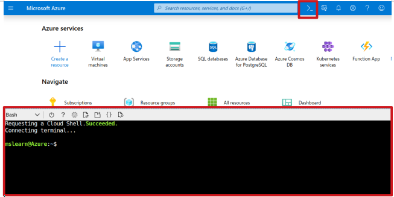
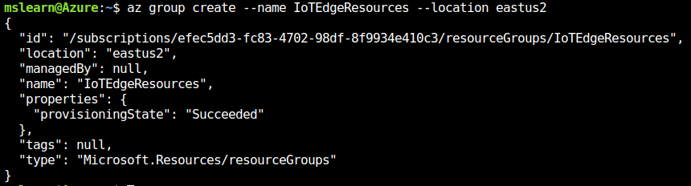
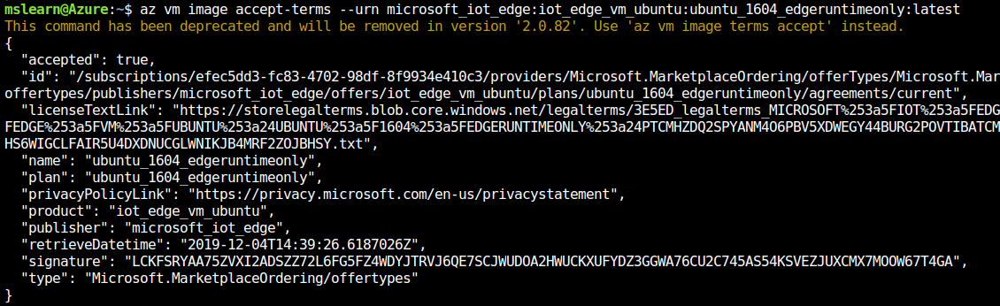
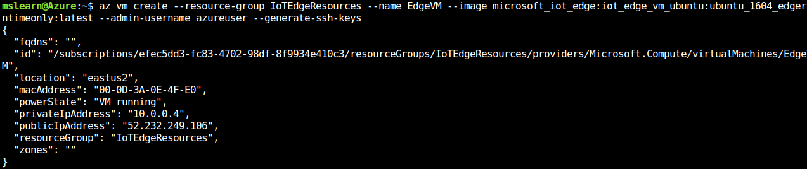
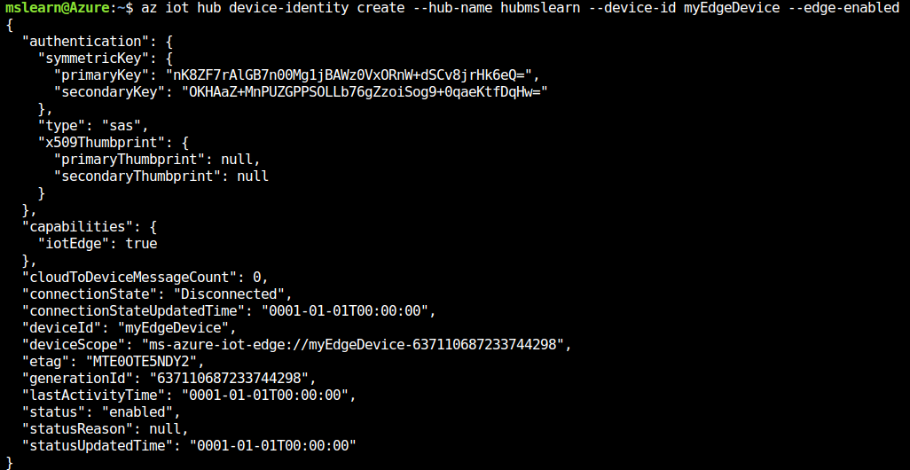
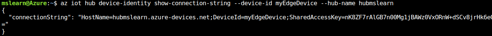
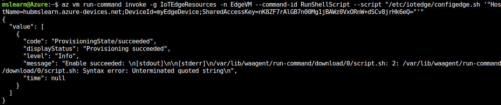
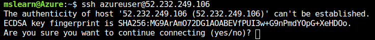
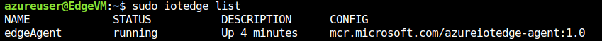

This exercise uses Azure CLI in Azure Cloud Shell to issue the required commands. To get started, open [**https://shell.azure.com**](https://shell.azure.com).



## Install Azure IoT extension

You need to add the Azure IoT extension to the Cloud Shell instance Azure CLI.
First, check which extensions you already have installed by running the following command:

```azurecli
az extension list
```

If the older version of the Azure IoT extension named `azure-cli-iot-ext` is installed, **remove it**. This version is incompatible with the current version. To remove the extension, run this command:

```azurecli
az extension remove --name azure-cli-iot-ext
```

Install the current Azure IoT extension:

```azurecli
az extension add --name azure-iot
```

## Create a resource group

Create a resource group called "IoTEdgeResources" using the following command:

```azurecli
az group create --name IoTEdgeResources --location eastus2
```

The resulting output should be similar to this:



## Create a virtual machine to act as your device

Accept the terms of use and create the Microsoft-provided Azure IoT Edge on Ubuntu virtual machine. This virtual machine preinstalls everything you need to run IoT Edge on a device.

### Accept license terms

To accept the license terms, run this command:

```azurecli
az vm image accept-terms --urn microsoft_iot_edge:iot_edge_vm_ubuntu:ubuntu_1604_edgeruntimeonly:latest
```

The resulting output should be similar to this:



### Deploy the virtual machine

Create the virtual machine named "EdgeVM" using the following commands:  

```azurecli
az vm create --resource-group IoTEdgeResources --name EdgeVM --image microsoft_iot_edge:iot_edge_vm_ubuntu:ubuntu_1604_edgeruntimeonly:latest --admin-username azureuser --generate-ssh-keys
```

The resulting output should be similar to this:



It may take a few minutes to create and start the new virtual machine.

Note the public IP address (`publicIpAddress`), which is provided as part of the create command output. You'll use this to connect to the virtual machine in later steps.

## Create an IoT hub

The following code creates a free F1 tier hub in the resource group "IoTEdgeResources". Replace `{hub_name}` with a unique name for your IoT Hub.

```azurecli
az iot hub create --resource-group IoTEdgeResources --name {hub_name} --sku F1 --partition-count 2
```

## Register an IoT Edge device

In the Azure Cloud Shell, use the following instructions to create a device named "myEdgeDevice" in your hub.

### Create a device identity

Since IoT Edge devices behave and can be managed differently compared to typical IoT devices, declare this identity to be for an IoT Edge device with the `--edge-enabled` flag.

> [!IMPORTANT]
> If you get an error about "iothubowner policy keys", make sure that your Cloud Shell is running the latest version of the `azure-cli-iot-ext` extension.

The following command creates the device identity:

```azurecli
az iot hub device-identity create --hub-name {hub_name} --device-id myEdgeDevice --edge-enabled
```



### Retrieve the connection string

To retrieve the connection string for your device, which links your physical device with its identity in IoT Hub, use this command:

```azurecli
az iot hub device-identity show-connection-string --device-id myEdgeDevice --hub-name {hub_name}
```

The resulting output should be similar to this:



Copy the value of the `connectionString` key from the JSON output and save it. This value is the **device connection string**. You use this to configure the IoT Edge runtime in the next section.

## Configure the IoT Edge device

You need to configure your device with the device connection string that you retrieved in the previous section. You can do this remotely without having to connect to the virtual machine. Run the following command, replacing `{device_connection_string}` with your own string:

```azurecli
az vm run-command invoke -g IoTEdgeResources -n EdgeVM --command-id RunShellScript --script "/etc/iotedge/configedge.sh '{device_connection_string}'"
```

The resulting output should be similar to this:



## View the IoT Edge runtime status

Use the following command to connect to your virtual machine. Replace `azureuser` if you used a different username than the one suggested during the [deployment of the VM](#deploy-the-virtual-machine). Replace `{publicIpAddress}` with your machine's address.

```bash
ssh azureuser@{publicIpAddress}
```

> [!TIP]
> Find the public IP of the VM in the "Overview" page of the virtual machine.

The resulting output should be similar to this:



## Check if the IoT Edge device is configured

To verify that the IoT Edge security daemon is running as a system service, we use `iotedge` commands. 

> [!IMPORTANT]
> You need elevated privileges to run iotedge commands.  

Run the following commands to test the status of the IoT Edge device:

```bash
sudo systemctl status iotedge
```

```bash
journalctl -u iotedge
```

```bash
sudo iotedge list
```

The resulting output should be similar to this:




**Your IoT Edge device is now configured.** It's ready to run cloud-deployed modules.
