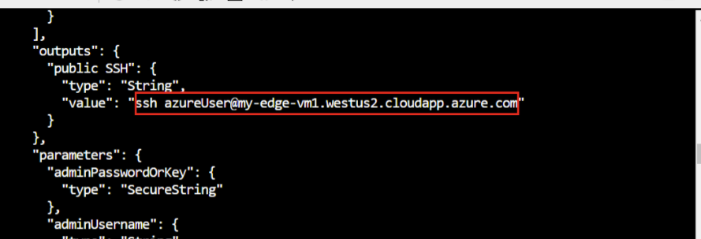

This exercise uses the Azure CLI in Azure Cloud Shell to run the required commands. 

   [](../media/cloud-shell.png)

## Install Azure IoT extension

Add the Azure IoT extension to the Cloud Shell instance Azure CLI.

```
az extension add --name azure-iot
```

> [!NOTE]
> This article uses the newest version of the Azure IoT extension, called `azure-iot`. The legacy version is called `azure-cli-iot-ext`. You should only have one version installed at a time. To check which extensions are installed, run `az extension list`.
> 
> Run `az extension remove --name azure-cli-iot-ext` to remove the legacy version of the extension.
>
> Run `az extension add --name azure-iot` to add the new version of the extension.

## Create a resource group

Create a resource group named "IoTEdgeResources" by running the following command:

```azurecli
az group create --name IoTEdgeResources --location eastus2
```

The output is similar to the following:

[](../media/resource-group.png)

## Create an IoT hub

The following code creates a free **F1 tier** hub in the resource group "IoTEdgeResources." Replace `{hub_name}` with a unique name for your IoT hub.

```azurecli
az iot hub create --resource-group IoTEdgeResources --name {hub_name} --sku F1 --partition-count 2
```

> [!NOTE]
> If you get an error because there's already one free hub in your subscription, change the SKU to **S1**. Each subscription can only have one free IoT hub. If you get an error that the IoT hub name isn't available, it means someone else already has a hub with that name. 

## Register an IoT Edge device

In Azure Cloud Shell, follow these steps to create a device named "myEdgeDevice" in your hub.

### Create a device identity

IoT Edge devices behave and are managed differently than typical IoT devices. Use the `--edge-enabled` flag to declare this identity as an IoT Edge device.

> [!IMPORTANT]
> If you see an error about "iothubowner policy keys", ensure that your Cloud Shell is running the latest version of the `azure-iot` extension.

The following command creates the device identity:

```azurecli
az iot hub device-identity create --hub-name {hub_name} --device-id myEdgeDevice --edge-enabled
```

[](../media/create-device-id.png)

### Retrieve the connection string

To retrieve the connection string for your device, which links your physical device with its identity in IoT Hub, use this command:

```azurecli
az iot hub device-identity connection-string show --device-id myEdgeDevice --hub-name {hub_name} --output table
```

The output is similar to the following:

   `HostName={YourIoTHubName}.azure-devices.net;DeviceId=MyNodeDevice;SharedAccessKey={YourSharedAccessKey}`

Copy the value of the `connectionString` key from the JSON output and save it. This value is the **device connection string**, which is used to configure the IoT Edge runtime in the next section.

## Deploy the IoT Edge device

Use this CLI command to create your IoT Edge device based on the prebuilt [iotedge-vm-deploy](https://github.com/Azure/iotedge-vm-deploy) template. Copy the command into a text editor, replace the placeholder text with your information, and then paste it into your bash or Cloud Shell window:

```azurecli
az deployment group create \
--resource-group IoTEdgeResources \
--template-uri "https://aka.ms/iotedge-vm-deploy" \
--parameters dnsLabelPrefix='<REPLACE_WITH_VM_NAME>' \
--parameters adminUsername='azureuser' \
--parameters deviceConnectionString=$(az iot hub device-identity connection-string show --device-id myEdgeDevice --hub-name
<REPLACE_WITH_HUB_NAME> -o tsv) \
--parameters authenticationType='password' \
--parameters adminPasswordOrKey="<REPLACE_WITH_PASSWORD>"
```

Ensure your password (**adminPasswordOrKey**) is at least 12 characters long and includes three of the following: lowercase characters, uppercase characters, digits, and special characters.

It might take a few minutes to create and start the new virtual machine. After the deployment is complete, you receive JSON-formatted output in the CLI containing the SSH information to connect to the virtual machine. Copy the value of the **public SSH** entry in the **outputs** section:

[](../media/public-ssh.png)

## View the IoT Edge runtime status

Use this command to connect to your virtual machine. Replace `azureuser` if you used a different username during the VM deployment. Replace `<DNS-name>` with your machine's DNS name.

```bash
ssh <admin-username>@<DNS-name>
```

## Check if the IoT Edge device is configured

To verify that the IoT Edge security daemon is running as a system service, use `iotedge` commands. 

> [!IMPORTANT]
> You need elevated privileges to run `iotedge` commands.  

Run the following command to check the status of the IoT Edge device:

```bash
sudo systemctl status iotedge
```

The resulting output should be similar to this:


**Your IoT Edge device is now configured.** It's ready to run cloud-deployed modules.

To troubleshoot the service, retrieve the service logs.

```bash
journalctl -u iotedge
```

View all the modules running on your IoT Edge device. Since the service just started for the first time, only the **edgeAgent** module is running. The edgeAgent module runs by default and helps to install and start any additional modules that you deploy to your device.

```bash
sudo iotedge list
```
