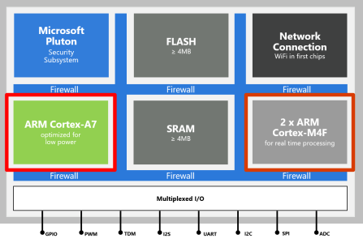
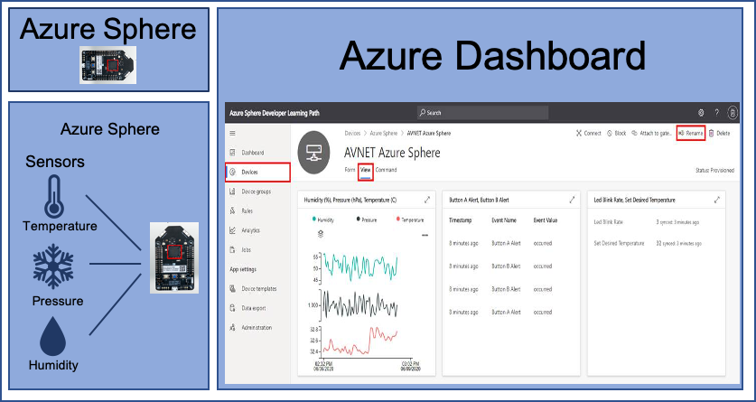

Building and running an application on microcontroller Internet of Things (IoT) devices can be challenging. These challenges could range from ease of development to securely capturing and transferring the data to a server.

With Azure Sphere, you can build IoT solutions that are secure by default with the confidence that your device is protected, your application is protected, and data is protected in transit.

You can build applications with Visual Studio or Visual Studio Code or integrate with your existing toolchains on Windows and Linux. Visual Studio and Visual Studio Code development environments provide integrated microcontroller debuggers and full source-code control, along with collaboration and productivity tools.

## What is Azure Sphere

[Azure Sphere](https://azure.microsoft.com/services/azure-sphere?azure-portal=true) is a comprehensive IoT security solution – including hardware, OS, and cloud components – to actively protect your devices, your business, and your customers.

Azure Sphere is made up of the following components:

* **Azure Sphere–certified chips** from hardware partners include built-in Microsoft security technology to provide connectivity and a dependable hardware root of trust.
* **Azure Sphere OS** adds layers of protection and ongoing security updates to create a trustworthy platform for new IoT experiences.
* **Azure Sphere Security Service** brokers trust for device-to-cloud communication, detects threats, and renews device security.

Together these components implement [The Seven Properties of Highly Secure Devices](https://www.microsoft.com/research/publication/seven-properties-highly-secure-devices?azure-portal=true).

## Azure Sphere Architecture

The Azure Sphere microcontroller unit (MCU) has three developer-accessible cores, a Cortex-A7 which runs a Linux kernel, and two Cortex-M4 cores that can run bare-metal code, or a real-time operating system such as Azure RTOS or FreeRTOS.

High-level applications running on the Cortex-A7 Linux kernel are used for less timing-sensitive tasks such as establishing network connections, negotiating security, updating device state, communicating with real-time core applications, and sending telemetry messages to cloud gateways such as IoT Hub.

## Developer tools

You can develop Azure Sphere applications from Windows and Linux. On Windows you can use either [Visual Studio 2019 or later](https://visualstudio.microsoft.com/downloads?azure-portal=true) (free community edition or better) or [Visual Studio Code](https://code.visualstudio.com?azure-portal=true). On Linux, you use [Visual Studio Code](https://code.visualstudio.com?azure-portal=true). You can simultaneously develop and debug applications running on all three cores.

This learning module supports developers on Linux and Windows using Visual Studio Code. If you are a Windows user comfortable using Visual Studio, then use Visual Studio appreciating the IDE screenshots included in this module will be different.

## Lab environment monitoring and control for sensitive microbiology experiments

Suppose you're a scientist in a microbiology laboratory who is responsible for storing samples from tests. You want to build a system that monitors the environment around the laboratory equipment in real time. This system would monitor the following room conditions:

* Pressure
* Temperature
* Humidity

Previously these were recorded manually by the lab assistants using sensors at regular intervals. Manual recording of ambient conditions is a tedious job which is also prone to human error. Having any issues with the sensors would invalidate the tests performed in the lab environment.

Maintaining the room conditions accurately is critical for managing the laboratory. The lab needs to maintain the right conditions to help you get more accurate results. Any variation in the conditions can affect the equipment temperature during the storage and manipulation of the samples, specimens, and lab equipment. This could impact the ability to produce the correct and stable results and can also have an economic impact on the organization.

## Proposed new system

The proposed new system would have the following factors:

* It would need the sensors within the lab at multiple points.
* The system must be secure from attack as some experiments are commercially sensitive and expensive.
* These sensors will automate the reading of air pressure, temperature, and humidity conditions at defined intervals.
* The sensor data from the devices will be transmitted securely for the analysis of data trends.
* Able to control a heating, ventilation, and air conditioning unit (HVAC) to automatically adjust the environment to match requires for lab experiments.
* Flexible enough to support future more sensitive lab environment sensors.

The solution must be built on an IoT platform that is highly secure, that is protected from attack and software bugs. Additionally, the system can trigger an alarm or alert message to a concerned authority when any of the defined parameters fall outside of expected ranges.

## Learning objectives

In this module, you will:

* Create an Azure IoT Central application
* Configure your Azure Sphere application to Azure IoT Central
* Build and deploy the Azure Sphere application
* Display environment data in the Azure IoT Central dashboard
* Control an Azure Sphere application by using Azure IoT Central properties and commands
* Deploy a new more sensitive room sensor onto an Azure Sphere real-time core running Azure RTOS
* Read the data from the new sensor running on the real-time core and send the data to IoT Central

## Prerequisites

* Azure Sphere kit
* Visual Studio Code installed in your computer
* Ability to use Visual Studio Code
* Git installed in your computer
* Ability to use Git/GitHub
* Basic knowledge of Azure Sphere
* Basic knowledge of Azure IoT
