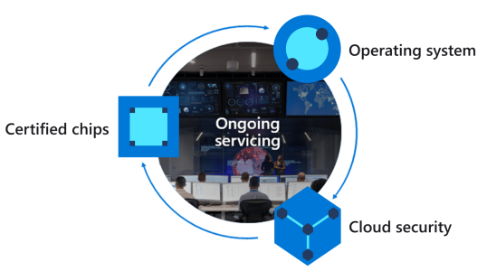
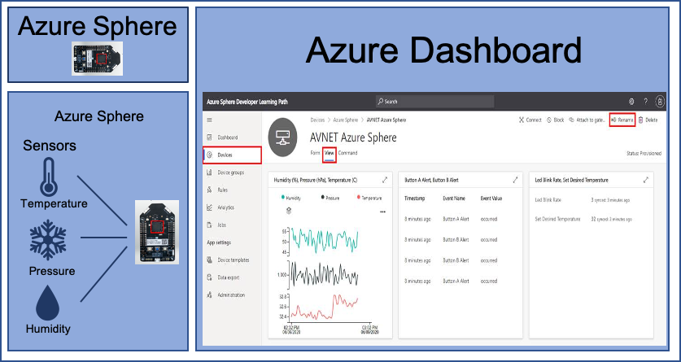

Building and running an application on microcontroller Internet of Things (IoT) devices can be challenging. These challenges could range from ease of development to securely capturing and transferring the data to a server.

With Azure Sphere, you can build IoT solutions that are secure by default with the confidence that your device is protected, your application is protected, and data is protected in transit.

> [!IMPORTANT]
> Microsoft announced the planned retirement of Azure Sphere on March 20, 2026, including the first-generation MT3620 microcontroller-based platform. The MT3620 MCU reaches end of life on July 31, 2026, and extended support for Azure Sphere OS and the Azure Sphere Security Service ends on July 31, 2031. Use this module to understand Azure Sphere concepts and maintain existing MT3620-based solutions, but evaluate replacement architectures and supported silicon before starting new product designs. For details, see [Retirement of Azure Sphere](/azure-sphere/product-overview/retirement?view=azure-sphere-integrated&preserve-view=true).

You can build applications with Visual Studio 2022 or Visual Studio 2019 version 16.11 with the Azure Sphere Visual Studio extension, or with Visual Studio Code and the Azure Sphere extension. (Visual Studio 2019 never shipped a version after 16.11; only 16.11.x servicing updates exist.) These development environments provide integrated microcontroller debuggers and full source-code control, along with collaboration and productivity tools.

## What is Azure Sphere

[Azure Sphere](/azure-sphere/product-overview/what-is-azure-sphere?view=azure-sphere-integrated&preserve-view=true) is a comprehensive IoT security solution – including hardware, OS, and cloud components – to actively protect your devices, your business, and your customers.

Azure Sphere is made up of the following components:

* **Azure Sphere–certified chips** from hardware partners include built-in Microsoft security technology to provide connectivity and a dependable hardware root of trust.
* **Azure Sphere OS** adds layers of protection and ongoing security updates to create a trustworthy platform for new IoT experiences.
* **Azure Sphere Security Service** brokers trust for device-to-cloud communication, detects threats, and renews device security.

Together these components implement [The Seven Properties of Highly Secure Devices](https://aka.ms/7properties?azure-portal=true). (The `aka.ms/7properties` short link resolves to the current 2nd-edition Microsoft Research paper, MSR-TR-2020-41.)

## Azure Sphere Architecture

The MT3620 Azure Sphere MCU used in this module has three developer-accessible cores: an Arm Cortex-A7 high-level application core that runs the Azure Sphere OS Linux kernel, and two Arm Cortex-M4F real-time cores that can run bare-metal code or a real-time operating system such as Eclipse ThreadX, formerly Azure RTOS ThreadX, or FreeRTOS.

High-level applications running on the Cortex-A7 core are used for less timing-sensitive tasks such as establishing network connections, negotiating security, updating device state, communicating with real-time core applications, and sending telemetry to Azure IoT services such as IoT Hub or IoT Central. Real-time capable applications can communicate with high-level applications, but they don't connect directly to the internet.

## Developer tools

You can develop Azure Sphere applications from Windows and Linux. On Windows, you can use [Visual Studio 2022](https://visualstudio.microsoft.com/downloads?azure-portal=true) or Visual Studio 2019 version 16.11 with the Azure Sphere Visual Studio extension, or [Visual Studio Code](https://code.visualstudio.com?azure-portal=true) with the Azure Sphere extension. On Linux, use Visual Studio Code with the Azure Sphere extension. You can simultaneously develop and debug applications running on all three MT3620 cores.

This learning module supports developers on Linux and Windows using Visual Studio Code. If you are a Windows user comfortable using Visual Studio, then use Visual Studio appreciating the IDE screenshots included in this module will be different.

## Lab environment monitoring and control for sensitive microbiology experiments

Suppose you're a scientist in a microbiology laboratory who is responsible for storing samples from tests. You want to build a system that monitors the environment around the laboratory equipment in real time. This system would monitor the following room conditions:

* Pressure
* Temperature
* Humidity

Previously these were recorded manually by the lab assistants using sensors at regular intervals. Manual recording of ambient conditions is a tedious job which is also prone to human error. Having any issues with the sensors would invalidate the tests performed in the lab environment.

Maintaining the room conditions accurately is critical for managing the laboratory. The lab needs to maintain the right conditions to help you get more accurate results. Any variation in the conditions can affect the equipment temperature during the storage and manipulation of the samples, specimens, and lab equipment. This could impact the ability to produce the correct and stable results and can also have an economic impact on the organization.

## Proposed new system

The proposed new system would have the following factors:

* It would need the sensors within the lab at multiple points.
* The system must be secure from attack as some experiments are commercially sensitive and expensive.
* These sensors will automate the reading of air pressure, temperature, and humidity conditions at defined intervals.
* The sensor data from the devices will be transmitted securely for the analysis of data trends.
* Able to control a heating, ventilation, and air conditioning unit (HVAC) to automatically adjust the environment to match the requirements for lab experiments.
* Flexible enough to support future more sensitive lab environment sensors.

The solution must be built on an IoT platform designed for defense in depth, authenticated connectivity, and renewable security, so attacks and software defects are less likely to compromise device or data integrity. Additionally, the system can trigger an alarm or alert message to a concerned authority when any of the defined parameters fall outside of expected ranges.

## Learning objectives

In this module, you will:

* Create an Azure IoT Central application
* Configure your Azure Sphere application to Azure IoT Central
* Build and deploy the Azure Sphere application
* Display environment data in the Azure IoT Central dashboard
* Control an Azure Sphere application by using Azure IoT Central properties and commands
* Deploy a new more sensitive room sensor onto an Azure Sphere real-time core running an Eclipse ThreadX real-time application (formerly Azure RTOS ThreadX)
* Read the data from the new sensor running on the real-time core and send the data to IoT Central

## Prerequisites

* Azure Sphere kit
* Visual Studio Code installed in your computer
* Ability to use Visual Studio Code
* Git installed in your computer
* Ability to use Git/GitHub
* Basic knowledge of Azure Sphere
* Basic knowledge of Azure IoT
