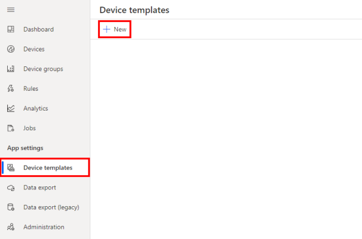
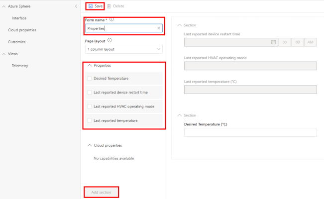

## Step 1: Open the project

1. Start Visual Studio Code to open your project.

2. Click **Open folder**.

3. Open the **Azure-Sphere lab** folder.

4. Open the **Lab_3_Device_Twins** folder.

5. Click **Select Folder** or the **OK** button to open the project.

## Step 2: Set your developer board configuration

These labs support developer boards from Avnet and Seeed Studio. Set the configuration that matches your developer board.

The default developer board configuration is for the Avnet Azure Sphere Starter Kit Revision 1. If you have this board, there's no additional configuration required.

1. Open the **CMakeList.txt** file.

2. Add a `#` at the beginning of the set Avnet line to disable it.

3. Uncomment the `set` command that corresponds to your Azure Sphere device developer board.

   ```text
   set(AVNET TRUE "AVNET Azure Sphere Starter Kit Revision 1 ")
   # set(AVNET_REV_2 TRUE "AVNET Azure Sphere Starter Kit Revision 2 ")
   # set(SEEED_STUDIO_RDB TRUE "Seeed Studio Azure Sphere MT3620 Development Kit (aka Reference Design Board or rdb)")
   # set(SEEED_STUDIO_MINI TRUE "Seeed Studio Azure Sphere MT3620 Mini Dev Board")
   ```

4. Save the file. The CMake cache with be auto-generated.

## Step 3: Configure the Azure IoT connection information

1. Open the **app_manifest.json** file.

2. You'll need to redo the settings for the **app_manifest.json** file. Either copy the settings from Notepad if you still have it open, or copy them from the **app_manifest.json** file you created in the previous exercise.

3. Replace the existing configuration by pasting the contents of the clipboard into **app_manifest.json**.

4. Save the updated **app_manifest.json** file.

## Step 4: Start the app build deploy process

1. Open **main.c**.

1. Select **CMake: [Debug]: Ready** from the Visual Studio Code Status Bar.

1. From Visual Studio Code, press F5 to build, deploy, start, and attach the remote debugger to the application.

## Step 5: Add a properties view to the Lab Monitor device template

IoT Central creates a device template and default views based on the IoT Plug and Play model downloaded from the public IoT Plug and Play models repository. A device template is a blueprint that defines the characteristics and behaviors of a type of device that connects to an Azure IoT Central application.

1. Switch back to the **IoT Central** web portal.
1. Navigate to **Device templates**, then click on the **Learning Path Lab Monitor** template.

   <!-- > [!div class="mx-imgBorder"]
   >  -->

   :::image type="content" source="../media/iot-central-open-lab-monitor-device-template.png" alt-text="The illustration shows how to create IoT device templates.":::

### Create a properties form

1. Navigate to the **Views** menu.

2. Select **Editing device and cloud data**.

   <!-- > [!div class="mx-imgBorder"]
   >  -->

   :::image type="content" source="../media/iot-central-view-properties-create.png" alt-text="The illustration shows how to edit device and cloud data.":::

3. Name the form **Properties**.

4. Expand the **Properties** section.

5. Select the following properties.
   - Last reported device restart time
   - Last reported device start time (UTC)
   - Last reported HVAC operating mode
   - Last reported temperature

6. Click **Add section**.

7. Select the following properties.
   - Desired Sample Rate in Seconds [1..60]
   - Desired Temperature

8. Click **Add section**.

9. Click **Save** to save the form.

<!-- > [!div class="mx-imgBorder"]
>  -->

:::image type="content" source="../media/iot-central-add-tile-form.png" alt-text="The illustration shows the properties section.":::

### Publish the device template

1. Click **Publish** to publish the template. Publishing the template makes it available for devices in your IoT Central application.

    :::image type="content" source="../media/iot-central-template-publish.png" alt-text="The illustration shows how to publish a device template.":::

2. Confirm and click **Publish**.

## Step 6: Set the desired temperature

To set the desired temperature:

1. From the sidebar menu, select **Devices**, then the **Learning Path Lab Monitor** template, then your **device**.
1. Click the **Properties** tab.
1. Update the **Desired Temperature** value.
1. Save the property. This will send the desired temperature property to Azure Sphere. The RGB LED color will change depending on the desired temperature chosen.

    :::image type="content" source="../media/iot-central-display-settings.png" alt-text="he illustration shows display settings.":::

1. The Desired Temperature property status will change to **Accepted now**.
1. If the HVAC operation mode changes then the **Last reported HVAC operating mode** property will also be updated.

## Step 7: Expected device behavior

The Avnet Azure Sphere Starter Kit, revisions 1 and 2, have a built-in temperature sensor. For other boards, a random temperature of 25 +/- 5 degrees Celsius is generated.

### Azure Sphere MT3620 Starter Kit Revision 1 and 2


1. The WLAN LED will blink every 5 seconds when connected to Azure.

1. The RGB LED will turn red if the measured temperature is less than the desired temperature, blue if the measured temperature is greater than the desired temperature and green if the measured temperature is the same as the desired temperature.

### Seeed Studio Azure Sphere MT3620 Development Kit


1. The WLAN LED will blink every 5 seconds when connected to Azure.

1. The RGB LED will turn red if the measured temperature is less than the desired temperature, blue if the measured temperature is greater than the desired temperature and green if the measured temperature is the same as the desired temperature.

### Seeed Studio MT3620 Mini Dev Board


1. The User LED will blink every 5 seconds when connected to Azure.


## Close Visual Studio

Now close Visual Studio.
