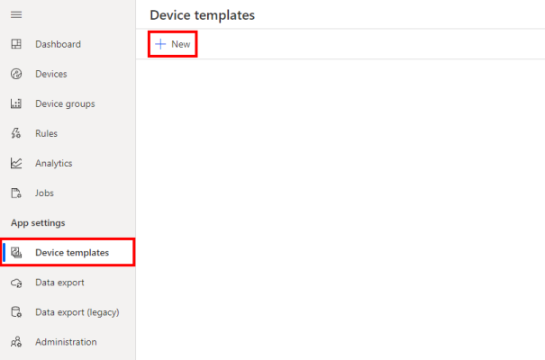
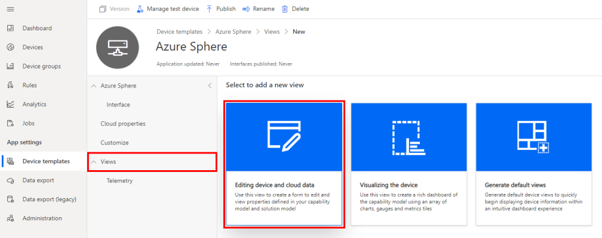
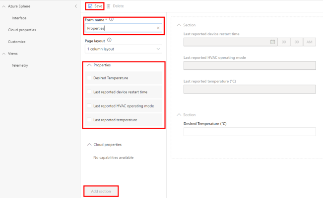

## Step 1: Open the project

1. Start Visual Studio Code to open your project.
1. Click **Open folder**.
1. Open the **Azure-Sphere** folder.
1. Open the **Lab_3_Device_Twins** folder.
1. Click **Select Folder** or the **OK** button to open the project.

## Step 2: Set your developer board configuration

These labs support developer boards from Avnet and Seeed Studio. The default developer board configuration is for the Avnet Azure Sphere Starter Kit Revision 1. If you're using the Avnet Revision 1 board, no **CMakeLists.txt** change is required.

If you're using any other supported board, update **CMakeLists.txt** so that only one board is selected:

1. Open the **CMakeLists.txt** file.
1. Add a `#` at the beginning of the `set(AVNET TRUE ...)` line to disable the Avnet Revision 1 default.
1. Uncomment exactly one `set` command that matches your Azure Sphere developer board. Leave all other board `set` commands commented out.

   ```text
   set(AVNET TRUE "AVNET Azure Sphere Starter Kit Revision 1 ")
   # set(AVNET_REV_2 TRUE "AVNET Azure Sphere Starter Kit Revision 2 ")
   # set(SEEED_STUDIO_RDB TRUE "Seeed Studio Azure Sphere MT3620 Development Kit (aka Reference Design Board or rdb)")
   # set(SEEED_STUDIO_MINI TRUE "Seeed Studio Azure Sphere MT3620 Mini Dev Board")
   ```
1. Save the file. The CMake cache will be auto-generated.

## Step 3: Configure the Azure IoT connection information

1. Open the **app_manifest.json** file.
1. You'll need to redo only the Azure IoT connection settings in this lab's **app_manifest.json** file. Do **not** replace the whole file with copied connection output or with the **app_manifest.json** file from a previous exercise.
1. Copy or update only the top-level **CmdArgs** array, plus the **AllowedConnections** and **DeviceAuthentication** entries inside **Capabilities**, using the values from Notepad if you still have it open or from the **app_manifest.json** file you created in the previous exercise.
1. Preserve the rest of this lab's manifest, including **SchemaVersion**, **Name**, **ComponentId**, **EntryPoint**, **ApplicationType**, and all existing **Capabilities** entries such as any GPIO, I2C, or **PowerControls** entries already present.
1. Save the updated **app_manifest.json** file.

## Step 4: Start the app build deploy process

1. Open **main.c**.

1. Select **CMake: [Debug]: Ready** from the Visual Studio Code Status Bar.

1. From Visual Studio Code, press F5 to build, deploy, start, and attach the remote debugger to the application.

## Step 5: Add a properties view to the Lab Monitor device template

IoT Central can create a device template from the IoT Plug and Play model ID sent by a device when the model is available from a model repository. A device template is a blueprint that defines the characteristics and behaviors of a type of device that connects to an Azure IoT Central application. The model defines capabilities such as telemetry, properties, and commands; views and forms define how operators visualize and manage those capabilities.

1. Switch back to the **IoT Central** web portal.
1. Navigate to **Device templates**, then click on the **Learning Path Lab Monitor** template.

   <!-- > [!div class="mx-imgBorder"]
   >  -->

   :::image type="content" source="../media/iot-central-open-lab-monitor-device-template.png" alt-text="The illustration shows how to create IoT device templates.":::

### Create a properties form

1. Navigate to the **Views** menu.
1. Select **Editing device and cloud data**.

   <!-- > [!div class="mx-imgBorder"]
   >  -->

   :::image type="content" source="../media/iot-central-view-properties-create.png" alt-text="The illustration shows how to edit device and cloud data.":::
1. Name the form **Properties**.
1. Expand the **Properties** section.
1. Select the following properties.
   - Last reported device restart time
   - Last reported device start time (UTC)
   - Last reported HVAC operating mode
   - Last reported temperature
1. Click **Add section**.
1. Select the following properties.
   - Desired Sample Rate in Seconds [1..60]
   - Desired Temperature
1. Click **Add section**.
1. Click **Save** to save the form.

<!-- > [!div class="mx-imgBorder"]
>  -->

:::image type="content" source="../media/iot-central-add-tile-form.png" alt-text="The illustration shows the properties section.":::

### Publish the device template

1. Click **Publish** to publish the template. Publishing the template makes it available for devices in your IoT Central application.

    :::image type="content" source="../media/iot-central-template-publish.png" alt-text="The illustration shows how to publish a device template.":::
1. Confirm and click **Publish**.

## Step 6: Set the desired temperature

To set the desired temperature:

1. From the sidebar menu, select **Devices**, then the **Learning Path Lab Monitor** template, then your **device**.
1. Click the **Properties** tab.
1. Update the **Desired Temperature** value.
1. Select **Save**. IoT Central sends the **Desired Temperature** writable property update to the Azure Sphere application. The RGB LED color will change depending on the desired temperature chosen.

    :::image type="content" source="../media/iot-central-display-settings.png" alt-text="The illustration shows display settings.":::

1. The **Desired Temperature** property status is **Pending** until the device reports an acknowledgment. After the device accepts the value, the status changes to **Accepted** along with a relative timestamp (for example, **Accepted seconds ago**). The exact label depends on the acknowledgment code (`ac`) returned by the device — values that are out of range or refused appear with a different status, so allow a few seconds for the device to respond.
1. If the HVAC operating mode changes, the **Last reported HVAC operating mode** property will also be updated.

## Step 7: Expected device behavior

The Avnet Azure Sphere Starter Kit, revisions 1 and 2, have a built-in temperature sensor. For other boards, a random temperature of 25 +/- 5 degrees Celsius is generated.

### Azure Sphere MT3620 Starter Kit Revision 1 and 2


1. The WLAN LED will blink every 5 seconds when connected to Azure.

1. The RGB LED will turn red if the measured temperature is less than the desired temperature, blue if the measured temperature is greater than the desired temperature and green if the measured temperature is the same as the desired temperature.

### Seeed Studio Azure Sphere MT3620 Development Kit


1. The WLAN LED will blink every 5 seconds when connected to Azure.

1. The RGB LED will turn red if the measured temperature is less than the desired temperature, blue if the measured temperature is greater than the desired temperature and green if the measured temperature is the same as the desired temperature.

### Seeed Studio MT3620 Mini Dev Board


1. The User LED will blink every 5 seconds when connected to Azure.


## Close Visual Studio Code

Now close Visual Studio Code.
