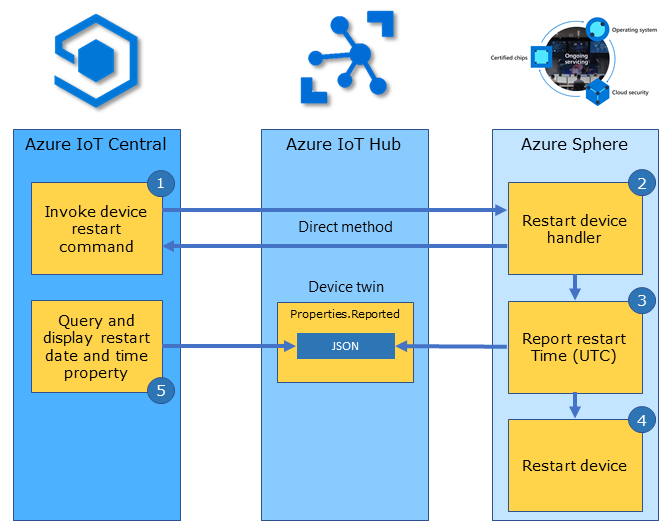
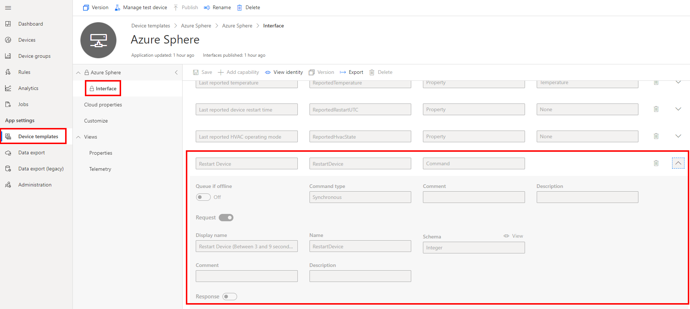

In this unit, you will learn how to remotely restart an Azure Sphere device from Azure IoT Central.

## Understanding IoT Central commands

Azure IoT Central uses commands to invoke an action on a device. Commands are often used for interactive control of devices, such as turning on a fan, a light, or in the case of this unit, restarting the Azure Sphere device.

IoT Central is built on Azure IoT Hub. In this lab, the **Restart Device** command is an IoT Central standard command that uses an IoT Hub direct method. IoT Hub direct methods represent a request-reply interaction with a device similar to an HTTP call in that they succeed or fail immediately. This approach is useful for scenarios where the course of immediate action is different depending on whether the device was able to respond. IoT Central also supports offline commands and long-running command patterns that use different IoT Central conventions.

> [!IMPORTANT]
> IoT Central standard commands aren't the same as invoking generic IoT Hub direct methods from a back-end app for timeout behavior. An IoT Central standard command must receive a device response within 30 seconds, and this timeout is not configurable. A generic IoT Hub direct method can use a configurable `responseTimeoutInSeconds` value, with a default of 30 seconds and a supported range from 5 to 300 seconds.

> [!NOTE]
> There are a number of reasons why you might need to remotely restart an Azure Sphere device. Azure Sphere checks for OS and application updates after the device first connects to the internet following power-on or reset, and then periodically thereafter. Microsoft Learn currently uses variant wording for the periodic update check: [About over-the-air updates](/azure-sphere/deployment/device-updates?view=azure-sphere-integrated&preserve-view=true) says regular intervals, currently 20 hours, while [Configure networking and update the device OS](/azure-sphere/install/configure-wifi?view=azure-sphere-integrated&preserve-view=true) says each boot, initial internet connection, and 24-hour intervals thereafter. Treat these as official cadence descriptions, not an application timing guarantee. Separately, Azure Sphere devices automatically perform authentication and attestation with the Azure Sphere cloud security services every 24 hours, resulting in a cryptographically signed device certificate. Restarting a device can trigger a new update check after it reconnects, but the 24-hour authentication and attestation cadence is independent of update checks and shouldn't be used to infer the update-check interval.

## Remote restarting an Azure Sphere device

From the IoT Central device commands tab, you can invoke the command to restart the device. You need to set the number of seconds the device will wait before restarting. In this lab, Azure IoT Central requests Azure IoT Hub to send a direct method message with an optional payload to the device. IoT Hub returns an HTTP response to IoT Central for the service-side method invocation. When the device responds, the direct method response body includes the device-supplied method status and payload, which IoT Central displays as the command result. For the IoT Central standard command to succeed, the device must send this method response before the 30-second command timeout. IoT Central can display the history of commands that have been invoked on the Azure Sphere device.



### Steps to restarting an Azure Sphere device from IoT Central

The following steps outline how the **Restart Device** standard command uses Azure IoT Hub direct methods for cloud-to-device control.

1. From the Azure IoT Central device commands tab you invoke the **Restart Device** command. IoT Central then requests IoT Hub to send a direct method message to the device.
1. On the Azure Sphere device, the **RestartDeviceHandler** function is called.
1. Next the device sends a device twin **ReportedRestartUTC** reported property to Azure IoT Hub to record the UTC time the restart was requested, before the reboot is scheduled.
1. IoT Hub returns an HTTP response for the service-side direct method invocation. When the device responds, it supplies the method status and response payload that IoT Central displays as the command response.
1. The Azure Sphere device is then restarted.
1. Azure IoT Central queries and displays the device **ReportedRestartUTC** property, which records the restart request time in this sample rather than confirmed post-reboot time.

## Getting started with Direct method bindings

Remember, the IoT Central standard command in this lab is implemented using an Azure IoT Hub direct method. A direct method binding maps a direct method name with a handler function that will be called to implement the action.

The following example declares a Direct Method Binding to restart the Azure Sphere device. This declaration maps the Azure IoT Central `RestartDevice` command with a handler function named `RestartDeviceHandler`.

```c
static LP_DIRECT_METHOD_BINDING dm_restartDevice = {
    .methodName = "RestartDevice",
    .handler = RestartDeviceHandler };
```

### Remote restarting the Azure Sphere device

The following is the implementation of the handler function `RestartDeviceHandler`. The handler function is called when the device receives a direct method message named `RestartDevice` from Azure IoT Hub.

```c
/// <summary>
/// Start Device Power Restart Direct Method 'RestartDevice' with integer seconds, e.g. 5
/// </summary>
static LP_DIRECT_METHOD_RESPONSE_CODE RestartDeviceHandler(JSON_Value* json, LP_DIRECT_METHOD_BINDING* directMethodBinding, char** responseMsg)
{
    const size_t responseLen = 60; // Allocate and initialize a response message buffer. The calling function is responsible for the freeing memory
    static struct timespec period;

    *responseMsg = (char*)malloc(responseLen);
    memset(*responseMsg, 0, responseLen);

    if (json_value_get_type(json) != JSONNumber) { return LP_METHOD_FAILED; }

    int seconds = (int)json_value_get_number(json);

    // leave enough time for the device twin dt_reportedRestartUtc to update before restarting the device
    if (seconds > 2 && seconds < 10)
    {
        // Report Device Restart UTC
        lp_deviceTwinReportState(&dt_reportedRestartUtc, lp_getCurrentUtc(msgBuffer, sizeof(msgBuffer))); // LP_TYPE_STRING

        // Create Direct Method Response
        snprintf(*responseMsg, responseLen, "%s called. Restart in %d seconds", directMethodBinding->methodName, seconds);

        // Set One Shot LP_TIMER
        period = (struct timespec){ .tv_sec = seconds, .tv_nsec = 0 };
        lp_timerOneShotSet(&restartDeviceOneShotTimer, &period);

        return LP_METHOD_SUCCEEDED;
    }
    else
    {
        snprintf(*responseMsg, responseLen, "%s called. Restart Failed. Seconds out of range: %d", directMethodBinding->methodName, seconds);
        return LP_METHOD_FAILED;
    }
}
```

## Azure Sphere PowerControls Capability

The RestartDeviceHandler function sets up a one-shot timer that invokes the **DelayRestartDeviceTimerHandler** function after the specified restart period measured in seconds. In the DelayRestartDeviceTimerHandler function, a call is made to the [**PowerManagement_ForceSystemReboot**](/azure-sphere/reference/applibs/applibs-power/function-power-forcesystemreboot?view=azure-sphere-integrated&azure-portal=true&preserve-view=true) API. The PowerManagement_ForceSystemReboot API requires the **PowerControls** capability to be declared in the app_manifest.json file.

```json
"PowerControls": [
    "ForceReboot"
]
```

> [!WARNING]
> Including the `ForceReboot` value in the **PowerControls** capability allows your application to call `PowerManagement_ForceSystemReboot`, which immediately terminates all running applications on the device. Used incorrectly — for example, on a device that reboots before it can connect to the Azure Sphere Security Service — this can result in the device being **unable to fetch updates and requiring recovery**. Always include enough idle, connected time in your application logic for the device to receive operating system and application updates between reboots. See [Force Power Down and updates](/azure-sphere/app-development/power-down?view=azure-sphere-integrated&azure-portal=true#force-power-down-and-updates&preserve-view=true) for the official guidance.

## How direct methods are mapped to handlers

All declared direct method bindings must be added by reference to the directMethodBindingSet array. When a direct method message is received by the device from Azure IoT Hub, it is checked for a matching *methodName* value in the directMethodBindingSet array. When a match is found, the corresponding handler function is called.

```c
LP_DIRECT_METHOD_BINDING* directMethodBindingSet[] = { &dm_restartDevice };
```

### Opening the direct method binding set

The direct method binding set is initialized in the **InitPeripheralsAndHandlers** function in **main.c**.

```c
lp_directMethodSetOpen(directMethodBindingSet, NELEMS(directMethodBindingSet));
```

### Closing the direct method binding set

The direct method bindings set is closed in the **ClosePeripheralsAndHandlers** function in **main.c**.

```c
lp_directMethodSetClose();
```

## Azure IoT Central commands

IoT Central commands are defined in the device template interface. In this example, the command display name is **Restart Device**, the command **Name** is **RestartDevice**, and the request schema type is **Integer**. For this standard command, IoT Central sends the integer request value as the direct method payload, which defines the number of seconds before restarting the device. The command **Name** must match the **RestartDevice** direct method binding declaration on the Azure Sphere device.

<!-- > [!div class="mx-imgBorder"]
>  -->

:::image type="content" source="../media/iot-central-device-template-interface-restart-device.png" alt-text="The illustration shows a device template interface.":::
