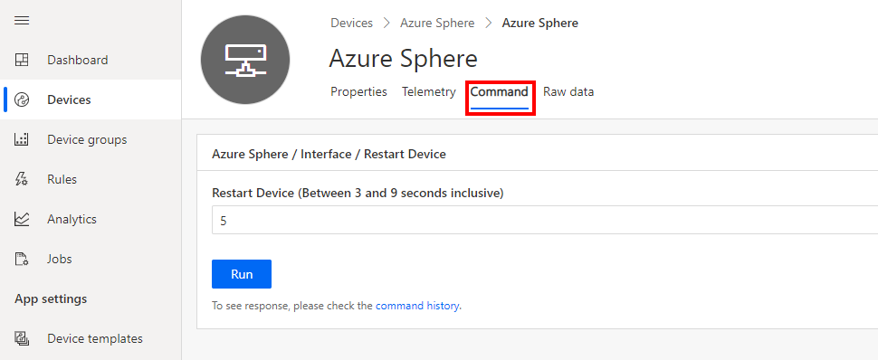

## Step 1: Build and deploy your application

1. Start Visual Studio Code to open your project.

2. Click **Open folder**.

3. Open the **Azure-Sphere lab** folder.

4. Open the **Lab_4_Direct_Methods** folder.

5. Click **Select Folder** or the **OK** button to open the project.

## Step 2: Set your developer board configuration

These labs support developer boards from Avnet and Seeed Studio. You need to set the configuration that matches your developer board.

The default developer board configuration is for the Avnet Azure Sphere Starter Kit Revision 1. If you have this board, there's no additional configuration required.

1. Open the **CMakeList.txt** file.

2. Add a `#` at the beginning of the set Avnet line to disable it.

3. Uncomment the `set` command that corresponds to your Azure Sphere device developer board.

   ```text
   set(AVNET TRUE "AVNET Azure Sphere Starter Kit Revision 1 ")
   # set(AVNET_REV_2 TRUE "AVNET Azure Sphere Starter Kit Revision 2 ")
   # set(SEEED_STUDIO_RDB TRUE "Seeed Studio Azure Sphere MT3620 Development Kit (aka Reference Design Board or rdb)")
   # set(SEEED_STUDIO_MINI TRUE "Seeed Studio Azure Sphere MT3620 Mini Dev Board")
   ```

4. Save the file. This will auto-generate the CMake cache.

## Step 3: Configure the Azure IoT connection information

1. Open the **app_manifest.json** file.

2. You'll need to redo the settings for the **app_manifest.json** file. Either copy the settings from Notepad if you still have it open or copy them from the **app_manifest.json** file you created in the previous exercise.

3. Replace the existing configuration by pasting the contents of the clipboard into **app_manifest.json**.

4. Save the updated **app_manifest.json** file.

## Step 4: Start the app build deploy process

1. Open **main.c**.
1. Select **CMake: [Debug]: Ready** from the Visual Studio Code status bar.
1. From Visual Studio Code, press F5 to build, deploy, start, and attach the remote debugger to the application now running the Azure Sphere device.

## Expected device behavior

### Azure Sphere MT3620 Starter Kit Revision 1 and 2


1. The WLAN LED will blink every 5 seconds when connected to Azure.

1. When you initiate the device restart direct method you will observe the device restarting.

### Seeed Studio Azure Sphere MT3620 Development Kit


1. The WLAN LED will blink every 5 seconds when connected to Azure.

1. When you initiate the device restart direct method you will observe the device restarting.

### Seeed Studio MT3620 Mini Dev Board


1. The User LED will blink every 5 seconds when connected to Azure.

1. When you initiate the device restart direct method you will observe the device restarting.

## Testing Azure IoT Central commands

1. Switch to Azure IoT Central in your web browser.

1. From the sidebar menu, select **Devices**, then the **Learning Path Lab Monitor** template, then your **device**.

1. Select the Azure IoT Central **Commands** tab.

1. Set the **Restart Device** time in seconds, and then click **Run**.

1. Observe the device rebooting. The LEDs will turn off for a few seconds.

   <!-- > [!div class="mx-imgBorder"]
   >  -->

   :::image type="content" source="../media/iot-central-device-command-run.png" alt-text="The illustration shows how to control the device with a command.":::

1. Switch back to Azure IoT Central and click the **Command History** button to view the result of the command.

## Close Visual Studio

Now close Visual Studio.
