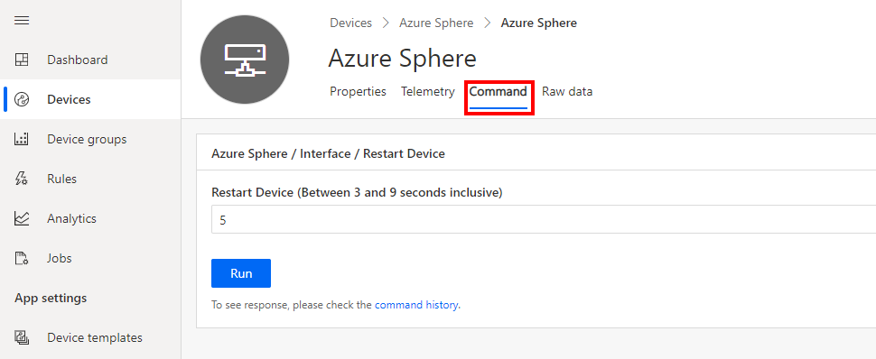

## Step 1: Build and deploy your application

1. Start Visual Studio Code to open your project.
1. Click **Open folder**.
1. Open the **Azure-Sphere** folder.
1. Open the **Lab_4_Direct_Methods** folder.
1. Click **Select Folder** or the **OK** button to open the project.

## Step 2: Set your developer board configuration

These labs support developer boards from Avnet and Seeed Studio. The default developer board configuration is for the Avnet Azure Sphere Starter Kit Revision 1. If you're using the Avnet Revision 1 board, no **CMakeLists.txt** change is required.

If you're using any other supported board, update **CMakeLists.txt** so that only one board is selected:

1. Open the **CMakeLists.txt** file.
1. Add a `#` at the beginning of the `set(AVNET TRUE ...)` line to disable the Avnet Revision 1 default.
1. Uncomment exactly one `set` command that matches your Azure Sphere developer board. Leave all other board `set` commands commented out.

   ```text
   set(AVNET TRUE "AVNET Azure Sphere Starter Kit Revision 1 ")
   # set(AVNET_REV_2 TRUE "AVNET Azure Sphere Starter Kit Revision 2 ")
   # set(SEEED_STUDIO_RDB TRUE "Seeed Studio Azure Sphere MT3620 Development Kit (aka Reference Design Board or rdb)")
   # set(SEEED_STUDIO_MINI TRUE "Seeed Studio Azure Sphere MT3620 Mini Dev Board")
   ```
1. Save the file. This will auto-generate the CMake cache.

## Step 3: Configure the Azure IoT connection information

1. Open the **app_manifest.json** file.
1. You'll need to redo only the Azure IoT connection settings for this lab's **app_manifest.json** file. Do **not** replace the whole file with copied connection output or with the **app_manifest.json** file from a previous exercise.
1. Copy or update only the top-level **CmdArgs** array, plus the **AllowedConnections** and **DeviceAuthentication** entries inside **Capabilities**, using the values from Notepad if you still have it open or from the **app_manifest.json** file you created in the previous exercise.
1. Confirm that the **Capabilities** section still includes the `PowerControls` capability for `ForceReboot`. This lab uses `PowerManagement_ForceSystemReboot` to restart the device.

   ```json
   "PowerControls": [
       "ForceReboot"
   ]
   ```

   > [!WARNING]
   > `ForceReboot` and `ForcePowerDown` allow an application to immediately terminate all applications on the device. Used incorrectly — for example, on a device that reboots before it can connect to the Azure Sphere Security Service — this can result in the device being **unable to fetch updates and requiring recovery**. Use `ForceReboot` only when required, and ensure your application leaves enough idle, connected time for the device to receive operating system and application updates between reboots. See [Force Power Down and updates](/azure-sphere/app-development/power-down?view=azure-sphere-integrated&azure-portal=true#force-power-down-and-updates&preserve-view=true) for the official guidance.
1. Save the updated **app_manifest.json** file.

## Step 4: Start the app build deploy process

1. Open **main.c**.
1. Select **CMake: [Debug]: Ready** from the Visual Studio Code status bar.
1. From Visual Studio Code, press F5 to build, deploy, start, and attach the remote debugger to the application now running the Azure Sphere device.

## Expected device behavior

### Azure Sphere MT3620 Starter Kit Revision 1 and 2


1. The WLAN LED will blink every 5 seconds when connected to Azure.

1. When you initiate the device restart direct method you will observe the device restarting.

### Seeed Studio Azure Sphere MT3620 Development Kit


1. The WLAN LED will blink every 5 seconds when connected to Azure.

1. When you initiate the device restart direct method you will observe the device restarting.

### Seeed Studio MT3620 Mini Dev Board


1. The User LED will blink every 5 seconds when connected to Azure.

1. When you initiate the device restart direct method you will observe the device restarting.

## Testing Azure IoT Central commands

1. Switch to Azure IoT Central in your web browser.

1. From the sidebar menu, select **Devices**, then the **Learning Path Lab Monitor** template, then your **device**.

1. Select the Azure IoT Central **Commands** tab.

1. Set the **Restart Device** command request value to an integer from **3** through **9** seconds, such as `5`, and then click **Run**. The `RestartDeviceHandler` in this lab accepts only values in that range; values outside the range are expected to fail.

1. Observe the device rebooting. The LEDs will turn off for a few seconds.

   <!-- > [!div class="mx-imgBorder"]
   >  -->

   :::image type="content" source="../media/iot-central-device-command-run.png" alt-text="The illustration shows how to control the device with a command.":::

1. Switch back to Azure IoT Central and select **command history** to view the result of the command.

## Close Visual Studio Code

Now close Visual Studio Code.
