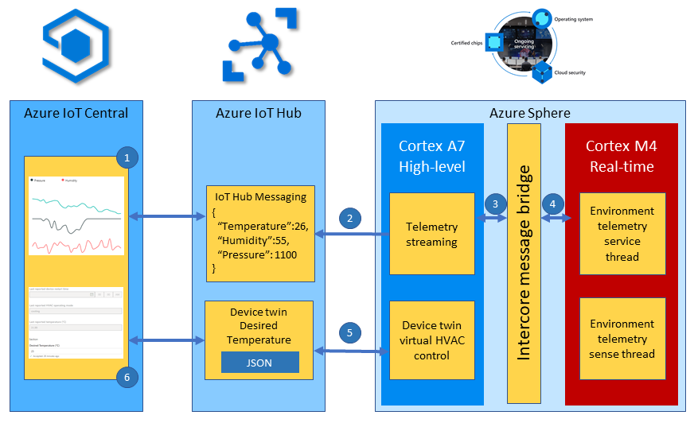

The microbiology laboratory is to run a set of experiments for a new customer. The experiments require the lab temperature, humidity, and pressure to be stable. After much investigation a new environment sensor is found that meets the customers needs. However, it's discovered that the new sensor is very timing sensitive and needs to be deployed onto one of the Azure Sphere real-time cores.

In this unit, you'll learn how to deploy a real-time application onto the Azure Sphere to support the new temperature, humidity, and pressure sensor.

## Azure Sphere Architecture

The MT3620 Azure Sphere microcontroller unit (MCU) used in these labs has three developer-accessible cores: one ARM Cortex-A7 application core, which runs the Azure Sphere OS Linux-based high-level environment, and two ARM Cortex-M4F real-time cores. The M4F cores can run bare-metal code or a real-time operating system (RTOS) such as Eclipse ThreadX, formerly Azure RTOS ThreadX, or FreeRTOS.

High-level applications running on the Cortex-A7 Linux kernel are used for less timing-sensitive tasks such as establishing network connections, negotiating security, updating device state, communicating with real-time core applications, and sending telemetry messages to cloud gateways such as IoT Hub.


## What is an RTOS (Real-Time Operating System)

A system is said to be real-time if the total correctness of an operation depends not only upon its logical correctness, but also upon the time in which it is performed [Link to Wikipedia Article](https://en.wikipedia.org/wiki/Real-time_computing)

A Real-Time Operating System is system software that provides services and manages processor resources for applications. These resources include processor cycles, memory, peripherals, and interrupts. The main purpose of a real-time Operating System is to allocate processing time among various duties the embedded software must perform.

This typically involves a division of the software into pieces, commonly called “tasks” or “threads,” and creating a run-time environment that provides each thread with its own virtual microprocessor (“Multithreading”). Basically, a virtual microprocessor consists of a virtual set of microprocessor resources, for example, register set, program counter, stack memory area, and a stack pointer. Only while executing does a thread use the physical microprocessor resources, but each thread retains its own copy of the contents of these resources as if they were its own private resources (the thread's “context”).

## Introducing Eclipse ThreadX

Eclipse ThreadX, formerly Azure RTOS ThreadX, is an advanced real-time operating system (RTOS) designed for deeply embedded applications. Microsoft contributed the Azure RTOS technology to the Eclipse Foundation, where it is now developed as the [Eclipse ThreadX](https://threadx.io/) suite.

ThreadX provides real-time multithreading, inter-thread communication and synchronization, timers, memory management, and interrupt management. It also has many advanced features, including picokernel architecture, preemption threshold, event chaining, and a rich set of system services. In this unit, the real-time application uses Eclipse ThreadX on one of the Azure Sphere Cortex-M4F cores.

## Why build and deploy real-time applications

The reasons to run code on the Cortex-M4F real-time cores include:

1. You are migrating existing Cortex-M4F code to an Azure Sphere.
1. Your application requires precise or deterministic timing that cannot be guaranteed on the Cortex-A7 Linux kernel core where it would have to compete with other services.
1. Your application may benefit from running across multiple cores to take advantage of all the memory and processing resources on the Azure Sphere.

To learn more, review the [Eclipse ThreadX overview](https://github.com/eclipse-threadx/rtos-docs/blob/main/rtos-docs/threadx/overview-threadx.md) and the Azure Sphere guidance for [real-time capable applications](/azure-sphere/app-development/create-rt-app?view=azure-sphere-integrated&preserve-view=true).

## Inter-core communications

For security reasons, applications running on the real-time cores cannot access any network resources. Azure Sphere supports inter-core communication between a high-level application (HLApp) and a real-time capable application (RTApp). The HLApp opens a connection to the RTApp by calling `Application_Connect`, then uses POSIX `send()` and `recv()` on the returned socket file descriptor. On the RTApp side, messages are exchanged through shared-memory ring buffers; the mailbox shared with the high-level core is used for setup and for notifications after reads or writes. This communication path is HLApp↔RTApp, not a general-purpose channel between arbitrary cores, and the message content can be at most 1 KB.

There also needs to be a shared understanding or contract that describes the shape of the data being passed between the applications. The Azure Sphere inter-core APIs transfer message content as bytes and don't interpret C structures. If you use C structs and enums as the message contract, the layout, field widths, padding/alignment, and endianness are part of your application ABI. Keep the contract in a shared header used by both applications, prefer fixed-width fields or an explicit serialization format for portable messages, and validate that `sizeof(message) <= 1024` before sending. For more complex needs, such as passing an array of objects, implement a serialization scheme that keeps each message within the 1 KB limit.

The following structure declares the inter-core contract used in this unit. You can find this contract in the **IntercoreContract** directory.

```c
typedef enum
{
    LP_IC_UNKNOWN,
    LP_IC_HEARTBEAT,
    LP_IC_ENVIRONMENT_SENSOR,
    LP_IC_SAMPLE_RATE
} LP_INTER_CORE_CMD;

typedef struct
{
    LP_INTER_CORE_CMD cmd;
    float temperature;
    float pressure;
    float humidity;
    int sample_rate;
} LP_INTER_CORE_BLOCK;
```

## Solution architecture



The solution architecture is as follows:

1. The Eclipse ThreadX real-time environment sensor thread samples every 2 seconds by default. The thread stores in memory the latest environment temperature, humidity, and pressure data; later in the module, the high-level application can forward a desired sample-rate property to change this interval.
1. The high-level telemetry streaming app requests from the real-time core the latest environment data.
1. The ThreadX real-time environment service thread responds with the latest environment data.
1. The high-level application serializes the environment data as JSON. After the device provisions through IoT Central by using DPS, it connects to the application's underlying IoT Hub and sends the telemetry message.
1. Azure IoT Central ingests the telemetry from its underlying IoT Hub and displays the data to the user.
1. The IoT Central user can also set the desired temperature for the room by setting a property. IoT Central delivers the property to the device by using the application's underlying IoT Hub device twin.
1. The Azure Sphere then sets the HVAC operating mode to meet the desired temperature.

## Real-time core security and communications

Like high-level applications, real-time applications are secure by default and you must declare all resources the application requires. This includes access to peripherals and which applications the real-time core can communicate with. To communicate, the HLApp and RTApp must be configured with corresponding Component IDs.

### Real-time inter-core capabilities

To communicate, both applications must include the `AllowedApplicationConnections` capability under `Capabilities`. The HLApp lists the Component ID of the RTApp, and the RTApp lists the Component ID of the HLApp.

The Component ID for the high-level application can be found in its **app_manifest.json** file.

```json
{
  "SchemaVersion": 1,
  "Name": "AzureSphereIoTCentral",
  "ComponentId": "25025d2c-66da-4448-bae1-ac26fcdd3627"
}
```

The **AllowedApplicationConnections** capability in the real-time **app_manifest.json** file is set to the Component ID of the Azure Sphere high-level application.

```json
{
    "Capabilities": {
        "AllowedApplicationConnections": [
            "25025d2c-66da-4448-bae1-ac26fcdd3627"
        ]
    }
}
```
